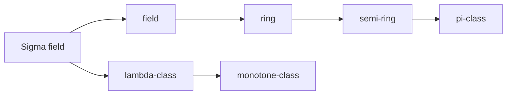

# 引言

measure space 是一个三元组——$(\Omega,\mathcal{F},\nu)$，分别代表 sample space、(基于 sample space 生成的)$\sigma$-field (or $\sigma$-algebra) 和 (定义在 $\sigma$-field 上的)measure。将 measure 的值域限制在 $[0,1]$ 上就得到了一个 probability measure，这样的 measure space 也被称为 probability space。

sample space $\Omega$ 包含了我们感兴趣的所有元素，比如在投骰子的游戏中，我们所关心的是骰子的点数的集合 $\{1,2,3,4,5,6\}$，这可以构成一个 sample space。可以看到，$\Omega$ 本质上是一个普通的抽象集合，关键在于我们在这个集合上赋予了特殊的结构（$\mathcal{F}$ 和 $\nu$），这个特殊的结构是要深入介绍的重点。本节我们将首先介绍 $\mathcal{F}$ —— $\sigma$ 域。

# 定义

::: {#def-02-sigma-field-1}

## $\sigma$-field

$\mathcal{F}$ 是 $\Omega$ 的子集组成的集合，如果其满足下面的 3 个条件，则我们称其为是一个 **$\sigma$-field**：

1. $\emptyset\in\mathcal{F}$
2. $A\in\mathcal{F}\implies A^c\in\mathcal{F}$
3. $A_{i}\in\mathcal{F},i=1,2,\dots\implies \cup A_{i}\in\mathcal{F}$

$(\Omega, \mathcal{F})$ 则称之为一个 measurable space。

:::
注意到，以上的三个条件有许多等价形式：
* 我们可以使用 $\Omega$ 和**差集的封闭性**来替换 2。
* 只要保证了差集的封闭性，我们可以使用互斥集合可列并来替代条件 3。
* 只要存在补运算的封闭性，根据 DeMorgan's Law，我们可以将可列交运算修改为可列并运算。
根据以上的替换，可以有很多很多的等价定义方法。以下使我们列举的四组等价定义：

::: {#def-02-sigma-field-2}

## $\sigma$-field 的等价定义

1. $\emptyset,\Omega\in\mathcal{F}$
2. $A,B\in\mathcal{F}\implies A\setminus B\in\mathcal{F}$
3. $A_{i}\in\mathcal{F},i=1,2,\dots\implies \cup A_{i}\in\mathcal{F}$

---

1. $\emptyset\in\mathcal{F}$
2. $A\in\mathcal{F}\implies A^c\in\mathcal{F}$
3. $A_{i}\in\mathcal{F},i=1,2,\dots,A_{i}\cap A_{j}=\emptyset,\forall i,j\implies \cup A_{i}\in\mathcal{F}$

---

1. $\emptyset,\Omega\in\mathcal{F}$
2. $A,B\in\mathcal{F}\implies A\setminus B\in\mathcal{F}$
3. $A_{i}\in\mathcal{F},i=1,2,\dots,A_{i}\cap A_{j}=\emptyset,\forall i,j\implies \cup A_{i}\in\mathcal{F}$

---

1. $\emptyset\in\mathcal{F}$
2. $A\in\mathcal{F}\implies A^c\in\mathcal{F}$
3. $A_{i}\in\mathcal{F},i=1,2,\dots\implies\cap A_{i}\in\mathcal{F}$

:::
针对一个 sample space，我们可以构造出非常多的 $\sigma$-field，以下是几个常见的例子：
* 对于任何一个集合，都会存在两个 **trivial $\sigma$-field**：Power set 和 $\{ \emptyset,\Omega \}$。
* 另外一个常被用来辅助理解 $\sigma$-field 的例子是：$\{ \emptyset,A,A^c,\Omega \}$，其中 $A\subset\Omega$ 并且 $A\neq\Omega$。
* 在后续的文章中，最常被提及的 $\sigma$ -field 应该是 @def-borel-sigma-field，其使用 $\mathcal{B}$ 表示。它是定义在实数轴 $\mathbb{R}$ 上的一个 $\sigma$ -field，其生成自 $\mathbb{R}$ 上的区间或开集。在我们介绍完 [Sigma 域的生成](#02-sigma-field-sigma-域的生成) 后，我们会更清晰地知道它是一个怎样的对象。

我们还可以将 sample space 限制在一个子集来定义一个 measurable space，

::: {#def-02-sigma-field-3}

## 子集上的测度空间

令 $C \subset\Omega$ 并且 $C\in\mathcal{F}$，则 $\mathcal{F}_{C}=\{ C\cap A|A\in\mathcal{F} \}$ 是定义在 $C$ 上的 $\sigma$-field，$(C,\mathcal{F}_{C})$ 构成了一个 **measurable space**，称为 **$\sigma$-field on $C$**。

:::

# 各种集合系

直接去构造一个足够大的、有意义的 $\sigma$-field 是非常困难的，特别是对于无穷大小的 sample space。这主要是因为 $\sigma$-field 还是非常复杂的结构。其需要满足至少 3 条性质，而且这些性质之间还存在相互影响。因此，我们使用一种常用的策略（可能是在测度论中最重要的方法）来研究它——**由简单到复杂**。我们首先去研究一些简单的结构（集合系，即 sample space 子集的集合），**这些简单结构通常只蕴含 $\sigma$-field 的部分性质，因此也易于构造和分析**。通过对这些结构的组合、提升来一步一步得到 $\sigma$-field。

我们首先定义**单调集合序列**、集合序列的上下极限以及序列极限：

::: {#def-780e88}

## 单调集合序列、集合序列的上下极限以及序列极限

1. 如果 $\{ A_{n},n=1,2,\dots \}$ 满足 $A_{n}\subset A_{n+1}$，则称 $\{ A_{n} \}$ 是非降的，记作 $A_{n}\uparrow$，并定义 $\lim_{ n \to \infty }A_{n}:=\cup^{\infty}_{n=1}A_{n}$，记作 $A_{n}\uparrow \lim_{ n \to \infty }A_{n}$。
2. 如果 $\{ A_{n},n=1,2,\dots \}$ 满足 $A_{n} \supset A_{n+1}$，则称 $\{ A_{n} \}$ 是非增的，记作 $A_{n}\downarrow$，并定义 $\lim_{ n \to \infty }A_{n}:=\cap^{\infty}_{n=1}A_{n}$，记作 $A_{n}\downarrow \lim_{ n \to \infty }A_{n}$。

以上两者被统称为**单调序列**，**单调序列总有极限**。

我们还可以定义

1. **上极限** ${\lim\inf}_{ n \to \infty }A_{n}:=\cup^{\infty}_{n=1}\cap^{\infty}_{k=n}A_{k}$
2. **下极限** $\lim\sup_{ n \to \infty }A_{n}:=\cap^{\infty}_{n=1}\cup^{\infty}_{k=n}A_{k}$

它们总是存在的。

如果
$${\lim\inf}_{ n \to \infty }A_{n}=\lim\sup_{ n \to \infty }A_{n},$$
则认为序列 $\{ A_{n} \}$ 的**极限**存在，其极限是

$$\lim_{ n \to \infty }A_{n}:={\lim\inf}_{ n \to \infty }A_{n}=\lim\sup_{ n \to \infty }A_{n}.$$

:::

::: {#def-other-sets}

## 其他集合系的定义

我们首先定义集合系是 sample space 子集的集合。

1. 如果某个非空集合系 $\mathcal{J}$ 满足 
  $$A,B\in\mathcal{J}\implies A\cap B\in\mathcal{J},$$
  则称之为 **${\pi}$-class**。
2. 如果存在某个 $\pi$-class $\mathcal{I}$ 满足下面的条件，则称之为 **semi-ring**：
  $$\forall A,B\in\mathcal{I},A\subset B\implies \exists \{ C_{k}\in\mathcal{I},k=1,\dots,n \},$$
 其中$\forall C_{i},C_{j},C_{i}\cap C_{j}=\emptyset$,使得$B\setminus A=\cup^{n}_{k=1}C_{k}$。
3. 如果某个非空集合系 $\mathcal{R}$ 对并和差运算是封闭的，则称之为 **ring**。即 
  $$A,B\in\mathcal{R}\implies A\cup B,A\setminus B\in\mathcal{R}.$$
4. 若某个非空集合系 $\mathcal{R}$ 对可列并和差运算封闭，则称之为 **$\sigma$ -ring**，即
  $$
    \begin{align}
    &A,B\in\mathcal{R}\implies A\setminus B\in\mathcal{R}, \\
    &\{ A_{n},n=1,2,\dots \}\subset \mathcal{R}\implies
    \bigcup_{n=1}^{\infty}A_{n}\in\mathcal{R}.
    \end{align}
   $$

---

1. 如果某个$\pi$-class$\mathcal{A}$满足以下两个条件，则称之为**field** (or **algebra**):
  $$
  \begin{align}
	&\Omega\in\mathcal{A}, \\
	&A\in\mathcal{A}\implies A^{c}\in\mathcal{A}.
  \end{align}
  $$
2. 如果集合系$\mathcal{M}$中的任意单调序列$\{ A_{n},n=1,2,\dots \}$，均有
  $$\lim_{ n \to \infty }A_{n}\in\mathcal{M},$$
  则称之为**monotone-class**。
3. 如果集合系$\mathcal{L}$满足下面的三个条件，则称之为**$\lambda$-class**:
  $$
  \begin{align}
	\Omega &\in\mathcal{L},  \\
	A,B\in\mathcal{L},A\subset B &\implies B\setminus A\in\mathcal{L},  \\
	A_{n}\in\mathcal{L},A_{n}\uparrow &\implies \cup^{\infty}_{n=1}A_{n}\in\mathcal{L}.
  \end{align}
  $$

:::

其中的很多集合系是非常容易构造的，下面，我们将以 $\mathbb{R}$ 作为 sample space，为以上的一些集合系构造例子。这些例子足够直观，并且是生成 borel $\sigma$-field 的基础。

::: {#exm-02-sigma-field-5}

## $\pi$-class, semi-ring, ring

1. $\pi$-class：$\mathcal{J}_{\mathbb{R}}:=\{ (-\infty,a]|a\in\mathbb{R} \}$。
2. semi-ring：$\mathcal{I}_{\mathbb{R}}:=\{ (a, b]|a,b\in\mathbb{R} \}$。
3. ring：$\mathcal{R}_{\mathbb{R}}:=\cup_{n=1}^{\infty}\{ \cup_{k=1}^{n}(a_{k},b_{k}]|a_{k},b_{k}\in\mathbb{R} \}$，也就是所有有限个左开右闭区间的并集组成的集合系。

:::
根据这些集合系的定义和上述例子，不难看出，这些集合系之间存在一定的联系。有一些集合系的定义非常“宽松”，仅需要满足一条性质即可，比如 $\pi$ -class 和 monotone-cflass；另外一些集合系的定义则非常“严格”，需要满足多条性质，比如 $\lambda$ -class 和 field，$\sigma$ -field。因此，一些“严格的”集合系通常也满足“宽松”集合系的定义。因此，我们可以得到下面的从宽松到严格的一个关系：

::: {#prp-02-sigma-field-6}

## 7 个集合系之间的关系

其中箭头表示“is”的意思。

:::
针对这些集合系，大致我们可以将它们分成两类：**第一类 ($\pi$-class、semi-ring、ring、field) 主要涉及对有限次集合运算的封闭性**，**第二类 (monotone-class、$\lambda$-class) 主要涉及对极限运算 (或可列运算) 的封闭性**。不难想象，$\sigma$-field 是对两类性质的“混合”。因此，如果存在某个集合系，其既是第一类中的某个集合系，又是第二类中的某个集合系，则它一定是一个 $\sigma$-field。

::: {#prp-67ef1f}

## 混合其他集合系得到 $\sigma$-field

1. 一个既是 monoton-class 又是 field 的集合系必是 $\sigma$-field；
2. 一个既是 $\lambda$-class 又是 $\pi$-class 的集合系必是 $\sigma$-field。

:::

# Sigma 域的生成 {#02-sigma-field-sigma-域的生成}

首先，我们需要明确一下生成的概念。

::: {#def-02-sigma-field-8}

## 生成集合系

如果某一个 $\sigma$-field（monotone-class, $\lambda$-class, $\pi$-class, semi-ring, ring, field）$\mathcal{I}$ 满足以下的两个条件，则我们称之为是 **$\sigma$-field（monotone-class, $\lambda$-class, $\pi$-class, semi-ring, ring, field）generated by $\mathcal{E}$**:
1. $\mathcal{I}\supset\mathcal{E}$；
2. $\forall$ $\sigma$-field（monotone-class, $\lambda$-class, $\pi$-class, semi-ring, ring, field）$\mathcal{I}'$，均有 $\mathcal{I}'\supset\mathcal{E}\implies \mathcal{I}'\supset\mathcal{I}$。

记作 $\sigma(\mathcal{E})$（$m(\mathcal{E}),\lambda(\mathcal{E}),\pi(\mathcal{E}),s(\mathcal{E}),r(\mathcal{E}),a(\mathcal{E})$）。不难证明，**任意集合系 $\mathcal{E}$ 生成的特殊集合系都是存在的**。

:::
**生成的 $\sigma$-field，其实就是最小的 $\sigma$-field**。这个概念有助于我们在 $\sigma$-field 中只包含必要的子集，这也是提出 $\sigma$-field 概念来替代 power set 的主要目的。接下来的定理是构造生成集合系的关键。

::: {#thm-sigma-field-generation}

## 集合系生成

1. 如果 $\mathcal{I}$ 是 semi-ring，则 $r(\mathcal{I})=\cup_{n=1}^{\infty}\{ \cup_{k=1}^{n}A_{k}|\{ A_{k}\in\mathcal{I},k=1,\dots,n \}\text{两两不交} \}$。
2. 如果 $\mathcal{A}$ 是 field，则 $\sigma(\mathcal{A})=m(\mathcal{A})$（等价的，$\mathcal{A}\subset \mathcal{M},\mathcal{M}$ is monotone-class$\implies\sigma(\mathcal{A})\subset \mathcal{M}$）。
3. 如果 $\mathcal{J}$ 是 $\pi$-class，则 $\sigma(\mathcal{J})=\lambda(\mathcal{J})$（等价的，$\mathcal{J}\subset \mathcal{L},\mathcal{L}\text{ is }\lambda{-class}\implies\sigma(\mathcal{J})\subset \mathcal{L}$）。

:::

::: {.proof}
**定理 1**
我们首先定义 $\mathcal{I}'=\cup_{n=1}^{\infty}\{ \cup_{k=1}^{n}A_{k}|\{ A_{k}\in\mathcal{I},k=1,\dots,n \}\text{两两不交} \}$。因为 ring 对有限并运算是封闭的，所以 $r(\mathcal{I})\supset\mathcal{I}'$。现在我们只需要证明 $r(\mathcal{I})\subset \mathcal{I}'$，而这只需要证明 $\mathcal{I}'$ 是一个 ring，也就是其相对于并和差运算封闭。假设 $A=\cup_{k=1}^{n}A_{k},A_{k}\in\mathcal{I}$ 和 $B=\cup_{l=1}^{m}B_{l},B_{l}\in\mathcal{I}$ 来自 $\mathcal{I}'$，则：

$$
A / B=A\cup B^{c}=\cup_{k}(A_{k}\cup B^{c})=\cup_{k}\cap_{l}(A_{k} / B_{l})
$$

因为 $\mathcal{I}$ 是 semi-ring，所以 $A_{k} / B_{l}=A_{k} / (A_{k}\cup B_{l})=\cup_{j} C_{klj}$，其中 $C_{klj}\in\mathcal{I}$ 且两两不交，因此 $A / B = \cup_{k}\cap_{l}\cup_{j}C_{klj}=\cup_{k}\cup_{j}(\cap_{l}C_{klj})\in\mathcal{I}'$。进而，

$$
A\cup B=A\cup(A / B)=\cup_{k}A_{k}\cup(\cup_{k}\cup_{j}\cap_{l}C_{klj})\in\mathcal{I}'
$$

。因此 $\mathcal{I}'$ 是一个 ring，命题得证。

**定理 2**
$\sigma(\mathcal{A})$ 就是一个包含 $\mathcal{A}$ 的 monotone-class，所以 $\sigma(\mathcal{A})\supset m(\mathcal{A})$。现在我们只需要证明 $\sigma(\mathcal{A})\subset m(\mathcal{A})$ 即可。只需要证明 $m(\mathcal{A})$ 是一个 $\sigma$-field。又因为 $m(\mathcal{A})$ 是一个 monotone-class，由 [上面的命题](#67ef1f) 可知，我们只需要证明 $m(\mathcal{A})$ 是一个 field 即可。这需要证明 3 个条件：
1. $\Omega \in m(\mathcal{A})$，这是显然的，因为 $\mathcal{A}$ 是一个 field。
2. $m(\mathcal{A})$ 对交、补运算封闭。

$\forall A\in\mathcal{A}$，令 $\mathcal{H}_{A}=\{ B|B,B^{c},A\cap B\in m(\mathcal{A}) \}$，容易验证 $\mathcal{H}_{A}$ 是一个 monotone-class 并且 $\mathcal{H}_{A}\supset\mathcal{A}$，所以 $\mathcal{H}_{A}\supset m(\mathcal{A})$。

1. 任取 $\mathcal{H}_{A}$ 中的一个单调序列 $\{ B_{i} \}$，则因为其来自 $m(\mathcal{A})$，所以 $\lim_{ i \to \infty }B_{i}\in m(\mathcal{A})$；
2. $\{ B_{i} \}$ 是单调序列，则 $\{ B_{i}^{c} \}$ 也是单调序列，又因为它们来自 $m(\mathcal{A})$，所以 $(\lim_{ i \to \infty }B_{i})^{c}=\lim_{ i \to \infty }B_{i}^{c}\in m(\mathcal{A})$；
3. $A\cap \lim_{ i \to \infty }B_{i}=\lim_{ i \to \infty }(A\cap B_{i})$，显然 $\{ A\cap B_{i} \}$ 也是单调序列，从 $\mathcal{H}_{A}$ 的定义可知，这些单调序列都在 $m(\mathcal{A})$ 中，则显然 $A\cap \lim_{ i \to \infty }B_{i}\in m(\mathcal{A})$。由 123 可知，$\mathcal{H}_{A}$ 是一个 monotone-class。
4. 如果 $B\in\mathcal{A}$，因为 $\mathcal{A}$ 是 field，所以 $B^{c},A\cap B\in\mathcal{A}\subset m(\mathcal{A})$，所以 $\mathcal{H}_{A}\supset\mathcal{A}$。(因为我们要证明这一条，所以不能直接将上面的 $\forall A\in\mathcal{A}$ 改成 $\forall A\in m(\mathcal{A})$)

使用相同的思想（1-3，其对于 $A$ 所属于的集合系的性质没有要求），可以证明，$\forall B\in m(\mathcal{A})$，$\mathcal{H}_{B}=\{ A|A,A^{c},A\cap B\in m(\mathcal{A}) \}$ 是 monotone-class。现在我们要证明 $\mathcal{H}_{B}\supset\mathcal{A}$，即 $B\in m(\mathcal{A}),\forall A\in\mathcal{A}\implies A,A^{c},A\cap B\in m(\mathcal{A})$，这由 $\mathcal{H}_{A}\supset m(\mathcal{A})$ 所保证。因此，$\mathcal{H}_{B}\supset m(\mathcal{A})$。所以，

$$
\forall A,B\in m(\mathcal{A})\implies A^{c}\in m(\mathcal{A}),A\cap B\in m(\mathcal{A})
$$

即 $m(\mathcal{A})$ 对交、补运算封闭，所以 $m(\mathcal{A})$ 是一个 field，命题得证。

> 程士宏书中是通过证明 $m(\mathcal{A})$ 是一个 ring，并进一步通过习题 1.6 来证明 $m(\mathcal{A})$ 是一个 field。我们这里跳过了这个步骤。

**定理 3**
类似定理 2。
:::

# Borel Sigma 域

现在，我们可以来比较准确地定义 borel $\sigma$-field 了。

::: {#def-borel-sigma-field}

## **Borel $\sigma$-field**

$$
\mathcal{B}:=\sigma(\mathcal{J}_{\mathbb{R}})=\sigma(\mathcal{I}_{\mathbb{R}})=\sigma(\mathcal{R}_{\mathbb{R}})=\sigma(\mathcal{O})
$$

其中 $\mathcal{O}$ 表示所有开集的集合。

:::

::: {.proof}
容易知道 $\sigma(\mathcal{J}_{\mathbb{R}})\subset\sigma(\mathcal{I}_{\mathbb{R}})\subset\sigma(\mathcal{R}_{\mathbb{R}})$。现在我们只需要证明反方向的包含关系即可。
因为 $(a,b]=(-\infty,b] / (-\infty,a]$，所以 $\sigma(\mathcal{J}_{\mathbb{R}})\supset\mathcal{I}_{\mathbb{R}}$，因此 $\sigma(\mathcal{J}_{\mathbb{R}})\supset\sigma(\mathcal{I}_{\mathbb{R}})$。同样的道理，我们也能证明 $\sigma(\mathcal{J}_{\mathbb{R}})\supset\sigma(\mathcal{R}_{\mathbb{R}})$。

因为 $(a,b)$ 是开集，所以可知 $(a,+\infty)\in\mathcal{O}$。又因为 $\mathbb{R}$ 也属于开集，进而可知 $(-\infty,a]\in\mathcal{O}$，因此 $\sigma(\mathcal{O})\supset\sigma(\mathcal{J}_{\mathbb{R}})$。
又因为任意一个开集都可以表示为开区间的可列并，而不难证明，开区间都是在 $\sigma(\mathcal{J}_{\mathbb{R}})$ 中的。因此 $\sigma(\mathcal{O})\subset\sigma(\mathcal{J}_{\mathbb{R}})$。

:::
