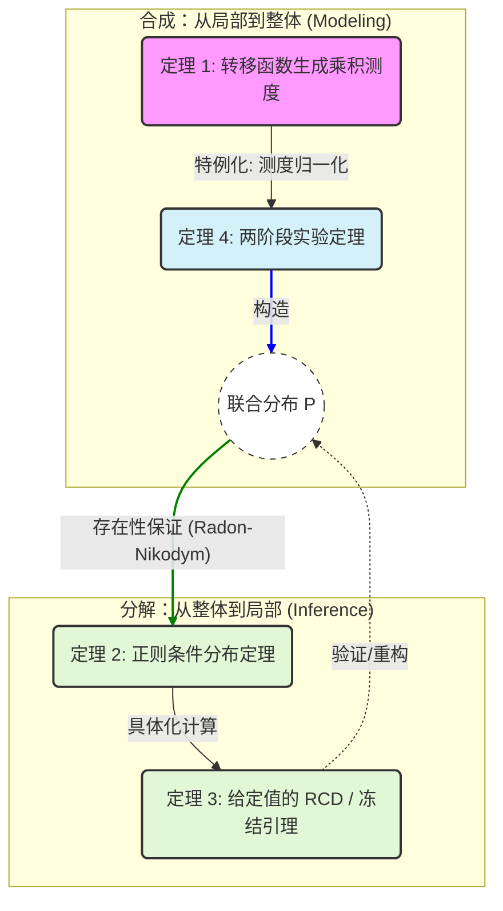

从本章开始，我们将不再面向**普通的测度空间**，而是针对**概率测度空间**来进行讨论。这是因为，本章中出现的很多内容，只有在概率测度空间中才会出现和成立。**概率测度最重要的一个特点是有限**，这带来了很多在普通测度空间中不会出现的性质。

其中，最重要的两个概念便是**独立**和**条件概率**，并且两者之间还存在这些密切的联系。今天，我们将从测度论的角度对两者及其相关的概念重新进行严谨的定义，这使得我们得以以现代数学的视角来审视概率和统计中的诸多概念。**也正是因为引入了条件期望、独立等概念之后，概率论从而与测度论产生分别**。

# 初等概率论中的定义

在深入测度论概率之前，回顾初等概率论的构建方式至关重要。初等概率论通常依赖于直观的**几何概型**或**离散模型**，虽然在解决实际计算问题时行之有效，但在面对**连续性**、**无限维空间**以及**零概率事件**时，其逻辑链条显得脆弱且不自洽。

## 定义逻辑链条

初等概率论的定义体系呈现出一种“由具体到抽象，由离散/绝对连续到混合”的**分治策略**。其核心逻辑构建过程如下：

**第一阶段：基石构建（事件与概率）**
逻辑起点是样本空间 $\Omega$。对于离散情况，定义概率为样本点权重的求和；对于几何概型，定义为长度、面积或体积的比值。在此基础上，建立了公理化体系的雏形（非负性、归一性、有限或可列可加性）。

**第二阶段：核心链接（条件概率）**
这是初等概率论中最关键的转折点。根据直觉，定义了事件 $B$ 发生条件下 $A$ 发生的概率。这成为了后续定义独立性和条件分布的基础。公式定义为：若 $P(B) > 0$，则 $P(A|B) = \frac{P(AB)}{P(B)}$。

**第三阶段：独立性（Independence）**
利用条件概率的直观意义（$B$ 的发生不影响 $A$），或者直接通过乘积法则定义独立性。定义为：若 $P(AB) = P(A)P(B)$，则称事件独立。

**第四阶段：随机变量及其分布**
将随机变量 $X$ 定义为从 $\Omega$ 到 $\mathbb{R}$ 的映射。但在处理分布时，初等概率论**被迫**分裂为两个平行的世界：
- 第一是**离散型**，使用分布列（PMF）描述。
- 第二是**连续型**，使用概率密度函数（PDF）描述，通过黎曼积分计算概率。

**第五阶段：条件分布与条件期望**
- 关于条件分布：对于离散型，利用条件概率公式直接计算；对于连续型，类比离散型，通过联合密度与边缘密度的比值 $f_{Y|X}(y|x) = \frac{f(x,y)}{f_X(x)}$ 来定义。
- 关于条件期望：将其定义为一个数值计算过程。即在求得条件分布后，对该分布进行加权求和（或积分）。

::: {.callout-note title="Abstract: 逻辑链总结"}
事件与概率 $\xrightarrow{P(B)>0}$ **条件概率** $\xrightarrow{定义}$ **独立性**
$\downarrow$
随机变量（离散/连续分裂） $\xrightarrow{类比推广}$ **条件分布**（密度比值） $\xrightarrow{积分/求和}$ **条件期望**

:::
## 逻辑漏洞

上述逻辑链在处理复杂的数学对象时存在本质的缺陷。

**第一：连续型随机变量会面临分母为 0 的问题。**

在初等定义 $P(A|B) = \frac{P(AB)}{P(B)}$ 中，必须要求 $P(B) > 0$。然而，在处理连续型随机变量时，这一限制导致了严重的逻辑断裂。对于连续型随机变量 $X$，其在任意单点 $x$ 处取值的概率均为 0，即 $P(X=x) = 0$。按照初等定义，条件概率 $P(A | X=x)$ 将变成无意义的 $\frac{0}{0}$。

虽然初等教材通过引入密度函数 $f_{Y|X}(y|x) = \frac{f(x,y)}{f_X(x)}$ “修补”了这个问题，但这实际上引入了一个未经严格证明的假设：**我们默认了可以通过极限过程 $\lim_{\epsilon \to 0} P(A | x < X < x+\epsilon)$ 来逼近单点情况。** 这就引出了著名的 **Borel-Kolmogorov 悖论**：如果我们在球面上选择不同的坐标系（例如经纬度 vs 极坐标）去逼近同一个“大圆”（零测集），我们会得到完全不同的条件概率分布。这说明，**在没有测度论关于 $\sigma$- 代数（信息流）的严格约束下，简单地对“零概率事件”进行条件化是多义且不适定的**。

**第二：初等概率论缺乏统一的积分工具。**

求期望时，离散型用求和 $\sum$，连续型用黎曼积分 $\int$。这导致在处理**混合型分布**（例如一个随机变量有 0.5 的概率是 0，有 0.5 的概率服从 $U[0,1]$）时，公式变得极其繁琐且不统一。更严重的是，它无法处理奇异分布（Singular Distribution），例如基于康托尔集（Cantor Set）构造的分布，这类分布既没有密度函数，也不是离散的，初等概率论对此束手无策。

**第三：条件期望的错误认识。**

在初等概率论中，条件期望 $E[Y|X=x]$ 被视为一个**实数**（依赖于参数 $x$）。逻辑链条是：先算出 $f(y|x)$ 这个函数，再积分得到一个数。这种视角掩盖了条件期望的本质——**随机变量**。在测度论中，条件期望 $E[Y|\mathcal{G}]$ 是全空间上的一个函数（随机变量），它是 $Y$ 在子 $\sigma$- 代数 $\mathcal{G}$ 上的**正交投影**。初等概率论的视角导致学生很难理解“**条件期望本身也是随机的**”以及“**平滑性质（Smoothing properties）**”等高级性质。

**第四，独立性的局限性。**

初等概率论通常只处理**有限个**事件或随机变量的独立性。当涉及到**无限序列**的独立性（例如强大的数定律、0-1 律）时，初等定义难以通过简单的乘积法则来严格描述“尾事件”或 $\sigma$- 代数的独立性。

::: {.callout-note title="核心痛点"}
初等概率论最大的软肋在于：**它试图用“静态的数值”去描述“动态的随机关系”，并且在处理 $P(B)=0$ 的情况时缺乏严谨的极限基础。** 测度论引入 Radon-Nikodym 导数正是为了解决 $0/0$ 的定义问题，并将离散与连续统一在 Lebesgue 积分的框架下。
**Info: 最佳实践**
在学习过程中，不要抛弃初等概率论的直觉，因为它是测度论中“正则条件概率”在平滑流形上的特例。
**建议的学习心法：** 将初等概率中的 $P(A|X=x)$ 视为测度论中条件期望 $E[\mathbf{1}_A | \sigma(X)]$ 这个随机变量 $Z(\omega)$ 在 $X(\omega)=x$ 时的取值 $g(x)$。始终记住，测度论不是推翻了初等概率，而是为那个“除以零”的非法操作提供了合法化的上下文（通过微分和测度的概念）。

:::
# 独立

独立是与“条件”相对的概念，也是概率论的中心概念之一。独立的学习是比较容易的，因为相比于条件期望和条件概率，其与初等概率论中的独立概念差别不大，只是通过 $\sigma$-field 来统一了一下，并推广到无穷序列上。

## 定义

::: {#def-15-independence-and-conditional-expectation-1}

## 独立

设 $\{ A_{t},t\in T \}$ 是概率空间 $(X,\mathcal{F},P)$ 上的事件系（可测集合系），若对于任何的正整数 $n$ 和任何 $\{ t_{1},\dots,t_{n} \}\subset T$ 有

$$
P\left( \bigcap_{k=1}^{n}A_{t_{k}} \right)=\prod\limits_{k=1}^{n}P(A_{t_{k}}),
$$

则称 $\{ A_{t},t\in T \}$ 是**相互独立**的。

设 $\{ \mathcal{E}_{t}\subset \mathcal{F},t\in T \}$ 是由事件系组成的族，若对每个 $t\in T$ 任取一个 $A_{t}\in\mathcal{E}_{t}$，事件系 $\{ A_{t},t\in T \}$ 是相互独立的，则称 $\{ \mathcal{E}_{t}\subset \mathcal{F},t\in T \}$ 是**相互独立**的。

设 $\{ f_{t},t\in T \}$ 是随机变量族，若 $\{ \sigma(f_{t}),t\in T \}$ 是相互独立的，则称 $\{ f_{t},t\in T \}$ 是**相互独立**的。

:::
这又是**由有限来定义无限**的一个典型案例。**当 $T$ 是有限集时，其独立的定义与初等概率论中一致**。其实, 这个定义是非常符合我们对于独立的认知的。我们可以举几个例子来说明一下。

比如, 如果存在一个 (非平凡的) 随机变量 $X$, 另一个随机变量 $Y=f(X)$ 是通过 $X$ 来生成的, 则根据我们的直觉, 两者一定不独立. 我们可以通过定义来验证：若存在某个 $B\in\sigma(Y)$, 并且 $0<P(B)<1$, 同时我们可以知道 $B\in\sigma(X)$, 则有

$$
P(B\cap B)=P(B)\neq P(B)\cdot P(B).
$$

我们可以再延伸一下, 如果还存在一个随机变量 $Z$, 有 $Y=f(X,Z)$, 则我们知道 $\sigma(Y)=\sigma(\sigma(X)\cup\sigma(Z))\supset\sigma(X)$. 则对于某个 $B\in\sigma(X)$, 并且 $0<P(B)<1$, 我们有

$$
P(B\cap B)=P(B)\neq P(B)\cdot P(B).
$$

也就是说, 这两种情况都不是独立的. 我们将其总结为一个推论, 以后遇到这样的情况就可以直接进行判断了.

::: {#prp-15-independence-and-conditional-expectation-2}

## 直接函数关系不独立

如果存在某个随机向量 $X$, 其**满足 $\exists B\in\sigma(X),0<P(B)<1$**, 若存在一个可测函数 $f$ 和另外的随机向量 $Z$, 使得

$$
Y=f(X,Z),
$$

则 $X$ 和 $Y$ 一定不独立.

:::
## 判定条件

我们可以看到，独立的定义涉及到集合系。特别当集合系是非常复杂时（比如是一个 $\sigma$ -field）通常是非常难以处理的。但是，通过下面的定理，我们可以稍微让独立的验证简单一些。

::: {#thm-independent-pi-class}

## $\pi$ -class 的独立

$\{ \mathcal{E}_{t},t\in T \}$ 是概率空间 $(X,\mathcal{F},P)$ 上相互独立的事件系，假设每个 $\mathcal{E}_{t}$ 都是 $\pi$ -class，则 $\{ \sigma(\mathcal{E}_{t}),t\in T \}$ 是相互独立的。

:::

::: {.proof}
首先，针对 $\{ A_{t_{k}}\in\mathcal{E}_{t_{k}},k=2,\dots,n \}$ 我们去构造一个集合系

$$
\mathcal{T}_{1}=\left\{  A\in\mathcal{F}|
P\left( A\cap\left( \bigcap_{k=2}^{n}A_{t_{k}} \right) \right)
=P(A)\prod\limits_{k=2}^{n}P(A_{t_{k}})\right\}.
$$

我们可以证明：
(1) $\mathcal{T}_{1}$ 是一个 $\lambda$ -class，这是因为

$$
\begin{align}
P\left( X\cap\left( \bigcap_{k=2}^{n}A_{t_{k}} \right) \right)
=P\left( \bigcap_{k=2}^{n}A_{t_{k}} \right)
=\prod\limits_{k=2}^{n}P(A_{t_{k}})
=P(X)\prod\limits_{k=2}^{n}P(A_{t_{k}}),
\end{align}
$$

所以 $X \in \mathcal{T}_{1}$。

$$
\begin{align}
P\left( (B\setminus A)\cap\left( \bigcap_{k=2}^{n}A_{t_{k}} \right) \right)
&=P\left(B \cap \left( \bigcap_{k=2}^{n}A_{t_{k}} \right)\right)
-P\left(A \cap \left( \bigcap_{k=2}^{n}A_{t_{k}} \right)\right) \\
&=(P(B)-P(A))\prod\limits_{k=2}^{n}P(A_{t_{k}}) \\
&=P(A\setminus A)\prod\limits_{k=2}^{n}P(A_{t_{k}}),
\end{align}
$$

所以，$B,A\in \mathcal{T}_{1},B\supset A\implies B\setminus A\in \mathcal{T}_{1}$。

$$
\begin{align}
P\left( \bigcup_{i=1}^{\infty}B_{i}\cap \left( \bigcap_{k=2}^{n}A_{t_{k}} \right) \right)
&=P\left( \bigcup_{i=1}^{\infty}\left( B_{i}\cap\left( \bigcap_{k=2}^{n}A_{t_{k}} \right) \right) \right) \\
&=\lim_{ i \to \infty } P\left( B_{i}\cap\left( \bigcap_{k=2}^{n}A_{t_{k}} \right) \right) \\
&=\lim_{ i \to \infty } P(B_{i})\prod\limits_{k=2}^{n}P(A_{t_{k}}) \\
&=P\left( \bigcup_{i=1}^{\infty}B_{i} \right)\prod\limits_{k=2}^{n}P(A_{t_{k}}),
\end{align}
$$

所以，$B_{i}\in\mathcal{T}_{1},B_{i}\uparrow B\implies B\in\mathcal{T}_{1}$。

又因为 $\mathcal{T}_{1}\supset\mathcal{E}_{t_{1}}$，$\mathcal{E}_{t_{1}}$ 是 $\pi$ -class，根据 @thm-sigma-field-generation，可知 $\mathcal{T}_{1}\supset\sigma(\mathcal{E}_{t_{1}})$，这意味着 $\forall A_{t_{1}}\in\sigma(\mathcal{E}_{t_{1}})$ 并且 $\forall k=2,\dots,n,A_{t_{k}}\in\mathcal{E}_{t_{k}}$，满足

$$
P\left( \bigcap_{k=1}^{n}A_{t_{k}}\right)=
\prod\limits_{k=1}^{n}P(A_{t_{k}}).
$$

(2) 对 $A_{t_{1}}\in\sigma(\mathcal{E}_{t_{1}})$ 和 $\{ A_{t_{k}}\in\mathcal{E}_{t_{k}},k=3,\dots,n \}$，令

$$
\mathcal{T}_{2}=\left\{  A\in\mathcal{F}|P\left( A\cap\left( \bigcap_{k\neq 2}^{} A_{t_{k}}\right) \right)=P(A)\prod\limits_{k\neq 2}^{} P(A_{t_{k}}) \right\},
$$

利用上一步的方法，可以证明 $\mathcal{T}_{2}\supset\sigma(\mathcal{E}_{t_{2}})$。

将以上步骤继续下去，进行 $n$ 步，进而完成我们的证明。
:::
根据以上内容，我们还可以得到下面的一个推论：**相互独立的很多 $\sigma$ 域被分割后，把分割的每一部分生成一个单独的 $\sigma$ 域，这些 $\sigma$ 域之间依然独立。**

::: {#cor-independent-seperate}

## 子 $\sigma$ 域的分割

若概率空间 $(X,\mathcal{F},P)$ 上的子 $\sigma$ 域族 $\{ \mathcal{F}_{t},t\in T \}$ 相互独立，则对于 $T$ 的任何一个分割 $T_{d},d\in D$，

$$
\left\{  \sigma\left( \bigcup_{t\in T_{d}}^{}\mathcal{F}_{t} \right),d\in D  \right\}
$$

是相互独立的。

:::

::: {.proof}
注意到，对于每个 $d\in D$，有

$$
\mathcal{T}_{d}=\bigcup_{n=1}^{\infty}\left\{  
\bigcap_{k=1}^{n}A_{k}|A_{k}\in\mathcal{F}_{t_{k}},\forall t_{k}\in T_{d},k=1,\dots,n
 \right\}.
$$

以上这个集合系中的元素是：从 $T_{d}$ 中任取有限个指标，找到这些指标对应的有限个 $\mathcal{F}_{t}$，从每一个中取出一个集合 $A_{t}$，然后将这些集合求交集。

我们可以证明：
(1) $\mathcal{T}_{d}\supset \bigcup_{t\in T_{d}}^{}\mathcal{F}_{t}$；
(2) $\mathcal{T}_{d}$ 是将 $\mathcal{F}_{t}$ 中的元素进行有限次交运算得到，所以一定有 $\mathcal{T}_{d}\subset\sigma\left( \bigcup_{t\in T_{d}}^{}\mathcal{F}_{t} \right)$;
以上两者意味着

$$
\sigma(\mathcal{T}_{d})=\sigma\left( \bigcup_{t\in T_{d}}^{}\mathcal{F}_{t} \right).
$$

此外，我们还能够证明 $\mathcal{T}_{d}$ 是一个 $\pi$ -class。直接利用 @thm-independent-pi-class，得到我们的结论。
:::
根据 @thm-independent-seperate，再结合随机变量独立的定义，我们有以下常用的一个推论：

::: {#prp-composit-map-indepent}

## Proposition

假设随机变量集合 $\{ f_{n},n=1,2,\dots \}$ 相互独立，则对任何一个分割 $T_{i}={i_{1},i_{2},\dots},i=1,2,\dots,$，有

$$
\{ g_{i}( f_{i_{1}},f_{i_{2}},\dots ),i=1,2,\dots \}
$$

相互独立，其中 $g_{i}$ 是多维 Borel 可测函数。

:::

::: {.proof}
首先，根据定义，对于相互独立的事件系 $\{ \mathcal{F}_{t},t\in T \}$，其子事件系也肯定是独立的。

因为 $\{ f_{n},n=1,2,\dots \}$ 是独立的，根据 @thm-independent-seperate，其任意分割所组成的随机向量（或序列）也是独立的，因为

$$
\sigma((f_{1},f_{2},\dots))=\sigma\left( \bigcup_{i=1}^{\infty}\sigma(f_{i}) \right),
$$

@thm-vector-measurable 的证明过程中有该式。而 $\sigma(g(f_{1},\dots))$ 得到的是 $\sigma((f_{1},\dots))$ 的子集，因此自然也是独立的。
:::
以上推论告诉我们，**对于相互独立的随机变量，将其任意分割成多个组，然后对每个组进行任意的变换得到的新的随机变量，依然是相互独立的。**

@thm-independent-pi-class 提示我们，对于随机变量的独立性的判定，可以仅通过分布函数 $F$ 进行（这里涉及到 @def-n-dist-rv 和 @def-margin-dist 之间的关系）。也就是下面的一系列等价条件：

::: {#thm-indepent-distribution}

## 分布函数独立

概率空间 $(X,\mathcal{F},P)$ 上的随机变量族 $\{ f_{t},t\in T \}$，以 $F_{t},t\in T$ 表示对应的分布函数族，则下列命题**等价**：
(1) $\{ f_{t},t\in T \}$ 相互独立；

(2) $\forall n\in\mathbb{N}^{+}$ 和 $t_{1},\dots,t_{n}\in T$，$\forall A_{i} \in\mathcal{B},i=1,\dots,n$，有

$$
P(f_{t_{1}},\dots,f_{t_{n}})^{-1}\left( \prod\limits_{k=1}^{n}A_{k} \right)=\prod\limits_{k=1}^{n}Pf^{-1}_{t_{k}}(A_{k}),
$$

再根据 @thm-fubini-plus 可知，$P(f_{t_{1}}, \dots,f_{t_{n}})^{-1}$ 就是 $\{ Pf_{t_{k}}^{-1},k=1,\dots,n \}$ 的乘积测度；

(3) 用 $F_{t_{1},\dots,t_{n}}$ 记 $f_{t_{1}},\dots,f_{t_{n}}$ 的联合分布函数，$\forall n\in\mathbb{N}^{+}$ 和 $t_{1},\dots,t_{n}\in T$，则对 $x_{1},\dots,x_{n}\in\mathbb{R}$ 有

$$
F_{t_{1},\dots,t_{n}}(x_{1},\dots,x_{n})=\prod\limits_{k=1}^{n}F_{t_{k}}(x_{k});
$$

(4) $\forall n\in\mathbb{N}^{+}$ 和 $t_{1},\dots,t_{n}\in T$，对 $(\mathbb{R}^{n},\mathcal{B}^{n})$ 上的可测函数 $g$，只要下式一端有意义，另一端也有意义并且相等：

$$
\mathbb{E}g(f_{t_{1}},\dots,f_{t_{n}})=
\int _{-\infty}^{\infty}dF_{t_{1}}(x_{1})\cdots
\int _{-\infty}^{\infty}g(x_{1},\dots,x_{n})dF_{t_{n}}(x_{n}). 
$$

:::

::: {.proof}
(1) -> (2)：$\forall A_{i} \in\mathcal{B},i=1,\dots,n$，有

$$
P(f_{t_{1}},\dots,f_{t_{n}})^{-1}\left( \prod\limits_{i=1}^{n}A_{i} \right)
=P\left( \bigcap_{i=1}^{n}f_{t_{i}}^{-1}(A_{i}) \right)
=\prod\limits_{i=1}^{n}Pf^{-1}_{t_{i}}(A_{i}),
$$

其中第二个等号来自于 $\{ f_{t} \}$ 的相互独立性。
(2)->(3)：将上面的 $A_{i}$ 替换为 $(-\infty,x_{i}]$ 即可得到 (3)。
(3)->(2)->(4)：注意到

$$
\mathbb{E}g(f_{t_{1}},\dots f_{t_{n}})=\int _{\mathbb{R}}g(x_{1},\dots,x_{n})d(Pf^{-1}),
$$

其中假设 $f=(f_{t_{1}},\dots,f_{t_{n}})$。若我们能够证明

$$
\forall A_{i}\in\mathcal{B},\quad
Pf^{-1}\left( \prod\limits_{i=1}^{n}A_{i} \right)
=\prod\limits_{i=1}^{n}Pf_{t_{k}}^{-1}(A_{i}),
$$

也就是说 $Pf^{-1}$ 是 $\{ Pf_{t_{k}}^{-1} \}$ 的乘积测度，则直接使用 @thm-fubini-plus 就可以得到我们的结论。而这实际上是 (2) 的结论，也就是说我们**现在需要证明 (3)->(2)**。(3) 的条件实际上是在说 $Pf^{-1}$ 和 $\prod\limits_{k=1}^{n}Pf_{t_{k}}^{-1}$ 在 $\pi$ -class $\{ (-\infty, (x_{1},\dots,x_{n})] \}$ 是相同的，容易证明两者在 [高维区间](13-finite-product-spaces.qmd#95c889) 构成的半环 $\mathcal{L}_{\mathbb{R}^{n}}=\{ ((a_{1},\dots,a_{n}), (b_{1},\dots,b_{n})] \}$ 上也相等，直接根据 1.1 测度空间和概率空间 (`1.1 测度空间和概率空间#^3c25cf`)，可以知道两者在 $\mathcal{B}^{n}=\sigma(\mathcal{L}_{\mathbb{R}^{n}})$ 上也相等。

(4)->(1)：$\forall A_{k} \in\mathcal{B},k=1,\dots,n$，令

$$
g=I_{\prod\limits_{k=1}^{n}A_{k}}=\prod\limits_{k=1}^{n}I_{A_{k}},
$$

则有

$$
\begin{align}
P\left( \bigcap_{k=1}^{n}f_{t_{k}}^{-1}(A_{k}) \right) &=
P(f_{t_{1}},\dots, f_{t_{n}})^{-1}\left( \prod\limits_{k=1}^{n}A_{k} \right) \\
&=\mathbb{E}g(f_{t_{1}},\dots,f_{t_{n}}) \\
&=\int _{-\infty}^{\infty}dF_{t_{1}}(x_{1})\cdots
\int _{-\infty}^{\infty}g(x_{1},\dots,x_{n})dF_{t_{n}}(x_{n}) \\
&=\prod\limits_{k=1}^{n}Pf^{-1}_{t_{k}}(A_{k}) \\
&=\prod\limits_{k=1}^{n}P(f^{-1}_{t_{k}}(A_{k})),
\end{align}
$$

这也就是证明了 $\{ f_{t},t\in T \}$ 的独立性。
:::

根据以上内容我们还可以证明独立随机变量的概率密度的关系.

::: {#prp-indepent-denisty}

## 带有密度的独立性条件

若随机向量 $(X_{1},\dots,X_{k})$ 相对于乘积测度 $v_{1}\times \dots \times v_{k}$ 有联合概率密度 $f(x_{1},\dots,x_{k})$, 并且每个分量的边缘概率密度是分别是 $f_{1},\dots,f_{k}$, 则 $X_{1},\dots,X_{k}$ 独立**当且仅当**

$$
f(x_{1},\dots,x_{k})=f_{1}(x_{1})\dots f(x_{k}),\quad
\forall(x_{1},\dots,x_{k})\in\mathbb{R}^{k}.
$$

:::

::: {.proof}
根据 @thm-indepent-distribution (2) ,独立当且仅当 $P(X_{1},\dots,X_{k})^{-1}$ 是 $PX^{-1}_{1},\dots,PX^{-1}_{k}$ 的乘积测度。直接利用 @prp-rn (4) 的推广版本, 可以直接得到上述命题

$$
f(x_{1},\dots,x_{k})=f_{1}(x_{1})\dots f(x_{k}).
$$

利用 @thm-indepent-distribution (4) 则可以推出反面, 即当上式成立的时候, 有

$$
\begin{align}
\mathbb{E}g(X_{t_{1}},\dots,X_{t_{n}}) &=
\int g(x_{t_{1}},\dots,x_{t_{n}})f(x_{t_{1}},\dots,x_{t_{n}}) \, d(v_{t_{n}}\times\dots \times v_{t_{n}})  \\
&=\int g(x_{t_{1}},\dots,x_{t_{n}})f(x_{t_{1}})\dots f(x_{t_{n}}) \, d(v_{t_{n}}\times\dots \times v_{t_{n}})  \\
&=\int f(x_{t_{1}})dv_{t_{1}}\dots\int g(x_{t_{1}},\dots,x_{t_{n}})f(x_{t_{n}})dv_{t_{n}} \\
&=\int dF_{t_{1}}\dots \int g(x_{t_{1}},\dots,x_{t_{n}})dF_{t_{n}},
\end{align}
$$

其中第一行是积分的定义，第二行来自于定理的条件，第三行来自 @thm-fubini-plus, 第四行来自于积分的分布函数表示形式。

:::

::: {.callout-note title="独立同分布"}
我们在统计中总是提到一个概念：独立同分布，我一直有一个疑问：**同分布后独立还成立吗？** 答案自然是肯定的。这里，我们需要明确一个概念，**同分布**是 $Pf^{-1}=Pg^{-1}$，而不是 $f=g$。

若 $f=g$，且 $0<P(f^{-1}(A))<1$ 则

$$
f^{-1}(A)=g^{-1}(A)\implies P (f^{-1}(A)\cap g^{-1}(A))
=P(f^{-1}(A)) \neq P(f^{-1}(A))^{2},
$$

显然，此时**独立**在大部分情况下都是不成立的。

若是 $Pf^{-1}=Pg^{-1}$，则独立是有可能成立的。比如，在 Borel 乘积测度空间中 $(\mathbb{R}^{n},\mathcal{B}^{n},P^{n})$，对于其上所有的 [投影](13-finite-product-spaces.qmd#1f2abf) $\pi_{i}$ ，此时，容易证明其满足 @thm-indepent-distribution (2) ，因此满足独立的定义。而其分布函数是 $P^{n}\pi_{k}^{-1}=P$ 是一样的。

从 @thm-indepent-distribution (2) 和 (3) 可以知道，独立对分布函数的限制在于**边缘分布函数与联合分布函数之间的乘积关系**；同分布则要求**边缘分布函数之间要相同**。这两个要求是可以共存的。

:::
## 性质

接下来，我们来证明**随机变量独立**所带来的一些性质。

::: {#lem-independent}

## Lemma

设随机变量 $f$ 的积分存在。若 $\sigma(f)$ 与集合系 $\mathcal{E}\subset \mathcal{F}$ 独立（也可以说成 $f$ 与 $\mathcal{E}$ 独立），则对任何 $A\in\mathcal{E}$，有

$$
\mathbb{E}(fI_{A})=\mathbb{E}f\mathbb{E}I_{A}=\mathbb{E}fP(A)
$$

:::

::: {.proof}
使用典型方法。首先假设 $f=\sum\limits_{k=1}^{n}a_{k}I_{A_{k}}$，则

$$
\mathbb{E}\left( I_{A}\sum\limits_{k=1}^{n}a_{k}I_{A_{k}} \right)
=\sum\limits_{k=1}^{n}a_{k}P(A\cap A_{k})
=P(A)\sum\limits_{k=1}^{n}a_{k}P(A_{k})
=P(A)\mathbb{E}f.
$$

然后假设 $f\geq 0$，则可以找到简单函数 $f_{n}\uparrow f$，则有

$$
\mathbb{E}(fI_{A})=\mathbb{E}(I_{A}\lim_{ n \to \infty } f_{n})
=\lim_{ n \to \infty } \mathbb{E}(I_{A}f_{n})
=I_{A}\lim_{ n \to \infty } \mathbb{E}f_{n}
=I_{A}\mathbb{E}\lim_{ n \to \infty } f_{n}=I_{A}\mathbb{E}f.
$$

对于一般的积分存在的 $f=f^{+}-f^{-}$，则有

$$
\mathbb{E}(fI_{A})=\mathbb{E}(f^{+}I_{A})-\mathbb{E}(f^{-}I_{A})
=I_{A}(\mathbb{E}f^{+}-\mathbb{E}f^{-})=I_{A}\mathbb{E}f.
$$

:::

根据以上的引理，继续使用典型方法，我们可以得到：

::: {#thm-15-independence-and-conditional-expectation-9}

## 独立随机变量的期望

若随机变量 $f,g$ 的积分存在，并且两者相互独立，则有

$$
\mathbb{E}(fg)=\mathbb{E}f\mathbb{E}g.
$$

继续利用 @prp-composit-map-indepent，我们有

$$
\mathbb{E}[h_{1}(f)h_{2}(g)]=\mathbb{E}[h_{1}(f)]\mathbb{E}[h_{2}(g)].
$$

:::
# 条件期望和条件概率 {#15-independence-and-conditional-expectation-条件期望和条件概率}

条件概率是概率论中最重要的概念之一，在初等概率论中，我们无法严谨地去定义它。现在我们学习了 [RN导数](11-radon-nikodym-derivative.qmd) 后，可以更好的定义了。

## 定义

::: {#def-condi-expectation}

## 条件期望和条件概率

设 $f$ 是概率空间 $(X,\mathcal{F},P)$ 上的**积分存在**的随机变量，称 $\mathbb{E}(f|\mathcal{G})$ 为 $f$ 关于 $\mathcal{F}$ 的子 $\sigma$ 域 $\mathcal{G}$ 的**条件期望**，如果
(1) $\mathbb{E}(f|\mathcal{G})$ 是 $(X,\mathcal{G},P)$ 上**积分存在**的可测函数；
(2) 对任意 $A\in\mathcal{G}$，满足

$$
\int _{A}\mathbb{E}(f|\mathcal{G})dP=\int _{A}fdP.
$$

$P(A|\mathcal{G}):=\mathbb{E}(I_{A}|\mathcal{G})$ 称为事件 $A\in\mathcal{F}$ 关于子 $\sigma$ 域 $\mathcal{G}$ 的**条件概率**。如果 $g$ 是 $(X,\mathcal{G},P)\to(Y,\mathcal{T})$ 的随机元，则称 $\mathbb{E}(f|g):=\mathbb{E}(f|\sigma(g))$ 为随机变量 $f$ 关于 $g$ 的**条件期望**，称 $P(A|g):=P(A|\sigma(g))$ 是事件 $A$ 关于 $g$ 的**条件概率**。

:::

这里我们对以上的定义进行一些讨论：
- 条件概率或期望仅针对**积分存在的随机变量**。但是我们需要清楚，积分存在也包括积分是无穷大的情况，所以其实这些随机变量还是非常多的。
- 条件概率或条件期望都是一个**随机变量**，是子 $\sigma$ 空间 $(X,\mathcal{G},P)$ 上的随机变量。
- 这个子 $\sigma$ 空间是 $\mathcal{F}$ 的子集，但是这只能得到 $\mathcal{F}\supset\mathcal{G},\mathcal{F}\supset\sigma(f)$，并不能得到 $\sigma(f)\supset\mathcal{G}$。比如，对于 $\mathbb{E}(f|g)$，并不需要要求 $\sigma(g)\subset\sigma(f)$，只需要 $\sigma(g),\sigma(f)\subset \mathcal{F}$ 即可。
- 我们是先定义了条件期望，然后用条件期望来定义条件概率。
- @thm-rn 保证了条件期望的存在性。
- @thm-rn 只能保证条件期望在 **a.e.（a.s.）下唯一**，所以我们下面进行相关讨论的时候，也是 a.s.的，只是为了方便我们不会每次都加。**这个 a.s.是相对于 $\mathcal{G}$ 上的零测集而言的**。

## 给定值的条件期望

注意到，以上我们定义的条件期望 $\mathbb{E}(f|g)$，是一个在 $(X,\sigma(g),P)$ 上的随机变量。然而，$X$ 是一个非常“自由”的集合，其中的元素可能是非常抽象的。我们更加关注的是当 $g=y$ 也就是其取某个值时的条件期望，这相当于变换一下条件中的 $\sigma$ -field。因此，我们有下面的定义：

::: {#def-condi-expectation-given}

## 给定值的条件期望

假设 $g$ 是一个 $(X,\sigma(g))\to(Y,\mathcal{H})$ 的随机元，$\mathbb{E}(f|g)$ 是一个 $(X,\sigma(g))\to(\mathbb{R},\mathcal{B})$ (或 $(\mathbb{R}^{n},\mathcal{B}^{n})$) 的随机变量。利用 @thm-composite-func，则存在一个 $h:(Y,\mathcal{H})\to(\mathbb{R},\mathcal{B})$ (或 $(\mathbb{R}^{n},\mathcal{B}^{n})$) 使得

$$
\mathbb{E}(f|g)=h\circ g,
$$

（这等价于

$$
\forall A\in\mathcal{H},\quad
\int _{g^{-1}(A)}f \, dP
=\int _{g^{-1}(A)}h\circ g \, dP=\int _{A}h \, d(Pg^{-1}), 
$$

所以，也可以使用这个条件来定义）
我们称 $h$ 是**给定值的 $f$ 的条件期望**，对于 $y\in Y$，记作 $\mathbb{E}(f|g=y)$。当 $f=I_{A},A\in\mathcal{F}$ 时，称为给定值的条件概率，记作 $P(A|g=y)$。（见下面）可以证明，$h$ 相对于 $Pg^{-1}$ 是 a.e. 唯一确定的。

:::

一般来说，$(Y,\mathcal{H})=(\mathbb{R},\mathcal{B})$ (或 $(\mathbb{R}^{n},\mathcal{B}^{n})$)，此时 $\mathbb{E}(f|g=y)$ 就是一个**定义域在 $\mathbb{R}$ 、值域在 $\mathbb{R}$ 上的实值函数**。使用给定值的条件期望，一个优势在于**可以将积分的空间进行变换，可以换到 Borel 测度空间中**。进而，令 $\mu(A)=\int _{g^{-1}(A)}f \, dP$。则

$$
Pg^{-1}(A)=0\implies
P(g^{-1}(A))=0\implies
\mu(A)=0,
$$

这意味着 $\mu \ll Pg^{-1}$，进而 $h$ 可以被看做 $\frac{d\mu}{d(Pg^{-1})}$，由 @thm-rn 可知 $h$ 是 a.e. w.r.t $Pg^{-1}$ 唯一确定的。

## 与初等概率论的联系

这里我们利用一个例子来讨论一下这里的定义和初等概率论中的条件期望、条件概率之间的关系。

::: {#exm-15-independence-and-conditional-expectation-12}

## Example

设 $B\in\mathcal{F}$ 而 $\mathcal{G}=\{ \emptyset,B,B^{c},X \}$，求事件 $A\in\mathcal{F}$ 关于 $\mathcal{G}$ 的条件概率 $P(A|\mathcal{G})$。

:::
::: {.proof}
首先，对于 $\mathcal{G}$ 可测的函数必然有以下的形式：

$$
aI_{B}+bI_{B^{c}},\quad
a,b\in \bar{\mathbb{R}}.
$$

（否则，该函数必然存在某个非 $B,B^{c}$ 集合，在其上取相同的值。这样必然导致无法对于 $\mathcal{G}$ 可测）
我们假设 $P(A|\mathcal{G})=aI_{B}+bI_{B^{c}}$，利用条件期望的积分关系，得到

$$
\begin{align}
&\int _{B}(aI_{B}+bI_{B^{c}}) \, dP=\int _{B}I_{A} \, dP
\implies
aP(B)=P(A\cap B), \\
&\int _{B^{c}}(aI_{B}+bI_{B^{c}}) \, dP=\int _{B^{c}}I_{A} \, dP
\implies
bP(B^{c})=P(A\cap B^{c}).
\end{align}
$$

进而，我们有

$$
a=\left\{\begin{matrix}
P(A\cap B) / P(B),\quad & P(B)>0 \\
\alpha,&P(B)=0,
\end{matrix}\right.\qquad
b = \left\{\begin{matrix}
P(A\cap B^{c}) / P(B^{c}),\quad & P(B^{c})>0 \\
\alpha,&P(B^{c})=0,
\end{matrix}\right.
$$

其中 $\alpha$ 是 $(0,1)$ 中的任意一个数。此时，其对应的那个集合是零测集，所以这样定义让 $P(A|\mathcal{G})$ 是 a.s.确定的。这样，

$$
x \in B \implies P(A|\mathcal{G})(x)=a,\quad
x \not\in B \implies P(A|\mathcal{G})(x)=b.
$$

基于此，我们可以定义一个随机变量 $g=I_{B}$，显然 $g^{-1}(\mathcal{B})=\mathcal{G}$，所以我们有

$$
P(A|g)=P(A|\mathcal{G})=aI_{b}+bI_{B^{c}}.
$$

根据 @def-condi-expectation-given，存在 $h(y): \mathbb{R}\to \mathbb{R}$，令

$$
P(A|g)=h \circ g,
$$

显然，容易知道

$$
h(y)=\left\{
\begin{matrix}
a,\quad &y=1,\\
b,\quad &y=0, \\
0,\quad &\text{otherwise}.
\end{matrix}
\right.
$$

我们将其表示为如下形式：

$$
P(A|I_{B}=y)=P(A|g=y)=h(y).
$$

显然，当 $P(B),P(B^{c})>0$ 时，$P(A|I_{B}=1)$ 其实就是 $P(A事件发生|B事件发生)$，$P(A|I_{B}=0)$ 其实就是 $P(A事件发生|B事件不发生)$。

我们提供的条件期望与初等概率论中的相关内容保持了一致。
:::

## 性质

接下来，我们将叙述一些关于条件期望的性质，这些性质在我们后续的研究中非常重要。

::: {#thm-prop-condi-expectation}

## 条件期望的性质

设 $f,g$ 是概率空间 $(X,\mathcal{F},P)$ 上积分存在的随机变量，$\mathcal{G},\mathcal{G}_{0}$ 是 $\mathcal{F}$ 的子 $\sigma$ 域。
(1) 若 $f$ 关于 $\mathcal{G}$ 可测，则 $\mathbb{E}(f|\mathcal{G})=f\ a.s.$。特别的，如果 $a\in \bar{\mathbb{R}}$，则 $\mathbb{E}(a|\mathcal{G})=a\ a.s.$。
(2) 若 $\mathcal{G}\subset \mathcal{G}_{0}$，则

$$
\mathbb{E}[\mathbb{E}(f|\mathcal{G})|\mathcal{G}_{0}]
=\mathbb{E}(f|\mathcal{G})=
\mathbb{E}[\mathbb{E}(f|\mathcal{G}_{0})|\mathcal{G}]\ a.s..
$$

(3) 对任意的 $a,b\in \mathbb{R}$，若 $a\mathbb{E}f+b\mathbb{E}g$ 有意义，则

$$
\mathbb{E}(af+bg|\mathcal{G})=a\mathbb{E}(f|\mathcal{G})+b\mathbb{E}(g|\mathcal{G})\ a.s..
$$

(4) 若 $f\leq g\ a.s.$，则

$$
\mathbb{E}(f|\mathcal{G})\leq \mathbb{E}(g|\mathcal{G})\ a.s..
$$

特别的，$\lvert \mathbb{E}(f|\mathcal{G}) \rvert\leq \mathbb{E}(\lvert f \rvert|\mathcal{G})\ a.s.$。

(5) $\mathbb{E}(\mathbb{E}(f|\mathcal{G}))=\mathbb{E}f$。
(6) $\sigma(g)\subset \mathcal{G}$，$fg$ 和 $f$ 积分存在，则

$$
\mathbb{E}(fg|\mathcal{G})=g\mathbb{E}(f|\mathcal{G}).

$$

(7) 若 $f^{2}$ 积分存在，则 $[\mathbb{E}(f|\mathcal{G})]^{2}\leq \mathbb{E}(f^{2}|\mathcal{G})$。

:::

::: {.proof}
(1) 直接使用 @thm-order (5) 即可。
(2) 因为 $\mathbb{E}(f|\mathcal{G})$ 相对于 $\mathcal{G}$ 可测，自然也相对于 $\mathcal{G}_{0}$ 可测，利用 (1) 可知第一个等号成立。至于第二个等号，利用条件期望的定义，有

$$
\forall A\in\mathcal{G}\subset \mathcal{G}_{0},\quad
\int _{A}\mathbb{E}[\mathbb{E}(f|\mathcal{G}_{0})|\mathcal{G}] \, dP
=\int _{A}\mathbb{E}(f|\mathcal{G}_{0}) \, dP
=\int _{A}f \, dP,
$$

利用 @thm-order (5) 得到第二个等号。
(3) 因为 $a\mathbb{E}f+b\mathbb{E}g$ 有意义，所以 $af+bg$ 积分存在，所以 $\mathbb{E}(af+bg|\mathcal{G})$ 有定义。又因为 $a\mathbb{E}(f|\mathcal{G})+b\mathbb{E}(g|\mathcal{G})$ 对于 $\mathcal{G}$ 可测，所以有

$$
\begin{align}
\int _{A}(af+bg) \, dP&=a\int _{A}f \, dP+b\int _{A}g \, dP \\
&=a\int _{A}\mathbb{E}(f|\mathcal{G}) \, dP+b\int _{A}\mathbb{E}(g|\mathcal{G}) \, dP \\
&=\int _{A}[a\mathbb{E}(f|\mathcal{G})+b\mathbb{E}(g|\mathcal{G})] \, dP.
\end{align}
$$

则根据 @thm-order (5) 得到最后的结果。
(4) 直接利用 @thm-order (4) 和条件期望的定义可以得到。又因为 $\lvert f \rvert\geq f,-f$，所以有

$$
\mathbb{E}(\lvert f \rvert |\mathcal{G})\geq \mathbb{E}(f|\mathcal{G}),
\quad
\mathbb{E}(\lvert f \rvert |\mathcal{G})\geq \mathbb{E}(-f|\mathcal{G})
=-\mathbb{E}(f|\mathcal{G}),
$$

进而得到

$$
\mathbb{E}(\lvert f \rvert |\mathcal{G})\geq
\lvert \mathbb{E}(f|\mathcal{G})
\rvert .
$$

这里使用到了 (3) 。

(5) 直接利用定义，因为 $X \in \mathcal{G}$，

$$
\int _{X}\mathbb{E}(f|\mathcal{G}) \, dP
=\int _{X}f \, dP=\mathbb{E}f.
$$

(6) 我们使用典型方法，先假设 $f\geq 0$，再 假设 $g=I_{B},B\in\mathcal{G}$，则对 $\forall A\in\mathcal{G}$ 有

$$
\int _{A}\mathbb{E}(fg|\mathcal{G}) \, dP
=\int _{A}fI_{B} \, dP
=\int _{A\cap B}f \, dP
=\int _{A\cap B}\mathbb{E}(f|\mathcal{G}) \, dP
=\int _{A}I_{B}\mathbb{E}(f|\mathcal{G}) \, dP,
$$

因此意味着 $\mathbb{E}(fg|\mathcal{G})=g\mathbb{E}(f|\mathcal{G})\ a.s.$。当 $g=\sum\limits_{i=1}^{n}a_{i}I_{B_{i}}$，其中 $B_{i}\in\mathcal{G}$，则

$$
\begin{align}
\int_{A}\mathbb{E}(fg|\mathcal{G}) \, dP
&=\int_{A}f\sum\limits_{i=1}^{n}a_{i}I_{B_{i}} \, dP \\
&=\sum\limits_{i=1}^{n}a_{i}\int _{A}fI_{B_{i}} \, dP \\
&=\sum\limits_{i=1}^{n}a_{i}\int _{A}I_{B_{i}}\mathbb{E}(f|\mathcal{G}) \, dP \\
&=\int_{A}g\mathbb{E}(f|\mathcal{G}) \, dP.
\end{align}
$$

其中第三行用到了和上一步一样的思路。当 $g\geq 0$，则可以找到简单函数列 $g_{n}\uparrow g$，

$$
\begin{align}
\int _{A}\mathbb{E}(fg|\mathcal{G}) \, dP &= \int _{A}f(\lim_{ n \to \infty } g_{n}) \, dP \\
&=\lim_{ n \to \infty } \int _{A}fg_{n} \, dP \\
&=\lim_{ n \to \infty } \int _{A}\mathbb{E}(f|\mathcal{G})g_{n} \, dP \\
&=\int _{A}\mathbb{E}(f|\mathcal{G})(\lim_{ n \to \infty } g_{n}) \, dP \\
&=\int _{A}g\mathbb{E}(f|\mathcal{G}) \, dP.
\end{align}
$$

这里第 2 行和 4 行使用了两次 @thm-mct。随后，再通过 $g=g^{+}-g^{-}$ 可以证明 $g$ 的一般情况。

现在我们再来证明 $f$ 是一般随机变量的情况。我们有

$$
(fg)^{+}=f^{+}g^{+}+f^{-}g^{-},\quad
(fg)^{-}=f^{+}g^{-}+f^{-}g^{+},
$$

$fg$ 积分存在意味着

$$
\mathbb{E}(f^{+}g)-\mathbb{E}(f^{-}g)=
\mathbb{E}(f^{+}g^{+}+f^{-}g^{-})-\mathbb{E}(f^{+}g^{-}+f^{-}g^{+})
$$

有意义，再利用 (3) 和刚才 $f\geq 0$ 的结论，可以证明我们最终的结论。

(7) 令 $g=f-\mathbb{E}(f|\mathcal{G})$，则 $g^{2}=f^{2}-2f\mathbb{E}(f|\mathcal{G})+\mathbb{E}^{2}(f|\mathcal{G})\geq 0$，因此其积分存在，自然存在条件期望，有

$$
\begin{align}
\mathbb{E}(g^{2}|\mathcal{G})
&=\mathbb{E}(f^{2}|\mathcal{G})-2\mathbb{E}(f\mathbb{E}(f|\mathcal{G})|\mathcal{G})+\mathbb{E}(\mathbb{E}^{2}(f|\mathcal{G})) \\
&=\mathbb{E}(f^{2}|\mathcal{G})-2\mathbb{E}^{2}(f|\mathcal{G})+
\mathbb{E}(\mathbb{E}^{2}(f|\mathcal{G})) \\
&=\mathbb{E}(f^{2}|\mathcal{G})-2\mathbb{E}^{2}(f|\mathcal{G})+
\mathbb{E}^{2}(f|\mathcal{G}) \\
&=\mathbb{E}(f^{2}|\mathcal{G})-\mathbb{E}^{2}(f|\mathcal{G})\geq 0,
\end{align}
$$

其中第二行来自于 (6)，第三行来自于 (1)。从这里，我们可以能够看出等号成立当且仅当 $g=0\ a.s.$ 。
:::

::: {#thm-conditional-mct-fatou-dct}

## 条件期望的极限运算性质

设 $\{ f_{n} \}$ 和 $f$ 是概率空间 $(X,\mathcal{F},P)$ 上积分存在的随机变量，$\mathcal{G}$ 是 $\mathcal{F}$ 的子 $\sigma$ 域。
(1) (MCT) 若 $0\leq f_{n}\uparrow f$ a.s.，则有

$$
0\leq \mathbb{E}(f_{n}|\mathcal{G})\uparrow \mathbb{E}(f|\mathcal{G})\ a.s.;
$$

(2) (Fatou) 若 $f_{n}\geq 0$ a.s.，则

$$
\mathbb{E}(\mathop{\lim\inf}_{n\to \infty}f_{n}|\mathcal{G})
\leq \mathop{\lim\inf}_{n\to \infty}\mathbb{E}(f_{n}|\mathcal{G});

$$

(3) (DCT) 若 $\lvert f_{n} \rvert\leq g\in L_{1}$ 对每个 $n$ 成立并且 $\lim_{ n \to \infty }f_{n}=f$ a.s.，则

$$

\lim_{ n \to \infty } \mathbb{E}(f_{n}|\mathcal{G})
=\mathbb{E}(f|\mathcal{G})\ a.s..

$$

:::

::: {.proof}
(1) $\mathbb{E}(f_{n}|\mathcal{G})$ 关于 $\mathcal{G}$ 可测，则 $\lim_{ n \to \infty }\mathbb{E}(f_{n}|\mathcal{G})$ 也关于 $\mathcal{G}$ 可测，于是有

$$
\begin{align}
\int _{A}\lim_{ n \to \infty } \mathbb{E}(f_{n}|\mathcal{G}) \, dP
=\lim_{ n \to \infty } \int _{A}\mathbb{E}(f_{n}|\mathcal{G}) \, dP
=\lim_{ n \to \infty } \int _{A}f_{n} \, dP=\int _{A}f \, dP.
\end{align}
$$

其中第一个等号和最后一个等号应用了 MCT，第二个等号是通过条件期望的定义。然后再根据条件期望的定义知道

$$
\lim_{ n \to \infty } \mathbb{E}(f_{n}|\mathcal{G})=\mathbb{E}(f|\mathcal{G}).
$$

(2) 和 (3) 的证明类似。
:::

通过以上内容，我们也能自然而然得到条件概率的性质

::: {#prp-prop-conditional-proba}

## 条件概率的性质

(1) 对任何 $A,B\in\mathcal{F}$ 并且 $A\subset B$，有

$$
0=P(\emptyset|\mathcal{G})\leq P(A|\mathcal{G})
\leq P(B|\mathcal{G})\leq P(X|\mathcal{G})=1\ a.s.;
$$

(2) 对于 $(X,\mathcal{F})$ 上的任一可列可测分割 $\{ A_{n} \}$，有

$$
P\left( \bigcup_{n=1}^{\infty}A_{n}|\mathcal{G} \right)
=\sum\limits_{n=1}^{\infty}P(A_{n}|\mathcal{G})\ a.s..
$$

:::

注意到：

第一，尽管如果忽略 a.s.则以上内容表明条件概率和测度的定义已经完全一样了，但是我们依然需要记得**条件概率实际上是一个随机变量**。
第二，以上内容（2）其实非常类似一个测度的可列可加性，这其实提示我们概率测度与条件概率之间一定存在某些联系，这也是 [正则条件分布函数](#15-independence-and-conditional-expectation-正则条件分布函数) 所要介绍的内容。

## 几何意义

我们接下来将介绍一个应用。

::: {#exm-exam-prediction}

## 预测问题

假设 $X$ 是 $(\Omega,\mathcal{F},P)$ 上的一个随机变量，并且有 $\mathbb{E}X^{2}<\infty$。$Y$ 是 $(\Omega,\mathcal{F},P)\to(\Gamma,\mathcal{G})$ 上的随机元。我们现在希望通过 $Y$ 来预测 $X$，即寻找一个合适的可测函数 $g$，其满足 $\mathbb{E}[g(Y)]^{2}<\infty$，并使得均方误差最小：

$$
\mathbb{E}[X-g(Y)]^{2}.
$$

我们将证明：最优的 $g(Y)$ 就是 $\mathbb{E}(X|Y)$，$g$ 就是给定值的条件期望 $\mathbb{E}(X|Y=y)$。

:::

::: {.proof}
由 @thm-prop-condi-expectation (7) 可知，

$$
\mathbb{E}(\mathbb{E}^{2}[X|Y])\leq \mathbb{E}(\mathbb{E}[X^{2}|Y])
=\mathbb{E}(X^{2})<\infty,
$$

所以 $\mathbb{E}(X|Y=y)$ 满足我们的要求（$\mathbb{E}[g(Y)]^{2}<\infty$）。然后，对于每一个满足条件的 $g$，有

$$
\begin{align}
\mathbb{E}[X-g(Y)]^{2}
&=\mathbb{E}[X-\mathbb{E}(X|Y)+\mathbb{E}(X|Y)-g(Y)]^{2} \\
&=\mathbb{E}[X-\mathbb{E}(X|Y)]^{2}+\mathbb{E}[\mathbb{E}(X|Y)-g(Y)]^{2}
+2\mathbb{E}\{ [X-\mathbb{E}(X|Y)][\mathbb{E}(X|Y)-g(Y)] \} \\
&=\mathbb{E}[X-\mathbb{E}(X|Y)]^{2}+\mathbb{E}[\mathbb{E}(X|Y)-g(Y)]^{2}
+2\mathbb{E}\{ [X-\mathbb{E}(X|Y)] \}[\mathbb{E}(X|Y)-g(Y)] \\
&=\mathbb{E}[X-\mathbb{E}(X|Y)]^{2}+\mathbb{E}[\mathbb{E}(X|Y)-g(Y)]^{2} \\
&\geq \mathbb{E}[X-\mathbb{E}(X|Y)]^{2}.
\end{align}
$$

其中，最关键的步骤是第三行，这是应用了 @thm-prop-condi-expectation (6)。
:::

**以上内容提示我们，条件期望 $\mathbb{E}(X|Y)$ 可以看做是 Banach 空间 $(\Omega,\mathcal{F},P)$ 上的元素 $X$ 在 $(\Omega,\sigma(Y),P)$ 上的投影，这就是条件期望的几何意义。**

## 和独立的关系

条件期望和独立之间存在非常有意思的联系。笼统一点说，**两者是相互对立的关系**。

::: {#thm-relationship-independent-condition}

## 条件期望和独立之间的关系

设 $f,g$ 是概率空间 $(X,\mathcal{F},P)$ 上积分存在的随机变量，$\mathcal{G},\mathcal{G}_{0}$ 是 $\mathcal{F}$ 的子 $\sigma$ 域。若 $f$ 与 $\mathcal{G}$ 独立，则

$$
\mathbb{E}(f|\mathcal{G})=\mathbb{E}f\ a.s..
$$

特别的，$\mathbb{E}(f|\{ \emptyset,X \})=\mathbb{E}f\ a.s.$。若 $f,g$ 之间相互独立，则 $\mathbb{E}(f|g)=\mathbb{E}f$。对于 Borel 测度空间上的可测函数 $h$，因为 $h(f)$ 依然与 $\mathcal{G}$ 独立，因此自然有下面的结论：

$$
\mathbb{E}[h(f)|\mathcal{G}]=\mathbb{E}[h(f)],\ a.s..
$$

:::

::: {.callout-note title="注意"}
如果 $\mathcal{G}$ 中包含 $f$ 所有的信息，也就是 $\sigma(f)\subset \mathcal{G}$ ($f$ 关于 $\mathcal{G}$ 可测)，则有 $\mathbb{E}(f|\mathcal{G})=f\ a.s.$（@thm-prop-condi-expectation (1)）。
如果 $\mathcal{G}$ 中不包含 $f$ 的任何信息，也就是 $f$ 与 $\mathcal{G}$ 独立，则有 $\mathbb{E}(f|\mathcal{G})=\mathbb{E}f\ a.s.$(@thm-relationship-independent-condition)。
**Note: 投影类比**
结合 [案例](#exam-prediction) 我们可以有这样的理解： **$f$ 看做一个向量，做关于 $\mathcal{G}$ 的条件期望意味着 $f$ 向 $\mathcal{G}$ 所对应的向量空间中做投影**。如果 $\sigma(f)\subset \mathcal{G}$，意味着 $f$ 就在这个向量空间中，做投影就是它本身。如果 $f$ 与 $\mathcal{G}$ 独立，意味着 $f$ 与 $\mathcal{G}$ 空间正交，投影之后只能得到一个“退化的点”，在这里对应于 $\mathbb{E}f$。

:::
::: {.proof}
$\forall A\in\mathcal{G}$，有

$$
\int _{A}\mathbb{E}(f|\mathcal{G}) \, dP
=\int _{A}f \, dP
=\int fI_{A} \, dP
=\mathbb{E}f\mathbb{E}I_{A}
=\int _{A}\mathbb{E}f \, dP
$$

其中关键的第三个等号成立源于 @lem-independent。 根据条件期望的定义，结论得到证明。
:::

::: {#thm-relationship-independent-conditional-given-value}

## 给定值的期望与独立之间的关系

设 $f,g$ 是概率空间 $(X,\mathcal{F},P)$ 上积分存在的随机变量，$h$ 是 $(\mathbb{R}^{n_{1}+n_{2}},\mathcal{B}^{n_{1}+n_{2}})$ 上的可测函数。若 $f,g$ 是独立的，并且 $h(f,g)$ 积分存在，则

$$
\mathbb{E}[h(f,g)|g=y]=\mathbb{E}[h(f,y)]\ a.s.\ Pg^{-1}.
$$

特别的，当 $h(f,g)=h(f)$ (也就是 $h$ 与 $g$ 无关时)，有

$$
\mathbb{E}[h(f)|g=y]=\mathbb{E}[h(f)]\ a.s. \ Pg^{-1}.
$$

:::

::: {.proof}
我们令 $e(y)=\mathbb{E}[h(f,y)]$，根据给定值的条件期望的定义，我们只需要证明

$$
e(g)=\mathbb{E}[h(f,g)|g],
$$

即可。也就是说，我们需要证明，$\forall A\in\sigma(g)$，有

$$
\int _{A}e(g) \, dP=\int _{A}h(f,g) \, dP.
$$

假设，存在 $B\in\mathcal{B}^{n_{2}},A=g^{-1}(B)$，则有

$$
\begin{align}
\int _{A}e(g) \, dP &=\int _{B}e(y) \, Pg^{-1}(dy) \\
&=\int _{B}\mathbb{E}[h(f,y)] \, Pg^{-1}(dy) =\int _{B}\int _{X}h(f(x),y) \, P(dx)  \, Pg^{-1}(dy) \\
&=\int _{X}\int _{B}h(f(x),y) \, Pg^{-1}(dy)  \, P(dx)  \\
&=\int _{\mathbb{R}}\int _{\mathbb{R}}I_{B}(y)h(z,y) \, Pg^{-1}(dy)  \, Pf^{-1}(dz) \\
&=\mathbb{E}[I_{B}(g)h(f,g)]=\int _{A}h(f,g) \, dP. 
\end{align}
$$

其中，第 1,4 行来自于 @thm-inte-by-subs，第 2 行是因为 $e(y)$ 的定义，第 3 行来自 Fubini 定理，第 5 行是因为独立和 @thm-indepent-distribution (4) 。命题得证。
:::

@thm-relationship-independent-condition 和 @thm-relationship-independent-conditional-given-value 证明了一个我们在初等概率论中的就已经经常使用的结论（有时候甚至是当做独立的定义使用）**：随机变量 $X,Y$ 独立，则 $\mathbb{E}[X|Y]=\mathbb{E}X$**。

## 条件独立

基于以上的结论，当条件上有多个随机变量时（比如 $\mathbb{E}[X|Y_{1},Y_{2}]$），那么独立性会更加多变（任意两个随机变量之间独立），此时会有怎样的性质呢？其实这就是我们在初等概率论中所讨论的条件独立性。

::: {#def-conditional-independence}

## 条件独立性

设 $X$ 和 $Y$ 是随机变量（或随机向量），$Z$ 是另一个随机变量（或随机向量）。我们称 **$X$ 和 $Y$ 在给定 $Z$ 的条件下是独立的**（记作 $X \perp \!\!\! \perp Y \mid Z$），当且仅当对于任意（合适的）有界可测函数 $h$，以下条件成立（几乎处处成立）：

$$
 \mathbb{E}[h(X) \mid Y, Z] = \mathbb{E}[h(X) \mid Z] 
$$

:::

根据我们之前学习的知识，我们首先证明下面的一个定理，其介绍了一个条件独立的**充分条件**：

::: {#thm-condi-independent-sufficient}

## 条件独立的充分条件

$X$ 是积分存在的随机变量，$Y_{i},i=1,2$ 是另外两个随机向量，并且满足 $(X,Y_{1})$ 与 $Y_{2}$ 之间是独立的，则有

$$
\mathbb{E}[X|Y_{1},Y_{2}]=\mathbb{E}[X|Y_{1}]\ a.s.
$$

同理，若存在 Borel 测度空间上的可测函数 $h$，则有

$$
\mathbb{E}[h(X)|Y_{1},Y_{2}]=\mathbb{E}[h(X)|Y_{1}]\ a.s.
 $$

也就是说 $X \perp \!\!\! \perp Y_{2} \mid Y_{1}$

:::

::: {.proof}
因为 $\sigma(Y_{1})\subset\sigma(Y_{1},Y_{2})$，所以 $\mathbb{E}[X|Y_{1}]$ 在 $(\Omega,\sigma(Y_{1},Y_{2}))$ 上也是可测的。想要证明上述公式，也就是在证明

$$
\begin{align}
&\int _{A}X \, dP=\int _{A}\mathbb{E}(X|Y_{1}) \, dP,\quad
\forall A\in\sigma(Y_{1},Y_{2}),
\end{align}
$$

也就是

$$
\begin{align}
&\int _{(Y_{1},Y_{2})^{-1}(B)}X \, dP
=\int _{(Y_{1},Y_{2})^{-1}(B)}\mathbb{E}(X|Y_{1}) \, dP,\quad
\forall B\in \mathcal{B}^{k_{1}+k_{2}}.
\end{align}
$$

当 $B=B_{1}\times B_{2}$ 时，我们有

$$
\begin{align}
\int _{(Y_{1},Y_{2})^{-1}(B)}\mathbb{E}(X|Y_{1}) \, dP
&=\int _{(Y_{1}^{-1}B_{1}\cap Y_{2}^{-1}B_{2})}\mathbb{E}(X|Y_{1}) \, dP\\
&=\int I_{Y_{1}^{-1}B_{1}}I_{Y_{2}^{-1}B_{2}}\mathbb{E}(X|Y_{1}) \, dP \\
&=\int I_{Y_{1}^{-1}B_{1}}\mathbb{E}(X|Y_{1}) \, dP \int I_{Y_{2}^{-1}B_{2}} \, dP \\
&=\int I_{Y_{1}^{-1}B_{1}}X \, dP \int I_{Y_{2}^{-1}B_{2}} \, dP \\
&=\int I_{Y_{1}^{-1}B_{1}}I_{Y_{2}^{-1}B_{2}}X \, dP,
\end{align}
$$

也就是说，此时我们要证明的等式成立。上面，第 3,5 行来自于 @thm-indepent-distribution (4)。

注意，以上我们只证明了在 $B_{1}\times B_{2}$ 这种集合上，我们的等式成立。为了将其推广到整个 Borel set，我们只需要证明

$$
\mathcal{H}=\left\{ B\in\mathcal{B}^{k_{1}+k_{2}}| 
\int _{(Y_{1},Y_{2})^{-1}(B)}X \, dP
=\int _{(Y_{1},Y_{2})^{-1}(B)}\mathbb{E}(X|Y_{1}) \, dP
\right\}
$$

是一个 $\sigma$ -field 即可。通过 @cor-measurable-seperate，容易证明其满足可列不交并的封闭性，利用 @thm-linear 可以证明补的封闭性，这就证明了 $\sigma$-field 了。

至于对于 $h(X)$ 的问题，通过 @prp-composit-map-indepent，可以证明 $(h(X),Y_{1})$ 与 $Y_{2}$ 是独立，则利用上面已经证明的结果，便可以证明第二个结论。
:::

# 条件分布

根据 @thm-prop-conditional-proba，我们发现条件概率与概率非常相似。同时，我们考虑到初等概率论中对于条件概率的理解，也是将其视为一个概率来进行处理的。那我们是否能够将其视为初等概率论中的条件概率呢？比如，我们固定一个样本点后（因为条件期望是随机变量）就与初等概率论中一般无二？**答案是否定的**，下面的例子详细介绍了这一点。

## 零测集堆积问题 {#15-independence-and-conditional-expectation-零测集堆积问题}

考虑最简单的概率空间：
* **样本空间**：$\Omega = [0, 1]$
* **$\sigma$- 代数**：$\mathcal{F}$ 为 Borel $\sigma$- 代数
* **概率测度**：$P$ 为勒贝格测度（即 $[0,1]$ 上的均匀分布）。
* **条件信息**：假设我们需要基于“毫无信息”（即平凡 $\sigma$- 代数 $\mathcal{G} = \{\emptyset, \Omega\}$）来计算条件概率。

既然毫无信息，条件概率应该等于无条件概率（可直接根据平凡 $\sigma$-field 与其他 $\sigma$-field 的独立性以及 @thm-relationship-independent-condition 得到）：

$$
P(A|\mathcal{G})(\omega) = P(A)\quad a.s.
$$

这对所有 $\omega$ 都成立。这很完美，对吧？**但是**，请记住条件概率的定义是基于**条件期望**的，而条件期望在定义上允许在零测集上任意修改值。由于 $P(A|\mathcal{G})$ 允许在一个零测集上取任意值，我们可以利用这一点来破坏可加性。

第一，定义事件 $A = [0, 0.5]$。它的真实概率是 $0.5$。我们定义 $P(A|\mathcal{G})$ 的一个版本 $f_A(\omega)$：

$$
f_A(\omega) = \begin{cases} 0.5 & \text{如果 } \omega \neq 0 \\ 100 & \text{如果 } \omega = 0 \end{cases}
$$

*注意：因为只改了 $\omega=0$ 这一点，该点测度为 0，所以 $f_A$ 依然是 $P(A|\mathcal{G})$ 的一个合法版本。*

第二，定义事件 $B = (0.5, 1]$。它的真实概率是 $0.5$。我们定义 $P(B|\mathcal{G})$ 的一个版本 $f_B(\omega)$：

$$
f_B(\omega) = 0.5 \quad (\text{对所有 } \omega)
$$

*这也是合法的。*

第三，定义事件 $C = A \cup B = [0, 1]$。它的真实概率是 $1$。我们定义 $P(C|\mathcal{G})$ 的一个版本 $f_C(\omega)$：

$$
f_C(\omega) = 1 \quad (\text{对所有 } \omega)
$$

*这也是合法的。*

现在，我们固定观察点 $\omega = 0$。来看看 $Q(\cdot) = P(\cdot|\mathcal{G})(0)$ 是否构成一个概率测度。

* $Q(A) = f_A(0) = 100$
* $Q(B) = f_B(0) = 0.5$
* $Q(A \cup B) = Q(C) = f_C(0) = 1$

显然：

$$
Q(A) + Q(B) = 100.5 \neq 1 = Q(A \cup B)
$$

对于 $\omega=0$ 这一点，我们随意（但合法）选取的条件概率版本**不满足有限可加性**，更别提构成一个概率测度了。

本质上，这个问题出在量词的交换上。**一般条件概率的定义保证了**

$$
\forall A \in \mathcal{F}, \quad \exists N_A \text{ (零测集)}, \quad \forall \omega \notin N_A: \text{性质成立}
$$

（对每个事件，都有一个例外集，把这些例外集并起来，可能覆盖全空间。）

**我们想要得到的（正则条件概率）：**

$$
\exists N \text{ (零测集)}, \quad \forall \omega \notin N, \quad \forall A \in \mathcal{F}: \text{性质成立}
$$

（存在一个统一的例外集，只要避开它，对所有事件都成立。）这两者是完全不同的。

**正则条件概率（RCP）** 的引入，就是为了证明在“好”的空间下，我们总是可以通过精细的选择，找到一个**统一的、完美的版本**，使得上述矛盾不会发生，让我们能放心地把 $\omega$ 固定下来讨论概率。

## 正则条件概率

这里我们给出**正则条件概率（RCP）** 的定义：

::: {#def-rcp}

## 正则条件概率函数

对概率空间 $(X,\mathcal{F},P)$ 上给定的子 $\sigma$ 域 $\mathcal{G}$，称满足下面条件的二元函数 $P_{\mathcal{G}}:X\times \mathcal{F}\to \bar{\mathbb{R}}$ 为**正则条件概率**：
(1) $\forall x \in X,P_{\mathcal{G}}(x,\cdot)$ 是 $(X,\mathcal{F})$ 上的概率测度；
(2) $\forall A\in\mathcal{F},P_{\mathcal{G}}(\cdot,A)$ 是 $A$ 关于 $\mathcal{G}$ 上的条件概率，即 $P_{\mathcal{G}}(\cdot,A)$ 关于 $\mathcal{G}$ 可测并且有

$$

P(A\cap B)=\int _{B}P_{\mathcal{G}}(\cdot,A) \, dP,\quad
\forall B\in\mathcal{G}. 
$$

:::

关于以上的定义，我们需要注意以下几点：

- 在学习了 @def-measure-transform-func 后，我们知道，以上定义的正则条件概率函数其实就是一个从 $(X,\mathcal{G})$ 到 $(X,\mathcal{F})$ 的**测度转移函数**。因此，它也满足测度转移函数的一些性质，比如：
	- 对于 $(X\times X,\mathcal{G}\times \mathcal{F})$ 上可测的二元函数 $f(x,y)$， $g_{f}(x)=\int f(x,y) P_{\mathcal{G}}(x,dy)$ 关于 $(X,\mathcal{G})$ 可测 (@lem-measure-transform-func-integrate)。
	- 对于 $(X,\mathcal{G})$ 上的任一概率测度 $P_{1}$，我们可以找到一个 $(X\times X,\mathcal{G}\times \mathcal{F})$ 上的概率测度 $P'$，满足 $P'(A_{1}\times A_{2})=\int _{A_{1}}P_{\mathcal{G}}(x,A_{2}) \, P_{1}(dx)$ (@thm-transform-func-generate-measure)。
- 正则条件概率的另外一个特点在于 (2)，即 $P(\cdot,A)$ 是 $A$ 关于 $\mathcal{G}$ 上的条件概率。此时，如果我们将 $P_{1}=P$，则有

$$
   P'(A_{1}\times A_{2})=\int _{A_{1}}P_{\mathcal{G}}(x,A_{2})P(dx)=P(A_{1}\cap A_{2}).
$$

  也就是说，通过正则条件概率，我们可以定义乘积空间 $(X\times X,\mathcal{G}\times \mathcal{F})$ 上的一个概率，这个概率的特点是**可测矩形的概率等于各个维度子集交的测度**。

**正则条件概率**的引入正是为了解决类似 [零测集堆积问题](#15-independence-and-conditional-expectation-零测集堆积问题) 的这些问题。它不再是针对每个 $A$ 单独定义，而是直接定义一个核函数（Kernel） $Q(\omega, A)$，强制要求：

1. **对于每个固定的 $\omega$**：$Q(\omega, \cdot)$ 必须是一个真正的概率测度（满足可列可加性）。
2. **对于每个固定的 $A$**：$Q(\cdot, A)$ 必须是 $P(A|\mathcal{G})$ 的一个版本（即满足 Radon-Nikodym 定义）。

因为在随机过程、马尔可夫链等领域，我们需要通过积分 $P(A|\mathcal{G})(\omega)$ 来定义路径的分布。如果对于固定的 $\omega$，它不是一个测度，我们就无法在上面定义积分，整个后续理论（如柯尔莫哥洛夫存在性定理）都会崩塌。所以，**正则条件概率的引入是必要的**。但是，**它是否一定存在呢？** 幸运的是，如果样本空间 $\Omega$ 是足够“好”的空间（例如波兰空间，Polish Space，像 $\mathbb{R}^n$ 这种），正则条件概率**一定存在**。但在一些病态的无穷维空间中，正则条件概率可能**不存在**。这也是为什么高等概率论通常限定在波兰空间上讨论的原因。

::: {.callout-note title="波兰空间 (Polish Space)"}
**波兰空间**（Polish Space）是现代概率论与测度论中最为核心的基础设施。它被定义为一类具备优良拓扑性质的拓扑空间，具体包含两个核心特征：
- 它是**可分的（Separable）**，即在空间中存在一个可列的稠密子集。这一性质保证了空间生成的 $\sigma$- 代数能够有效地捕捉其拓扑结构，使得我们能够利用可列操作来处理复杂的集合。
- 它是**完全可度量化的（Completely Metrizable）**，意味着空间上存在一个与其拓扑兼容的度量 $d$，使得度量空间 $(X, d)$ 是完备的。这确保了序列的极限运算在空间内部是封闭的，不会出现“极限点缺失”的情况。

在高等概率论的研究中，波兰空间（如 $\mathbb{R}^n$、可分 Hilbert 空间或连续函数空间 $C[0, 1]$）具有决定性意义。由于波兰空间在 Borel 意义下与 $[0, 1]$ 上的 Borel 子集同构，它从根本上保证了正则条件概率的存在性，消除了由于事件集合不可数而可能导致的测度可加性失效问题，并为测度的弱收敛理论以及柯尔莫哥洛夫存在性定理提供了坚实的数学基础。

:::
## 正则条件分布

正则条件概率的存在性是一个非常有意义的问题，但在概率论的学习中我们可能更加关注它的一个特殊情况：$\mathcal{F}=\sigma(f)$，其中 $f$ 是某个随机变量。此时，它一定存在，我们称其为**正则条件分布**。

::: {#def-15-independence-and-conditional-expectation-22}

## 正则条件分布

$f$ 是概率空间 $(X,\mathcal{F},P)$ 上的随机向量，$\mathcal{G}$ 是其上的子 $\sigma$ 域，则称满足下面条件的二元函数 $P_{f}:X\times \mathcal{B}^{n}\to [0,1]$ 为**$f$ 关于 $\mathcal{G}$ 的正则条件分布**：
(1) $\forall x \in X,P_{f|\mathcal{G}}(x,\cdot)$ 是 $(\mathbb{R}^{n},\mathcal{B}^{n})$ 上的概率测度；
(2) $\forall B\in\mathcal{B}^{n},P_{f|\mathcal{G}}(\cdot,B)=P[f^{-1}(B)|\mathcal{G}]$ 是 $f^{-1}(B)$ 关于 $\mathcal{G}$ 上的条件概率，即 $P_{f|\mathcal{G}}(\cdot,B)$ 关于 $\mathcal{G}$ 可测并且有

$$
P(f^{-1}(B)\cap A)=\int _{A}P_{f|\mathcal{G}}(\cdot,B) \, dP,\quad
\forall A\in\mathcal{G}. 
$$

根据 @prp-measure2dist 中的内容，可以找到与一一对应的二元函数：$F_{f|\mathcal{G}}:(X \times \mathbb{R}^{n})\to[0,1]$，称为**$f$ 关于 $\mathcal{G}$ 的正则条件分布函数**：
(1) $\forall x \in X,F_{f|\mathcal{G}}(x,\cdot)$ 是 $(\mathbb{R}^{n},\mathcal{B}^{n})$ 上的分布函数，即 $F_{f|\mathcal{G}}(x,a)=P_{f|\mathcal{G}}(x, (-\infty,a])$；
(2) $\forall a\in\mathbb{R}^{n},F_{f|\mathcal{G}}(\cdot,a)=P_{f|\mathcal{G}}(\cdot,(-\infty,a])$ 是 $\{ f\leq a \}$ 关于 $\mathcal{G}$ 上的条件概率。

若还存在另外一个随机变量 $g$，令 $\mathcal{G}=\sigma(g)$，则记作 $P_{f|g}(x,B)$ 或 $F_{f|g}(x,a)$。

:::
我们有下面的存在性定理

::: {#thm-rcp-exist}

## 正则条件分布的存在性

任何随机变量 $f$ 关于任何子 $\sigma$ 域 $\mathcal{G}$ 的正则条件分布存在。

:::

::: {.proof}
设 $\mathbb{Q}$ 是 $\mathbb{R}$ 中的有理数集，$\forall r\in\mathbb{Q}$，取一个实值函数

$$
G(\cdot,r)=P(f\leq r|\mathcal{G})(\cdot)\ a.s..
$$

令

$$
\begin{align}
&N_{1}=\bigcup_{r_{1},r_{2}\in\mathbb{Q},r_{1}\leq r_{2}}^{}
\{ x \in X| G(x,r_{1})>G(x,r_{2}) \}, \\
&N_{2}=\bigcup_{r\in\mathbb{Q}}^{}\left\{  
x \in X|\lim_{ n \to \infty } G\left( x,r+\frac{1}{n} \right)\neq
G(x,r)\right\}, \\
&N_{3}=\{ x \in X|\lim_{ n \to \infty } G(x,n)\neq 1 \}\cup
\{ x \in X| \lim_{ n \to \infty } G(x,-n)\neq 0 \}, \\
&N=N_{1}\cap N_{2}\cap N_{3}.
\end{align}
$$

由可测函数的性质和 @thm-prop-conditional-proba 可知 $N_{1}\in\mathcal{G},P(N_{1})=0$。由 @thm-conditional-mct-fatou-dct 可知，$\lim_{ n \to \infty }G\left( x,r+\frac{1}{n} \right)$ 和 $\lim_{ n \to \infty }G(x,n)$ 都是相对于 $\mathcal{G}$ 可测，因此 $N_{2},N_{3}\in\mathcal{G}$，并且有 $P(N_{2})=P(N_{3})=0$。最终我们得到 $N\in\mathcal{G},P(N)=0$。

然后令 $\forall a\in\mathbb{R}$，有

$$
F_{f|\mathcal{G}}(x,a)=\left\{\begin{matrix}
&\inf\{ G(x,r)|r\in\mathbb{Q},r>a \},\quad &x \not\in N, \\
&H(a),\quad &x \in N.
\end{matrix}\right.
$$

其中 $H$ 是任何一个分布函数。我们来证明 $F_{f|\mathcal{G}}$ 是我们上面定义的正则条件分布函数。

**第一**，我们需要去证明 $\forall x \in X\implies F_{f|\mathcal{G}}(x,\cdot)$ 是分布函数。我们只需要证明 $x \notin N$ 的情况即可，根据 $N$ 的定义可知

$$
\begin{align}
&\lim_{ a \to -\infty } F_{f|\mathcal{G}}(x,a)
=\lim_{ a \to -\infty } \inf_{r>a,r\in\mathbb{Q}}G(x,r)=\mathop{\lim\inf}_{ n \to \infty }  G(x,n)=0, \\
&\lim_{ a \to \infty } F_{f|\mathcal{G}}(x,a)
=\lim_{ a \to \infty } \inf_{r>a,r\in\mathbb{Q}}G(x,r)=\mathop{\lim\inf}_{ n \to \infty }  G(x,n)=1.
\end{align}
$$

也容易证明 $F_{f|\mathcal{G}}(x,a)$ 是非减和右连续的，所以第一得到证明。(多维的情况的证明是类似的。)

**第二**，我们需要证明 $\forall a\in \mathbb{R}^{n}\implies F_{f|\mathcal{G}}(\cdot,a)$ 是 $\{ f<a \}$ 关于 $\mathcal{G}$ 的条件概率。当 $a\in\mathbb{Q}$ 时，直接通过定义得到；当 $a\not\in\mathbb{Q}$，则通过 @thm-conditional-mct-fatou-dct 和定义得到。然后对于每个 $x \in X$，创建 $F_{f|\mathcal{G}}(x,\cdot)$ 的 L-S 测度，这也就得到正则条件分布。
:::

::: {.callout-important title="诱导测度与正则条件分布的存在性机制"}
**正则条件分布**（RCD）之所以在高等概率论中具备极强的适用性，其核心逻辑**在于随机变量 $f$ 对定义域的“结构化过滤”作用**。通过将抽象样本空间 $(\Omega, \mathcal{F})$ 映射至具备优良拓扑性质的波兰空间 $(S, \mathcal{B}(S))$，我们实质上利用了诱导测度 $P \circ f^{-1}$ 将概率讨论的范畴限制在了 Borel 集族之内。由于波兰空间的 Borel $\sigma$- 代数是**可列生成的**，这使得我们能够避开**不可数并集带来的零测集累积风险**，**仅需在可列个生成元上协调版本，即可利用测度扩张定理在几乎处处意义下构造出满足可列可加性的正则版本**，这也是我们在上述证明中做的事情。

此外，Borel 同构定理为这一机制提供了深层支撑。由于所有不可数的波兰空间在 Borel 意义下均与 $[0, 1]$ 及其 Borel 子集族同构，这一性质允许我们将任何复杂的条件分布问题转化为在实数区间内处理分布函数的问题。利用实数轴上的单调性和连续性性质，我们可以在剔除可列个零测集后，确保对于剩余的每一个采样点 $\omega$，诱导出的集合函数都严格符合概率测度的公理。这种从抽象到具体、从不可数到可列生成的跨越，正是正则条件分布能够规避 RCP 存在性困境、成为随机分析底层工具的数学本质。

:::
根据正则条件分布的定义，我们知道，这个正则条件分布其实是 @def-measure-transform-func 的一种特殊情况 （从 $(X,\mathcal{G})$ 到 $(\mathbb{R}^{n},\mathcal{B}^{n})$ 上的转移函数）。那么根据 @thm-transform-func-generate-measure，对于任何积分存在的 $h(x,y):X \times\mathbb{R}^{n}\to \mathbb{R}$，我们有

$$
\int _{X\times \mathbb{R}^{n}}h(x,y) \, d\mu=
\int _{X} dP \int h(x,y) F_{f|\mathcal{G}}(x,dy),
$$

其中 $\mu$ 是一个 $(X\times \mathbb{R}^{n},\mathcal{G}\times \mathcal{B}^{n})$ 上的一个测度，满足

$$
\mu(A\times B)=\int _{A}P_{f|\mathcal{G}}(x,B) \, P(dx)
=P(A\cap f^{-1}(B))
,\quad
\forall A\in \mathcal{G},B\in\mathcal{B}^{n}.
$$

假如 $g(x,y)=I_{A}(x)I_{B}(y),\forall A\in\mathcal{G},\forall B\in\mathcal{B}$，则根据对公式 [eq-rcp-integrate](#eq-rcp-integrate) 的计算得到

$$
\begin{align}
\int _{X\times \mathbb{R}^{n}}I_{A}(x)I_{B}(y) \, d\mu
&=P(A\cap f^{-1}(B))=\int _{A}I_{\{ f\in B \}} \, dP  \\
&=\int _{A}(I_{B}\circ f) \, dP \\
&=\int _{A}dP \int I_{B}(y) \, F_{f|\mathcal{G}}(x,dy). 
\end{align}
$$

这意味着

$$
\mathbb{E}[I_{B}\circ f|\mathcal{G}]=\int I_{B}(y) \, F_{f|\mathcal{G}}(x,dy).
$$

利用积分和条件期望的线性性质可以将 $I_{B}$ 扩展到简单函数上，进一步依靠 @thm-mct 和 @thm-conditional-mct-fatou-dct ，可以进一步扩展至非负可测函数。在保证了积分存在的前提下，我们又可以进一步推广至一般可测函数。这样，我们就利用**典型方法**得到了下面的定理：

::: {#thm-rcp}

## 正则条件分布定理

以 $F_{f|\mathcal{G}}$ 记随机变量 $f$ 关于子 $\sigma$ 域 $\mathcal{G}$ 的正则条件分布函数，则对于任何 Boreal 可测函数 $g$，只要 $\mathbb{E}g(f)$ 有意义，则

$$
\mathbb{E}[g(f)|\mathcal{G}](x)=
\int _{\mathbb{R}^{n}}g(y)F_{f|\mathcal{G}}(x,dy)
=\int _{\mathbb{R}^{n}}g(y)P_{f|\mathcal{G}}(x,dy)\ a.s.,
$$

特别的，有

$$
\mathbb{E}[f|\mathcal{G}](x)=
\int _{\mathbb{R}^{n}}yF_{f|\mathcal{G}}(x,dy)
=\int _{\mathbb{R}^{n}}yP_{f|\mathcal{G}}(x,dy)\ a.s.,
$$

和

$$
\mathbb{E}[g(f)|h](x)=
\int _{\mathbb{R}^{n}}g(y)F_{f|h}(x,dy)
=\int _{\mathbb{R}^{n}}g(y)P_{f|h}(x,dy)\ a.s.,
$$

其中 $h$ 是另外一个随机变量。

:::

::: {.proof}
证明在上面的叙述中已经给出。
:::

观察上面的这些式子我们发现，这里的条件分布 $P_{f|h}(x,B)$ 对应于 $Pf^{-1}(B)$，因为我们有下面的式子的对比：

$$
\begin{align}
&\mathbb{E}[g(f)]=\int g(y) \ d(Pf^{-1}),\\
&\mathbb{E}[g(f)|\mathcal{G}](x)=\int g(y) \, P_{f|h}(x, dy). 
\end{align}
$$

**这也是其什么被称为分布的原因**。

::: {.callout-note title="Abstract: 正则条件分布定理的理论意义"}
@thm-rcp 在高等概率论中具有极其深远的意义，它不仅是计算上的便利工具，更是连接抽象测度论与直观概率推导的逻辑桥梁。该定理实际上是将概率论中条件概率分布推广至测度论后的结果，也就是说，我们在初等概率论中使用的条件概率，实际上是正则条件概率（RCP）和正则条件分布（RCD）。

**第一，该定理从解决了条件期望定义的“版本统一”问题**。根据 Radon-Nikodym 定理，对于每一个特定的可测函数 $g$，其条件期望 $\mathbb{E}[g(f)|\mathcal{G}]$ 仅在几乎处处意义下唯一。如果我们需要处理不可数个不同的函数 $g$，原则上需要为每一个函数单独寻找一个版本，这会导致零测集带来的不确定性无法被统一控制。而正则条件分布的引入，使得我们可以通过挑选一个唯一的正则版本 $P_{f|\mathcal{G}}(x, dy)$，就同时满足所有 Borel 可测函数 $g$ 的条件期望计算要求，实现了“以一持万”的理论效果。

**第二，它实现了从“抽象算子”到“具体积分”的范式转换**。原本条件期望被定义为满足特定积分等式的 $\mathcal{G}$- 可测随机变量，这种定义虽然在测度论上严谨，但在实际推导中非常抽象。该定理通过等式 $\mathbb{E}[g(f)|\mathcal{G}](x) = \int_{\mathbb{R}^n} g(y) P_{f|\mathcal{G}}(x, dy)$，**将复杂的条件期望运算还原为初等概率中熟悉的积分形式**。这不仅赋予了条件期望直观的物理意义，即在已知信息 $\mathcal{G}$ 下对状态空间的“局部加权平均”，也允许我们直接应用勒贝格控制收敛定理、换元法等强有力的分析工具进行具体计算。

**第三，该定理为随机过程与统计推断奠定了坚实的底层逻辑**。在马尔可夫过程的研究中，**转移概率核本质上就是一种正则条件分布**。若无此定理保证，多步转移的积分表达（如切普曼 - 柯尔莫哥洛夫方程）将失去数学严密性。同时，在贝叶斯统计中，**它保证了后验分布在观测到特定样本点时的存在性与合法性**，使得我们能够从抽象的联合分布中严谨地提取出在给定观测数据下的参数分布。
**Note: 条件期望的计算方式**
在刚刚学习了 [条件期望和条件概率](#15-independence-and-conditional-expectation-条件期望和条件概率) 后, 我们可能会有一个疑惑: 如何计算条件期望? 在本节的学习中, 我们从没有提到过如何计算条件期望。条件期望的定义不是构造性的, 我们无法使用它来实际计算出一个条件期望的实际表达。此外, 当我们回想在初等概率论中的做法的时候, 也会发现其与当前的定义不同. 在初等概率论中, 我们计算条件期望是通过积分进行的, 做法与计算期望没有差别。

正则条件分布和 @thm-rcp 实际上为初等概率论中的积分算法提供了高等概率论中的对应物, 这意味着, 如果我们能够知道了 (正则) 条件分布, 我们可以通过积分来计算出条件期望。当然, 和计算期望时一样, 仅依靠正则条件分布和 @thm-rcp 我们还是无法与初等概率论中的计算方法完全匹配, 或者说我们还是无法实际进行任何的计算, 这是因为:

- 在初等概率论中我们面对的实际上是 [给定值的正则条件分布](#15-independence-and-conditional-expectation-给定值的正则条件分布) .
- 我们唯一能够进行计算的积分是 Riemann 积分, 所以我们还需要将此处的积分转换到它 (准确的说是转换到与 Riemann 积分基本等价的 Lebesgue 积分), 这时候我们需要引入 [条件概率密度](#15-independence-and-conditional-expectation-条件概率密度).

:::
## 给定值的正则条件分布 {#15-independence-and-conditional-expectation-给定值的正则条件分布}

仿照 @def-condi-expectation-given，我们也可以定义给定值的正则条件分布：

::: {#def-rcd-given-value}

## 给定值的正则条件分布

$f$ 是概率空间 $(X,\mathcal{F},P)$ 上的随机向量，$g:(X,\mathcal{F},P)\to(Y,\mathcal{T})$ 是一个随机元，则称满足下面条件的二元函数 $P_{f|g}:Y\times \mathcal{B}^{n}\to [0,1]$ 为**$f$ 关于随机元 $g$ 的给定值的正则条件分布**：
(1) $\forall y \in Y,P_{f|g}(y,\cdot)$ 是 $(\mathbb{R}^{n},\mathcal{B}^{n})$ 上的概率测度；
(2) $\forall B\in\mathcal{B}^{n},P_{f|g}(y,B)=P[f^{-1}(B)|g=y]$ 是 $f^{-1}(B)$ 关于 $g$ 给定值的条件概率，即 $P_{f|g}(y,B)$ 关于 $\mathcal{T}$ 可测并且有

$$
P(f^{-1}(B)\cap g^{-1}(A))=\int _{A}P_{f|g}(y,B) \, dPg^{-1}(dy),\quad
\forall A\in\mathcal{T}. 
$$

同样，我们也可以定义一个相应的**给定值的正则条件分布函数**。

:::

根据 @thm-rcp，我们可以得到下面其给定值的版本（在测度论中，这个定理被称为 **“测度分解定理（Disintegration Theorem）”**）：

::: {#cor-rcd-given-value}

## 给定值的正则条件分布定理

任何随机变量 $f$ 关于任何随机元 $g$ 的给定值的正则条件分布 $P_{f|g}$ 存在，并且对于任何 Borel 可测函数 $h$，只要 $\mathbb{E}h(f)$ 有意义，则

$$
\mathbb{E}[h(f)|g=x]=\int _{\mathbb{R}^{n}}h(y)P_{f|g}(x,dy) \ a.s.\ Pg^{-1}. 
$$

我们可以进一步推广, 若存在一个二元 Borel 函数 $h(\cdot,\cdot)$ 满足 $h(f,g)$ 积分存在, 则有

$$
\mathbb{E}[h(f,g)|g=x]=\mathbb{E}[h(f,x)|g=x]=
\int _{\mathbb{R}^{n}}h(y,x)P_{f|g}(x,dy) \ a.s.\ Pg^{-1}. 
$$

:::

::: {.proof}
根据 @thm-rcp-exist，正则条件分布函数 $P_{f|g^{-1}(\mathcal{B})}$ 一定存在。进而利用 @thm-composite-func 可以找到一个函数 $P'_{f|g}$ 满足

$$
\forall B\in\mathcal{B}^{n},\quad
P'_{f|g}(g(\omega),B)=P_{f|g^{-1}(\mathcal{B})}(\omega,B),
$$

也就是说，固定 $B\in \mathcal{B}$，$P'_{f|g}$ 是给定值的条件概率；固定 $y\in Y$，找到 $g(\omega)=y$，则 $P'_{f|g}(y,\cdot)=P_{f|g^{-1}(\mathcal{B})}(\omega,\cdot)$ 是一个概率测度。存在性得到证明。进而，再利用 @thm-rcp，可以证明剩下的结论。

至于**推广结果**, 对于每个固定的 $x$, 利用上面的结论我们可以证明第二个等号成立。要想证明第一个等号成立, 根据 @def-condi-expectation-given 我们需要证明 $\forall A\in\mathcal{T}$,

$$
\int _{g^{-1}(A)}h(f,g) \, dP=
\int _{A}Pg^{-1}(dx)\int _{\mathbb{R}^{n}}h(y,x)P_{f|g}(x,dy) ,
$$

此时，根据 @thm-order (5)，就可以证明第一个等号成立。

而要证明 [eq-prove-rcd-given-value-1](#eq-prove-rcd-given-value-1)，只需要意识到下面的等式成立即可：

$$
\begin{align}
\int _{g^{-1}(A)}h(f,g) \, dP&=
\int _{\mathbb{R}^{n}\times A}h(y,x) \, (Pf^{-1}\times Pg^{-1})(dy,dx) \\
&=\int _{A}Pg^{-1}(dx)\int _{\mathbb{R}^{n}}h(y,x)P_{f|g}(x,dy) 
\end{align}
$$

其中第一行来自于变量代还, 并且根据 @def-rcd-given-value ,有关系:

$$
(Pf^{-1}\times Pg^{-1})(B\times A)
=P(f^{-1}(B)\cap g^{-1}(A))
=\int _{A} P_{f|g}(x,B) \, Pg^{-1}(dx),
$$

进而得到式 [eq-prove-rcd-given-value-2](#eq-prove-rcd-given-value-2)-2.
:::

::: {.callout-note title="Abstract: “给定值”条件正则条件分布的理论与现实意义"}
“给定值”的条件期望及其相关概念（条件概率、正则条件分布）在概率论中承载着从**测度论抽象**到**数理统计具象**转换的核心使命。其存在的意义首先在于彻底解决了**零测集条件的逻辑悖论**。在连续型随机变量的框架下，单点事件 $\{X=x\}$ 的概率通常为零，这使得初等概率论中的条件定义因分母为零而失效。通过引入给定值的正则定义，我们不再依赖单点的比值，而是利用测度分解（Disintegration）的思路，通过全局积分性质严谨地界定了局部平均值，确保了在已知“概率为零的特定观测”时，数学讨论依然合法。

其次，它实现了**从随机变量到回归函数的范式迁移**。抽象的条件期望 $\mathbb{E}[Y|X]$ 本质上是一个以样本点 $\omega$ 为自变量的随机变量，这在实际观测中是不可触达的；而 $\mathbb{E}[Y|X=x]$ 则演变为一个以状态空间取值 $x$ 为自变量的确定性函数。这种转换将概率推断从模糊的样本空间拉回到可观测、可建模的实数空间，使得我们能够定义并研究“回归曲线”，从而分析响应变量随观测值的连续变化趋势或导数特征。

此外，该概念为**全概率公式提供了测度论意义下的终极推广**。通过将联合测度“切片化”，给定值的条件分布允许我们将整体分布拆解为局部测度关于边缘分布的加权积分，即 $\mathbb{E}[Y] = \int \mathbb{E}[Y|X=x] P_X(dx)$（其实就是 @def-rcd-given-value 中的公式）。这一结构是贝叶斯统计的底层支柱，它使得我们能够从具体的似然函数（即给定参数时的观测分布）出发，严谨地推导出边缘分布与后验分布。

最后，它是**动态系统与随机演化描述的必然要求**。在马尔可夫过程或随机分析中，我们需要描述系统处于确定的状态 $x$ 时，下一时刻进入特定区域的概率。如果没有“给定值”的正则化定义，转移核将无法作为确定的函数参与计算，Chapman-Kolmogorov 等核心演化方程也将失去其数学基石。正则条件分布保证了这种从 $\omega$ 到 $x$ 的映射不仅存在，且在几乎所有观测点上都能保持概率测度的公理自洽性。

:::
## 两阶段实验定理

接下来, 我们来讨论一个非常重要的定理, 尽管这个定理实际上是我们之前已经证明的某个定理的特殊化, 因此无需进行证明。但是, 在概率空间中重新对其进行叙述是有意义的, 因为**这更加接近其在现实条件下的应用**。

::: {#thm-two-phase-trial}

## 两阶段实验定理

假设 $(\Lambda,\mathcal{G},P_{1})$ 是一个概率空间, $P_{2}$ 是一个概率转移函数, 即定义域为 $(\Lambda \times \mathcal{B}^{n})$, 并且满足:
(1) 对于每个 $y\in\Lambda$, $P_{2}(y,\cdot)$ 是一个 $(\mathbb{R}^{n},\mathcal{B}^{n})$ 上的概率测度;
(2) 对于每个 $B\in\mathcal{B}^{n}$, $P_{2}(\cdot,B)$ 是一个 Borel 可测函数.
则存在一个唯一的概率测度 $P$ 在 $(\Lambda \times \mathbb{R}^{n},\sigma(\mathcal{B}^{n}\times \mathcal{G}))$ 上, 满足 $\forall B\in\mathcal{B},A\in\mathcal{G}$ 有

$$
P(A\times B)=\int _{A}P_{2}(y,B) \, P_{1}(dy). 
$$

**此外,** 如果 $(\Lambda,\mathcal{G})=(\mathbb{R}^{m},\mathcal{B}^{m})$, 并且有 $X(x,y)=x,Y(x,y)=y$ 是 $(\mathbb{R}^{m+n},\mathcal{B}^{m+n})$ 上的两个投影函数. 此时我们令

$$
P_{1}=PY^{-1},\quad
P_{2}(y,\cdot)=P[\cdot|Y=y],
$$

(这里的 $P_{2}$ 表示 @def-rcd-given-value), 则利用上面计算出来的这个概率测度 $P$ 来构造一个 $(X,Y)$ 的联合概率分布, 其 c.d.f 计算如下:

$$
F(x,y)=\int _{(-\infty,y]}P[(-\infty,x]|z]PY^{-1}(dz),
\quad
x \in \mathbb{R}^{n},y \in\mathbb{R}^{m}.
$$

:::

::: {.proof}
其实该定理是 @thm-transform-func-generate-measure 的特殊化。
:::
以上定理实际上描述了这样的一个步骤:
- 在 stage 1 ,从 $(\mathbb{R}^{m},\mathcal{B}^{m},PY^{-1})$ 中采样一个样本 $y$;
- 在 stage 2, 从 $(\mathbb{R}^{n},\mathcal{B}^{n},P[\cdot|Y=y])$ 中采样一个样本 $x$;

则 $(x,y)$ 服从某个联合概率分布, 其分布函数依赖于 $PY^{-1}$ 和 $P[\cdot|Y=y]$. 这是一种构造 **dependent** random variables 的有效方法.

现在, 对于 $(\Omega,\mathcal{F},P)$ 上的两个随机变量, 根据 @cor-rcd-given-value, 一定存在给定值的正则条件分布 $P_{X|Y}(y,B)$. 再根据 @thm-two-phase-trial, 我们可以得到 $(X,Y)$ 的一个唯一的概率测度, 也就对应一个唯一的联合概率分布 $F$. 之后, 一旦我们提到联合概率分布, 指的就是这个联合概率分布.

::: {.callout-note title="Summary: 概率测度构建与分解的完整图景"}
结合 [有限乘积空间](13-finite-product-spaces.qmd) 与本章的内容，我们有四个定理构成了概率论中关于 **联合分布** 与 **条件分布** 的核心逻辑闭环。
*   **合成路径 (Synthesis):** 利用边缘分布和转移核构造联合分布（建模过程）。
*   **分解路径 (Analysis):** 从联合分布中反向提取正则条件概率（推断过程）。

### 1. 定理关系逻辑图 (DAG)

### 2. 定理详细对比表

| 编号 | 定理 | 学术通用名称 | 核心逻辑 | 关键作用 |
| :--- | :--- | :--- | :--- | :--- |
| **T1** | @thm-transform-func-generate-measure | **Ionescu-Tulcea 定理** (单步) 或 由核构造测度 | **测度论基础** $\sigma$ 有限测度 + 转移核 $\to$ 乘积空间测度 | **地基**：保证了“先选 $x_1$ 再选 $x_2$”这种序贯过程在数学上是合法的。 |
| **T4** | @thm-two-phase-trial | **联合分布的构造** (Bayesian Modeling) | **正向合成** 边缘分布 $P(Y)$ + 条件概率 $P(X\|Y)$ $\to$ 联合分布 $P(X,Y)$ | **建模**：T1 在概率空间的直接应用。贝叶斯统计模型构建的基础。 |
| **T2** | @thm-rcp | **正则条件概率的存在性** (Existence of RCD) | **反向分解** 给定联合分布 $\to$ 存在一个满足几乎处处成立的概率核 | **理论保证**：保证了条件期望 $\mathbb{E}[f\|\mathcal{G}]$ 可以写成关于某个测度的积分形式。 |
| **T3** | @cor-rcd-given-value | **测度的分解** / **冻结引理** (Disintegration / Freezing Lemma) | **计算法则** 将条件 $\sigma$ 域具体化为数值，把随机变量视为常数 | **计算工具**：提供了 $\mathbb{E}[h(X,Y)\|Y=y] = \int h(x,y)P(dx\|y)$ 的计算合法性。 |

### 3. 核心洞察

*   **T1 & T4 (构造者):** 解决的是 **"Existential"** 问题。当我们设计一个系统（如马尔可夫链、贝叶斯网络）时，我们是按照 T4 的规则在搭积木。
*   **T2 & T3 (分析者):** 解决的是 **"Operational"** 问题。当我们拿到数据或定义好的联合分布后，想要推断局部性质（如后验分布、条件期望）时，需要 T2 保证存在性，用 T3 进行实际积分计算。
*   **冻结引理 (T3 的推广):** 最强大的工具在于它允许我们在计算条件期望时，将条件变量 $g$ **" 冻结 "** 为常数 $x$ 代入函数 $h(f,g)$ 中，即 $h(f,x)$，从而将复杂的随机变量运算转化为确定的参数积分运算。

:::
## 条件概率密度 {#15-independence-and-conditional-expectation-条件概率密度}

对于 (给定值的) 正则条件分布的概率测度分布，相对于某个给定的 $\sigma$ 有限测度绝对连续时，我们可以进行 R-N 导数的求解，进而我们能够定义条件密度函数。

::: {#def-15-independence-and-conditional-expectation-28}

## 正则条件概率密度

假设 $X,Y$ 是 $(\Omega,\mathcal{F},P)$ 上的随机向量，取值于 $\mathbb{R}^n$ 和 $\mathbb{R}^m$。令 $\mu$ 是 $(\mathbb{R}^n, \mathcal{B}^n)$ 上的 $\sigma$- 有限测度。

若存在一个非负函数 $p: \mathbb{R}^m \times \mathbb{R}^n \to [0, \infty)$，满足：
1.  **联合可测性**：$p(y, x)$ 是关于 $(\mathbb{R}^m \times \mathbb{R}^n, \mathcal{B}^m \otimes \mathcal{B}^n)$ 的可测函数。
2.  **密度性质**：对于 $P_Y$- 几乎所有的 $y \in \mathbb{R}^m$，以及任意 $B \in \mathcal{B}^n$，都有：

$$
     P_{X|Y}(y, B) = \int_B p(y, x) \, \mu(dx) 
 $$

其中 $P_{X|Y}$ 是 $X$ 关于 $Y$ 的**给定值的正则条件分布**。则称 $p(y, x)$ 为 **$X$ 关于 $Y$ 的（联合可测）正则条件概率密度**，通常表示为 $f(x|y)$ 或 $p(x|y)$。

:::
根据我们之前学习的，我们似乎只需要令正则条件分布（这个是一定存在的）相对于 $\mu$ 绝对连续，然后通过该 @thm-rn 就可以得到这个正则条件概率密度。但是实际上这样得到的 RN 导数并不一定是一个合理的正则条件概率密度。因为 RN 定理只能保证在 a.s.意义上成立，因此对于任意一个这样的二元函数，在固定 $y$ 时其对于 $x$ 是可测的，但是固定 $x$ 后对于 $y$ 不一定成立。**但是我们可以证明，存在一个版本，其在固定 $x$ 后对于 $y$ 是可测的，我们这里的正则条件分布密度，指的就是这个版本**。

为了证明这个定理，我们首先证明下面的一个引理成立。这个引理的场景我们固定在 @thm-two-phase-trial 的场景上，因为该场景是一个概率测度和一个概率转移函数（其概率分支定义在 Borel 上），相比于直接使用给定值的正则条件分布（他就是概率分支定义在 Borel 上的一个概率转移函数，但是还需要满足条件概率的要求，即 @def-rcd-given-value 中的公式）更一般化。因此，其得到的后续结论。我们可以直接用到正则条件分布上。

::: {#lem-15-independence-and-conditional-expectation-29}

## Lemma

$P_{1}$ 和 $P_{2}(y,B)$ 分别是 @thm-two-phase-trial 中所描述的概率测度和概率转移函数，$P$ 中它们生成的（唯一的）乘积测度。$\lambda,\mu$ 是两个 $\sigma$ 有限的测度。若 $P_{1}\ll\lambda$, 则

$$
P_{2}(y,\cdot)\ll \mu \ a.s. \ P_{1}
\iff
P\ll\lambda \times \mu.
$$

:::
::: {.proof}
假设有 $A$ 满足 $(\lambda \times \mu)(A)=0$, 则有

$$
\begin{align}
P(A)&=\int I_{A} \, dP \\
&=\int P_{1}(dy)\int I_{A} P_{2}(y,dx) \\
&=\int \frac{P_{1}(dy)}{d\lambda} d\lambda
\int I_{A}\frac{dP_{2}(y,dx)}{d\mu}d\mu \\
&=\int \frac{P_{1}(dy)}{d\lambda}I_{A}\frac{dP_{2}(y,dx)}{d\mu} \, d(\lambda \times \mu) \\
&=0,
\end{align}
$$

其中第二行是因为 @thm-transform-func-generate-measure, 第三行是因为 @prp-rn (1), 第四行是因为 @cor-tonelli, 最后一行是因为 @thm-order (3)（$(\lambda \times \mu)(A)=0$ 蕴含 $I_{A}=0\ a.s.$）。

另一个方向，我们假设存在 $B\in\mathcal{B}^{n}$，使得 $\mu(B)=0$，则对于 $\forall A\in\Lambda$，有

$$
(\lambda \times \mu)(A\times B)=\lambda(A)\times \mu(B)=0 \implies P(A\times B)=0.
$$

又根据 @thm-transform-func-generate-measure，可知

$$
P(A\times B)=\int _{A}P_{2}(y,B) \, dP_{1}=0, 
$$

由此得到

$$
P_{2}(y,B)=0\ a.s.\ P_{1}.
$$

:::

接下来，我们来证明存在性。

::: {#thm-15-independence-and-conditional-expectation-30}

## 正则条件概率密度存在性

设 $P_{X|Y}(y, \cdot)$ 是给定值的正则条件分布。假设对于 $P_Y$- 几乎所有的 $y$，测度 $P_{X|Y}(y, \cdot)$ 都绝对连续于 $\sigma$- 有限测度 $\mu$（即 $P_{X|Y}(y, \cdot) \ll \mu$），则存在一个 $\mathcal{B}^m \otimes \mathcal{B}^n$ 联合可测的函数 $p(y, x)$ 满足上述定义。

:::
::: {.proof}

令 $P_{2}(y,B)=P_{X|Y}(y,B)$ 时（此时 $P_{1}=P_{Y}$，定义在 $(\mathbb{R}^{m},\mathcal{B}^{m})$ 上），令 $\lambda=P_{1}=P_{Y}$，根据上述引理，可以直接得到 $P\ll(P_{Y}\times \mu)$。

根据乘积空间上的 Radon-Nikodym 定理，存在一个 **$\mathcal{B}^m \otimes \mathcal{B}^n$ 可测的** 非负函数 $p(y, x)$，使得：

$$
 \frac{d P}{d (P_Y \times \mu)} (y, x) = p(y, x) \quad ((P_{Y}\times \mu)\text{-a.s.})
$$

这就保证了 $f$ 的联合可测性。

接下来，我们需要验证 $p(y, x)$ 满足条件密度的定义积分式。对于任意 $A \in \mathcal{B}^m$ 和 $B \in \mathcal{B}^n$，考虑集合 $C = A \times B$。一方面，根据 @thm-two-phase-trial：

$$
 P(A\times B) = \int_A P_{X|Y}(y, B) \, P_Y(dy)
$$

另一方面，利用 RN 导数 $p(y, x)$：

$$
\begin{aligned}
P(A \times B) &= \int_{A \times B} p(y, x) \, d(P_Y \times \mu) \\
&= \int_A \left[ \int_B p(y, x) \, \mu(dx) \right] P_Y(dy) \quad (\text{Fubini 定理})
\end{aligned}
$$

注意这里能使用 Fubini 定理正是因为 $p(y,x)$ 是联合可测的且非负。比较上述两个关于 $P_Y(dy)$ 的积分式。对于任意 $A \in \mathcal{B}^m$：

$$
 \int_A P_{X|Y}(y, B) \, P_Y(dy) = \int_A \left[ \int_B p(y, x) \, \mu(dx) \right] P_Y(dy)
$$

这说明对于固定的 $B$，被积函数在 $P_Y$- 几乎处处相等：

$$
 P_{X|Y}(y, B) = \int_B p(y, x) \, \mu(dx) \quad P_Y\text{-a.s.}
$$

**证毕。**

:::

::: {.callout-important title="实际意义"}
在贝叶斯统计或机器学习中，当我们写出似然函数 $L(y; x) = p(x|y)$ 时，我们通常假设这是连续函数或具有特定解析形式（如高斯分布的密度公式）。这些具体的解析形式天然就是联合可测的（Jointly Measurable），甚至是联合连续的（Jointly Continuous），因此不需要担心这个问题。

:::
我们现在得到了条件概率密度，并且确定了其存在性。自然地，我们想知道，条件概率密度和联合概率密度之间的关系，其对应于初等概率论中我们最常用到的**贝叶斯公式**。

::: {#thm-condition-joint-density}

## 条件密度与联合密度

假设 $X,Y$ 是两个随机向量, 维度分别为 $n,m$，$P_{X|Y}$ 表示给定值的条件分布，其对应的正则条件概率密度函数为 $p(x|y)$。根据 @thm-two-phase-trial] 可定义一个唯一的联合概率分布 $P$。假设存在两个分别在 $(\mathbb{R}^{n},\mathcal{B}^{n}),(\mathbb{R}^{m},\mathcal{B}^{m})$ 上的 $\sigma$ 有限测度：$\lambda$ 和 $\mu$。其中 $PY^{-1}\ll \lambda$，$P\ll(\lambda \times \mu)$。因此 $Y$ 有 p.d.f $p(y)$ w.r.t $\lambda$， $(X,Y)$ 有 p.d.f $p(x,y)$ w.r.t $\lambda \times \mu$。 则 $p(x|y)$ 满足下面的关系

$$
p(x|y)p(y)=p(x|y)\cdot\frac{PY^{-1}(dy)}{\lambda(dy)}=p(x,y).
$$

结合 @cor-rcd-given-value, 若函数 $g(x,y)$ 积分存在, 则有

$$
\begin{align}
\mathbb{E}[g(X,Y)|Y=y]&=\int g(x,y)P_{X|Y}(y,dx) \\
&=\int g(x,y)p(x|y)\lambda(dx)\ a.s. \\
&=\frac{\int g(x,y)p(x,y) \lambda(dx) }
{\int p(x,y)\lambda (dx) }\ a.s.
\end{align}

$$

:::

::: {.proof}

$\forall B_{1}\in\mathcal{B}^{n},B_{2}\in\mathcal{B}^{m}$, 我们有

$$
\begin{align}
\int _{B_{1}\times B_{2}}p(x,y) \, (\lambda \times \mu)(dxdy)&=
P_{X,Y}(B_{1}\times B_{2}) \\
&=\int _{B_{2}}P_{X|Y}(y,B_{1}) \, PY^{-1}(dy) \\
&=\int _{B_{2}}P_{X|Y}(y,B_{1})\frac{dPY^{-1}}{d\mu}d\mu = \int _{B_{2}}P_{X|Y}(y,B_{1})p(y)\mu(dy)\\
&=\int _{B_{2}}p(y)\mu(dy)
\int _{B_{1}}\frac{P_{X|Y}(y,dx)}{\lambda(dx)} \lambda(dx) =
\int _{B_{2}}p(y)\mu(dy)
\int _{B_{1}}p(x|y) \lambda(dx)\\
&=\int _{B_{1}\times B_{2}}p(x|y)p(y)
(\lambda \times \mu)(dxdy).
\end{align}
$$

根据定义，其中 $\frac{P_{X|Y}(y,dx)}{\lambda(dx)}$ 就是条件密度 $p(x|y)$。我们令

$$
\mathcal{H}=\left\{ A\in\mathcal{B}^{n+m}|
\int _{A}p(x,y)(\lambda \times \mu)(dxdy) =\int _{A}p(x|y) p(y)(\lambda \times \mu)(dxdy)
 \right\},
$$

容易证明, $\mathcal{H}$ 是一个 $\sigma$ -field. 因此, 有

$$
f(x,y)=p(x|y)p(y).
$$

后面的等式, 前两行是容易得到的. 第三行则是因为 $\forall B\in\mathcal{B}^{m}$,

$$
\begin{align}
\int _{B}\mathbb{E}[g(X,Y)|Y=y] \, PY^{-1}(dy)
&=\int _{Y^{-1}(B)}g(X,Y) \, dP \\
&=\int _{\mathbb{R}^{n}\times B}g(x,y) p(x,y)\, (\lambda \times \mu)(dxdy) \\
&=\int _{B}\int g(x,y)p(x,y)\lambda(dx)\mu(dy) \\
&=\int _{B} \frac{\int g(x,y)p(x,y)\lambda(dx)}
{p(y)} p(y) \mu(dy) \\
&=\int _{B} \frac{\int g(x,y)p(x,y)\lambda(dx)}
{\int p(x,y)\lambda(dx) }PY^{-1}(dy),
\end{align}
$$

其中, 第一行是因为给定值的条件期望的定义, 第三行是因为 Fubini 定理, 最后一行是因为 @prp-comb-margin-density 的结论。
:::
与初等概率论中一致, 我们可能还会使用 $f_{X}(x),f_{Y}(y),f_{X,Y}(x,y),f_{X|Y}(x,y)$ 来分别表示 $X,Y$ 的边缘密度函数, 联合密度函数以及条件密度函数. 当 $f_{X}(x)$ 或 $f_{Y}(y)$ 不等于 0 时, 根据以上内容,我们有

$$
f_{X|Y}(x,y)=\frac{f_{X,Y}(x,y)}{f_{Y}(y)}.
$$

这其实都是初等概率论中条件概率密度函数的定义. 包括 @thm-condition-joint-density 中第二个等式,通过我们上述的介绍可以知道, **基于测度理论的条件期望理论体系完全蕴含初等概率论中的内容**。
