# 引言

第 6 章讨论的核心，不是某一个单独的算法，而是一种新的学习视角：**预测可以由样本之间的相似性来组织，而不必完全依赖一个显式参数向量**。在前几章中，我们主要站在参数化模型的角度理解回归与分类；到了这一章，讨论的重心转向另一条路线，即训练样本在预测阶段仍然继续发挥作用，新样本的输出由它与训练样本之间的关系共同决定，这个关系一般使用**核函数**来表示。

若存在某个 Hilbert 空间 $\mathcal H$ 及映射
$$
\phi:\mathcal X\to\mathcal H
$$
使得
$$
k(x,x')=\langle \phi(x),\phi(x')\rangle_{\mathcal H},
$$
则称 $k(x,x')$ 为一个 kernel function。

也就是说，kernel 的本质是特征空间中的内积，而不是任意一个“看起来像相似度”的函数。一旦某个算法只通过内积使用输入，我们就可以尝试用 kernel 来替换内积，这就是 kernel trick 的基本思想。

:::: {.callout-note title="本章的方法论意义"}
第 6 章真正提出的，不只是几种新的具体方法，而是一种新的建模视角。许多学习问题虽然最初写成参数模型，但在适当重写之后，可以主要通过样本之间的两两关系来计算，也就是通过 $k(x_n,x_m)$ 这样的量来组织预测与推断。为了统一刻画这种“相似性结构”，我们引入 kernel function 这一对象，并进一步讨论其合法性条件与构造规则。

从这个视角看，本章提供的不是单一路径上的技巧，而是一条系统性的模型改造路线：当一个方法能够被改写成 kernel form 时，我们就可以通过替换或设计 kernel，来改变模型所表达的函数类与归纳偏好，而不必总是直接修改显式参数化结构。后续各节实际上是在展示，不同模型都能在这个框架下获得统一解释：

- 在 `6.1` 中，kernel 表现为隐式特征映射后的内积。
- 在 `6.3` 中，kernel 表现为样本之间的局部相似性与加权平均机制。
- 在 `6.4` 中，kernel 进一步升级为函数值之间的协方差函数。

因此，本章不是单独引入了某一种算法，而是把核函数提升为统一连接特征表示、局部平滑和函数先验的核心语言。
::::

# 对偶表示

`6.1 Dual Representations` 的意义，不只是给最小二乘问题写出另一套公式，而是说明一个更普遍的事实：许多线性模型的最优解天然落在训练样本张成的子空间里。一旦这一结构被揭示出来，模型就会自然进入 kernel form。

## 从正则化最小二乘回归出发

我们考虑一个带有固定特征映射 $\phi(x)$ 的线性回归模型，其目标函数为
$$
J(w)=\frac12\sum_{n=1}^N\bigl(w^\top\phi(x_n)-t_n\bigr)^2+\frac{\lambda}{2}w^\top w,
$$
其中 $\lambda\ge 0$。这里第一项是数据拟合项，第二项是 $L_2$ 正则化项。若将训练样本的特征向量写成设计矩阵
$$
\Phi=
\begin{bmatrix}
\phi(x_1)^\top\\
\phi(x_2)^\top\\
\vdots\\
\phi(x_N)^\top
\end{bmatrix},
$$
那么模型的预测向量可以写成 $\Phi w$，目标向量记作 $t=(t_1,\dots,t_N)^\top$。

## 最优解为何落在训练样本张成的子空间中

对目标函数关于 $w$ 求梯度，可得
$$
\nabla_w J(w)=\sum_{n=1}^N\bigl(w^\top\phi(x_n)-t_n\bigr)\phi(x_n)+\lambda w.
$$
令梯度为零，得到
$$
\sum_{n=1}^N\bigl(w^\top\phi(x_n)-t_n\bigr)\phi(x_n)+\lambda w=0.
$$
将 $w$ 移项后可写成
$$
w=-\frac{1}{\lambda}\sum_{n=1}^N\bigl(w^\top\phi(x_n)-t_n\bigr)\phi(x_n).
$$
右端显然是训练样本特征向量 $\phi(x_n)$ 的线性组合，因此左端的最优解 $w$ 也必然是这些向量的线性组合。于是我们可以写
$$
w=\sum_{n=1}^N a_n\phi(x_n)=\Phi^\top a,
$$
其中 $a=(a_1,\dots,a_N)^\top$。这不是一个任意的代换，而是最优解结构本身给出的表示。

:::: {.callout-important title="几何含义"}
最优解 $w$ 并不会指向参数空间中的任意方向，而是被限制在训练样本特征向量所张成的子空间中。对偶表示首先揭示的是这一几何结构，而不是一种计算技巧。
::::

## 从 primal 形式到 dual 形式

将 $w=\Phi^\top a$ 代回目标函数，可以得到关于 $a$ 的目标函数
$$
J(a)=\frac12 a^\top \Phi\Phi^\top\Phi\Phi^\top a-a^\top\Phi\Phi^\top t+\frac12 t^\top t+\frac{\lambda}{2}a^\top \Phi\Phi^\top a.
$$
此时自然定义 Gram matrix
$$
K=\Phi\Phi^\top,\qquad K_{nm}=\phi(x_n)^\top\phi(x_m)=k(x_n,x_m).
$$
于是目标函数化简为
$$
J(a)=\frac12 a^\top KKa-a^\top Kt+\frac12 t^\top t+\frac{\lambda}{2}a^\top Ka.
$$
对 $a$ 求梯度得到
$$
\nabla_a J(a)=KKa-Kt+\lambda Ka
=K\bigl((K+\lambda I)a-t\bigr).
$$
因此，令括号中的项为零即可得到一个驻点解
$$
a=(K+\lambda I)^{-1}t.
$$
由于 $\lambda>0$ 时 $K+\lambda I$ 可逆，这个解是良定义的。

## 对偶预测公式

得到了 $a$ 之后，对任意新输入 $x$，其预测值为
$$
y(x)=w^\top \phi(x)
=a^\top \Phi \phi(x).
$$
再定义
$$
k(x)=
\begin{bmatrix}
k(x_1,x)\\
k(x_2,x)\\
\vdots\\
k(x_N,x)
\end{bmatrix},
$$
就有
$$
y(x)=k(x)^\top (K+\lambda I)^{-1}t.
$$
这个公式是第 6 章最重要的公式之一。它表明，模型对新样本的预测可以完全通过训练目标值 $t$ 与 kernel 向量 $k(x)$ 来完成，而不再需要显式写出特征向量 $\phi(x)$。

## 为什么这叫 dual representation

之所以称之为“对偶表示”，是因为我们从原始参数 $w$ 的表示，转向了训练样本系数 $a$ 的表示。两种表示描述的是同一个模型，但计算视角不同：

| 表示 | 未知量 | 主要矩阵规模 | 直观含义 |
|---|---|---|---|
| primal | $w$ | $M\times M$ | 直接在特征参数空间中求解 |
| dual | $a$ | $N\times N$ | 在训练样本之间的关系上求解 |

如果显式特征维度 $M$ 很小，而样本数 $N$ 很大，那么 primal 表示通常更省计算；但如果我们希望工作在一个非常高维、甚至无限维的特征空间中，那么 primal 表示往往失去可操作性，而 dual 表示因为只依赖 kernel 值，反而成为关键入口。

:::: {.callout-warning title="一个容易误解的地方"}
dual 表示并不总是更快。若 $N\gg M$，直接求解 $N\times N$ 系统在数值上可能更昂贵。dual 表示的真正优势，不是计算复杂度一定更低，而是它把模型改写成了只依赖 kernel 的形式，从而允许我们避开显式特征映射。
::::

## kernel trick 在这里如何出现

在对偶预测公式中，输入变量已经只通过 $k(x_n,x)$ 出现。因此，只要一个算法完成对偶化之后具有类似结构，我们就可以把原来的显式内积
$$
\phi(x_n)^\top \phi(x)
$$
替换成任意一个合法 kernel。由此，算法可以保持原有形式，而底层工作的特征空间却已经发生改变。

从这个意义上说，`6.1` 不是在教一个局部技巧，而是在为整个 kernel machine 的统一语言做铺垫。后面的 perceptron、SVM、Gaussian process 都会不同程度地沿用这一思路。

## 本节小结

`6.1` 的核心结论可以压缩成一句话：许多线性模型的最优解可以写成训练样本特征向量的线性组合，因此预测最终只依赖于样本之间的内积；一旦把这些内积统一记为 kernel，模型就可以在不显式构造特征向量的情况下被 kernel 化。

# 核函数构造

如果说 `6.1` 说明了为什么 kernel 会自然出现，那么 `6.2` 要回答的问题就是：什么样的函数才是合法 kernel，以及如何系统地构造新的 kernel。与其把这一节看作“列举若干常见 kernel”，不如把它看成一套关于相似性设计的基本框架。

## 从基函数出发构造 kernel

一种直接的构造方式，是先给定特征映射 $\phi(x)$，再定义
$$
k(x,x')=\phi(x)^\top \phi(x').
$$
若输入是一维，而我们选取一组基函数 $\phi_1(x),\dots,\phi_M(x)$，那么对应的 kernel 就是
$$
k(x,x')=\sum_{i=1}^M \phi_i(x)\phi_i(x').
$$
这说明一个 kernel 可以被看成“由一组基函数共同诱导出来的相似度”。不同的基函数族，对应不同的相似性概念。多项式基函数会强调全局代数结构，高斯型基函数会强调局部邻域结构，而 sigmoidal 形式则会让人联想到神经网络中的非线性单元。

## 合法 kernel 的判据

虽然从定义上看，kernel 是某个 Hilbert 空间中的内积，但在实际中我们通常并不知道 $\phi(x)$ 的显式形式。因此需要一个直接检验函数 $k(x,x')$ 是否合法的判据。

:::{#thm-legal-kernel-function}

### Gram matrix 半正定的充要条件

设 $k:\mathcal X\times\mathcal X\to \mathbb R$ 是一个对称函数。则下面两个条件等价：

1. 存在某个 Hilbert 空间 $\mathcal H$ 以及映射 $\phi:\mathcal X\to\mathcal H$，使得
   $$
   k(x,x')=\langle \phi(x),\phi(x')\rangle_{\mathcal H};
   $$
2. 对任意有限样本集 $\{x_1,\dots,x_N\}$，由
   $$
   K_{ij}=k(x_i,x_j)
   $$
   构成的 Gram matrix 都是半正定的，也即对任意 $c\in\mathbb R^N$，
   $$
   c^\top K c\ge 0.
   $$

:::

这就是判断合法 kernel 的数学标准。前面给出的是内积表示式的定义，而这里给出的是可直接用于检验的判定定理。

:::{.proof}

### 必要性

若已知
$$
k(x_i,x_j)=\langle \phi(x_i),\phi(x_j)\rangle,
$$
那么对任意向量 $c=(c_1,\dots,c_N)^\top$，
$$
\begin{aligned}
c^\top K c
&=\sum_{i=1}^N\sum_{j=1}^N c_i c_j k(x_i,x_j)\\
&=\sum_{i=1}^N\sum_{j=1}^N c_i c_j \langle \phi(x_i),\phi(x_j)\rangle\\
&=\left\langle \sum_{i=1}^N c_i\phi(x_i),\sum_{j=1}^N c_j\phi(x_j)\right\rangle\\
&=\left\|\sum_{i=1}^N c_i\phi(x_i)\right\|^2\ge 0.
\end{aligned}
$$
因此，任何真正来自内积的 kernel，都必然使任意有限 Gram matrix 半正定。

:::

反过来，如果一个对称函数对任意有限样本集都给出半正定 Gram matrix，那么可以证明它必然对应某个 Hilbert 空间中的内积表示。这一“逆向存在性”是一个真正的定理，而不是直觉。后续若进一步引入 RKHS 的语言，则可以把这个空间显式构造出来。

:::: {.callout-note title="不要把这个判据与 Mercer 定理混淆"}
本节判断 kernel 合法性所需的，是“对任意有限样本集 Gram matrix 半正定”的充要条件。Mercer 定理则是在附加连续性、紧致性等条件后给出的谱展开结果，它更强，但不是本节判定 kernel 合法性的最基本内容。可对照 Mercer 定理与核函数谱展开 理解二者差别。
::::

:::: {.callout-warning title="半正定不等于元素都非负"}
一个矩阵可以含有负元素，但仍然是半正定；也可以所有元素都非负，却不是半正定。判断 kernel 合法性时，关键是二次型 $c^\top K c$ 是否总非负，而不是逐个看矩阵元素的符号。
::::

## 构造新 kernel 的闭包性质

一旦已经知道某些函数是合法 kernel，就可以把它们当作积木来构造新的 kernel。若 $k_1$ 与 $k_2$ 都是合法 kernel，则以下操作仍然给出合法 kernel。

:::{#prp-kernel-construct}

### 合法构造核函数的方法

若$k_1,k_2$是两个核函数，则有如下结论：

- $ck_1(x,x')$，其中 $c>0$；
- $f(x)k_1(x,x')f(x')$；
- $k_1(x,x')+k_2(x,x')$；
- $k_1(x,x')k_2(x,x')$；
- 对 $k_1$ 施加带非负系数的多项式变换；
- $\exp(k_1(x,x'))$；
- 在分块输入上分别定义 kernel，再做和或积。

:::

这些闭包性质之所以重要，是因为它们把“验证一个复杂 kernel 合法”的问题，转化成了“先找若干基础 kernel，再用保持合法性的运算把它们组合起来”。因此，kernel engineering 的关键不是背诵一长串公式，而是围绕具体任务去设计适当的相似性结构。

## 典型 kernel 例子

为了让“相似性设计”这件事更成体系，可以把常见 kernel 粗略分成几类：

- 代数型
- 几何型
- 结构对象型
- 概率诱导型
- 提醒我们注意合法性条件的反例

这样组织之后，本节的例子就不再只是若干零散公式，而是几种不同来源的相似性结构。

### 代数型 kernel：线性与多项式

线性 kernel
$$
k(x,x')=x^\top x'
$$
是最基础的例子。它对应恒等映射 $\phi(x)=x$，因此既可以看成 kernel 家族的起点，也可以看成所有更复杂 kernel 的参照系。很多时候，一个复杂 kernel 的意义就是：它在某种隐式特征空间里，扮演了“线性 kernel”的角色。

#### 多项式 kernel

多项式 kernel 的典型形式为
$$
k(x,x')=(x^\top x'+c)^M.
$$
若先看最简单的二次情形
$$
k(x,z)=(x^\top z)^2,
$$
在二维输入 $x=(x_1,x_2)$、$z=(z_1,z_2)$ 下可展开为
$$
\begin{aligned}
(x^\top z)^2
&=(x_1z_1+x_2z_2)^2\\
&=x_1^2z_1^2+2x_1x_2z_1z_2+x_2^2z_2^2\\
&=(x_1^2,\sqrt{2}x_1x_2,x_2^2)(z_1^2,\sqrt{2}z_1z_2,z_2^2)^\top.
\end{aligned}
$$
因此它对应的特征映射可以取为
$$
\phi(x)=(x_1^2,\sqrt{2}x_1x_2,x_2^2)^\top.
$$
这个例子说明，多项式 kernel 本质上是在隐式地引入各阶单项式及变量间的交互项。$(x^\top x'+c)^M$ 中的常数 $c$ 还会带来低阶项与常数项。

:::: {.callout-tip title="如何理解多项式 kernel"}
它不是“神奇地让模型变非线性”，而是系统地把输入变量之间的高阶乘积项加入特征空间，只不过这些项是隐式出现的。
::::

### 几何型 kernel：Gaussian kernel

Gaussian kernel 的形式为
$$
k(x,x')=\exp\left(-\frac{\|x-x'\|^2}{2\sigma^2}\right).
$$
它强调的是局部相似性：两个点在输入空间中越接近，kernel 值越接近 1；距离越远，kernel 值越迅速减小。与多项式 kernel 偏向全局代数展开不同，Gaussian kernel 更强调邻域结构与局部平滑。

Gaussian kernel 合法性的一个常见证明思路，是先把平方距离展开：
$$
\|x-x'\|^2=x^\top x + x'^\top x' - 2x^\top x'.
$$
于是
$$
k(x,x')
=\exp\left(-\frac{x^\top x}{2\sigma^2}\right)
\exp\left(\frac{x^\top x'}{\sigma^2}\right)
\exp\left(-\frac{x'^\top x'}{2\sigma^2}\right).
$$
中间项 $\exp(x^\top x'/\sigma^2)$ 可以再按幂级数展开为
$$
\sum_{m=0}^\infty \frac{1}{m!}\left(\frac{x^\top x'}{\sigma^2}\right)^m.
$$
由于线性 kernel 合法，而合法 kernel 在非负系数幂级数与缩放操作下仍保持合法，因此 Gaussian kernel 合法。这也说明它对应的特征空间是无限维的。

:::: {.callout-important title="一个容易混淆的点"}
虽然它叫“Gaussian kernel”，但这里的对象不是概率密度，而是相似度函数。因此公式里没有高斯密度的归一化常数。
::::

### 结构对象上的 kernel：集合 kernel

kernel 的输入对象不必局限于实向量。若固定一个集合 $D$，并考虑其所有子集构成的空间，对两个子集 $A_1,A_2\subseteq D$ 定义
$$
k(A_1,A_2)=2^{|A_1\cap A_2|}.
$$
这个函数是合法 kernel。

:::{.proof}
显式构造特征映射：令特征空间的坐标由所有子集 $U\subseteq D$ 索引，并定义
$$
\phi_U(A)=
\begin{cases}
1, & U\subseteq A,\\
0, & \text{otherwise}.
\end{cases}
$$
那么
$$
\langle \phi(A_1),\phi(A_2)\rangle
=\sum_{U\subseteq D}\phi_U(A_1)\phi_U(A_2).
$$
其中只有当 $U$ 同时满足 $U\subseteq A_1$ 且 $U\subseteq A_2$ 时，该项才等于 1，也即当且仅当 $U\subseteq A_1\cap A_2$。因此上式等于 $A_1\cap A_2$ 的所有子集个数，而这个个数正好是
$$
2^{|A_1\cap A_2|}.
$$
:::

这个例子非常重要，因为它说明 kernel 的本质不是欧氏距离，而是能否把对象嵌入某个 Hilbert 空间并在那里通过内积表达相似性。集合、字符串、图、文本等非向量对象也都可能拥有自然的 kernel。

### 概率模型诱导的 kernel

`6.2` 中一个很有思想价值的扩展，是用概率模型来定义 kernel。其意义在于：**相似性不再只表示“几何上的接近”，还可以表示“统计机制上的接近”**。如果两个样本都能够由同一个生成成分较好地解释，那么我们就可以把它们视为相似。

最简单的例子是
$$
k(x,x')=p(x)p(x'),
$$
它显然是合法 kernel，因为可以把它看成一维特征映射 $\phi(x)=p(x)$ 的内积。这个例子虽简单，却很有启发性：它说明“概率大”本身就可以诱导一种相似性。

更进一步，若生成模型带有离散潜变量 $i$，则可构造形如
$$
k(x,x')=\sum_i p(x\mid i)p(x'\mid i)
$$
的 kernel；若潜变量是连续的，则可以写成
$$
k(x,x')=\int p(x\mid z)p(x'\mid z)p(z)\,dz.
$$
它们的共同思想是：两个样本之所以相似，是因为它们可以由相同的潜在机制生成。对于序列、文本、图等复杂对象，这种概率诱导的相似性往往比欧氏距离自然得多。

若输入是序列，还可以利用 hidden Markov model 来构造 kernel：
$$
k(X,X')=\sum_Z p(X\mid Z)p(X'\mid Z)p(Z).
$$
这里的含义是，如果两个观测序列都能由同一条隐藏状态序列较好解释，那么它们就应被视为相似。这为在可变长度、结构化对象上应用 kernel 方法提供了重要思路。

### Fisher kernel

Fisher kernel 是概率诱导 kernel 中最有代表性的例子之一。给定一个参数化生成模型
$$
p(x\mid \theta),
$$
定义 Fisher score
$$
g(\theta,x)=\nabla_\theta \log p(x\mid \theta).
$$
这个向量可以理解为：在参数值为 $\theta$ 时，样本 $x$ 会把模型参数往哪个方向推动。于是，我们不再直接比较两个样本的原始值，而是比较它们在参数空间中诱导出的“更新方向”是否相似。

Fisher kernel 定义为
$$
k(x,x')=g(\theta,x)^\top F^{-1}g(\theta,x'),
$$
其中 $F$ 是 Fisher information matrix，其表达式为
$$
F=\mathbb E\bigl[g(\theta,x)g(\theta,x)^\top\bigr].
$$
在适当正则条件下，由于
$$
\mathbb E[g(\theta,x)]=0,
$$
所以 $F$ 也可以理解为 Fisher score 的协方差矩阵；同时还有等价表达
$$
F=-\mathbb E\bigl[\nabla_\theta^2 \log p(x\mid \theta)\bigr].
$$
因此，Fisher information 不只是一个抽象符号，而是刻画参数空间局部几何的对象。

为什么要在 Fisher kernel 中放入 $F^{-1}$？直观上看，$g(\theta,x)$ 把样本映射到了“统计特征空间”，而 $F^{-1}$ 的作用是对白化和尺度校正，从而使不同参数方向上的比较具有更合理的几何意义。这也是 Fisher kernel 在参数重参数化下具有不变性的原因之一。若省略 $F^{-1}$，则得到简化形式
$$
k(x,x')=g(\theta,x)^\top g(\theta,x'),
$$
它计算更简单，但丢失了这种几何不变性。

:::: {.callout-tip title="如何理解 Fisher kernel"}
普通 kernel 比较的是两个样本“看起来像不像”；Fisher kernel 比较的是它们“是否会把同一个生成模型往相近的参数更新方向推”。
::::

### 反例提醒：sigmoidal kernel

最后看一个具有提醒意义的例子：
$$
k(x,x')=\tanh(ax^\top x'+b).
$$
这个 sigmoidal kernel 在形式上与神经网络激活函数非常接近，也正因此容易让人误以为它天然合法。但事实上，它的 Gram matrix 一般并不总是半正定，因此不能无条件地视为合法 kernel。这个例子提醒我们，kernel 的合法性不是由“形式上是否平滑、是否像相似度函数”决定的，而必须回到 Hilbert 空间内积表示或 Gram matrix 半正定性这样的数学条件上来检验。

## 本节小结

`6.2` 的主旨不是单纯地列出一串 kernel，而是建立一个系统框架：

- kernel 可以通过特征映射诱导出来，因此其本质是某个 Hilbert 空间中的内积。
- 一个候选函数是否合法，可以通过有限 Gram matrix 的半正定性来判定。
- 合法 kernel 之间存在丰富的闭包性质，因此可以像搭积木一样构造新 kernel。
- kernel 的输入对象可以超越欧氏向量，延伸到集合、序列、文本与概率模型诱导的统计对象。

若把这节内容再压缩成一句话，那么就是：kernel 所统一起来的，并不只是若干“公式”，而是“相似性”的多种来源。它可以来自代数结构、几何结构、组合结构，也可以来自统计生成机制。

# 径向基函数网络与核回归

`6.3` 是第 6 章中一个非常关键的过渡部分。前面的 `6.1` 与 `6.2` 主要建立了 kernel 的语言：什么是 kernel，为什么 dual representation 会自然导出 kernel，以及如何判断一个函数是否合法。到了 `6.3`，这些抽象语言开始落实到一种非常具体的函数形式上，也就是径向基函数。再往后到 `6.4`，kernel 又会从“基函数展开中的相似度”进一步提升为“函数空间中的协方差函数”。因此，`6.3` 的位置可以概括为：它一头连接第 3 章的固定基函数线性模型，另一头连接核回归与高斯过程。

## RBF 的基本形式

在第 3 章中，我们已经见过一般的固定基函数线性模型
$$
y(x)=\sum_{j=1}^M w_j\phi_j(x).
$$
这一节所做的，并不是换一种完全不同的模型，而是对基函数的形式作出更具体的选择。所谓径向基函数（radial basis function），是指每个基函数都只依赖于输入点与某个中心之间的径向距离：
$$
\phi_j(x)=h(\|x-\mu_j\|).
$$
这里的中心是 $\mu_j$，函数 $h(\cdot)$ 则决定响应曲线的具体形状。Gaussian basis function 是最典型的例子，因为它会在中心附近取得较大响应，并随着距离增大而衰减。

这种形式带来的最重要后果，是模型由“全局基函数展开”转向“局部响应叠加”。多项式基函数往往具有全局影响，而 RBF 更像许多局部小山丘的加和，每一个基函数只在自身中心附近显著起作用。因此，RBF network 对局部结构尤其敏感。

这一点也解释了它与第 3 章参数化 RBF 的关系。第 3 章中的 RBF 本质上仍是一个有限维参数模型：先固定较少的中心，再学习对应的线性系数；而这里进一步讨论的 full RBF、normalized RBF 以及 Nadaraya-Watson kernel regression，则更接近“每个训练样本都参与定义局部相似性”的非参数视角。两者共享同一个局部基函数骨架，只是所处的建模层次不同。

## 从精确插值到平滑预测

RBF 的历史起点并不是分类，而是插值。给定样本点 $\{x_n,t_n\}_{n=1}^N$，最早的目标是寻找一个光滑函数 $f(x)$，使得
$$
f(x_n)=t_n,\qquad n=1,\dots,N.
$$
一种做法是直接以每个训练点作为一个中心，写出
$$
f(x)=\sum_{n=1}^N w_n h(\|x-x_n\|).
$$
若基函数与系数选取得当，就可以让函数在所有训练点上精确通过目标值。这就是 exact interpolation 的背景。

但在模式识别问题中，这通常不是我们真正想要的目标。因为目标值往往带有噪声，如果要求函数在每一个训练点上都精确通过，那么模型极有可能过拟合。于是，RBF 的角色开始从“精确插值器”转向“局部平滑预测器”。

## 两个理论来源

这一节给出 RBF 的两个重要来源：

- 从 regularization theory 出发，若误差函数中加入由微分算子定义的平滑正则项，则最优解可以表示成对应 Green’s function 的展开；当该算子是各向同性时，Green’s function 只依赖于径向距离，于是得到 radial basis functions。
- 从统计学习出发，如果输入本身带有噪声，那么对平方误差进行噪声平均后，最优函数自然会变成一个归一化的局部加权平均。

前一个来源更多是函数分析与正则化理论的视角；后一个来源则直接通向 `Nadaraya-Watson` 模型，因此在理解 `6.3` 时尤其重要。

## 输入带噪声时的最优函数

设输入噪声由随机变量 $\xi$ 描述，其分布为 $\nu(\xi)$。考虑误差函数
$$
E[y]=\frac12\sum_{n=1}^N \int \{y(x_n+\xi)-t_n\}^2 \nu(\xi)\, d\xi.
$$
这个目标函数的含义是：我们不再把观测到的输入点 $x_n$ 看成完全精确，而是假设其附近存在由 $\nu(\xi)$ 描述的不确定性。因此，模型不是只在离散点 $x_n$ 上对误差负责，而是要对这些点邻域内的函数值负责。

### 变分法推导

为了直接应用欧拉 - 拉格朗日方程，先对每一项做变量替换。令
$$
z=x_n+\xi,
$$
则 $\xi=z-x_n$，于是
$$
E[y]
=\frac12\sum_{n=1}^N \int \{y(z)-t_n\}^2 \nu(z-x_n)\, dz.
$$
将求和与积分交换后，可以写成
$$
E[y]
=\int \mathcal{L}(z,y(z),y'(z))\, dz,
$$
其中
$$
\mathcal{L}(z,y,y')
=\frac12\sum_{n=1}^N (y-t_n)^2 \nu(z-x_n).
$$
注意这里的被积函数并不依赖于 $y'(z)$，因此欧拉 - 拉格朗日方程
$$
\frac{\partial \mathcal{L}}{\partial y}
-\frac{d}{dz}\left(\frac{\partial \mathcal{L}}{\partial y'}\right)=0
$$
直接退化为
$$
\frac{\partial \mathcal{L}}{\partial y}=0.
$$
对 $\mathcal{L}$ 关于 $y$ 求偏导，得到
$$
\frac{\partial \mathcal{L}}{\partial y}
=\sum_{n=1}^N (y-t_n)\nu(z-x_n)=0.
$$
整理得
$$
y(z)\sum_{n=1}^N \nu(z-x_n)=\sum_{n=1}^N t_n \nu(z-x_n),
$$
从而有
$$
y(z)=\frac{\sum_{n=1}^N t_n \nu(z-x_n)}{\sum_{m=1}^N \nu(z-x_m)}.
$$
再把自变量 $z$ 改写回常用记号 $x$，便得到
$$
y(x)=\sum_{n=1}^N t_n h(x-x_n),
$$
其中
$$
h(x-x_n)=\frac{\nu(x-x_n)}{\sum_{m=1}^N \nu(x-x_m)}.
$$
这正是书中的式 `(6.40)` 与 `(6.41)`。

### 推导结果的含义

这个结果非常值得仔细体会。它告诉我们：在输入带噪声的情形下，最优函数不再是某种任意的全局拟合，而是对训练目标值 $t_n$ 做归一化加权平均。权重取决于当前输入点 $x$ 与训练输入点 $x_n$ 的距离，并且这些权重满足
$$
\sum_{n=1}^N h(x-x_n)=1.
$$
因此，模型输出始终是邻近训练目标值的一种局部平均，而不会在所有基函数都很小时退化到某个无意义的全局常数。

若噪声分布 $\nu(\xi)$ 只依赖于 $\|\xi\|$，也就是各向同性，则 $h(x-x_n)$ 只依赖于 $\|x-x_n\|$，于是这些 basis functions 就是 radial 的。这一点把“输入噪声模型”和“RBF 结构”直接连接了起来。

:::: {.callout-important title="这一推导的结论"}
RBF 在这里不是作为任意选定的局部基函数出现的，而是作为“输入带噪声时最优回归函数的形式”自然出现的。
::::

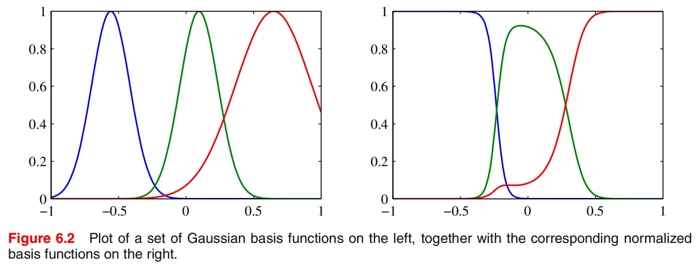

## 为什么要做归一化

从上面的推导可以看出，归一化不是附加技巧，而是变分最优性自然导出的结果。它至少有两个直接作用：

- 它保证权重和为 1，因此预测值具有局部平均的解释。
- 它避免了在远离所有训练点的区域里，所有 basis functions 同时接近 0 的问题。若不归一化，这些区域的输出可能异常小，甚至主要由偏置项控制；而归一化后，模型会把注意力自动分配给相对更近的几个中心，从而表现出更稳定的外推行为。

## 计算代价与中心选择

如果每个训练点都对应一个 basis function，那么预测新点时需要和全部训练点计算一次响应，这会带来较高代价。因此，实际中常常采用 $M<N$ 的有限 RBF network：只保留较少数量的中心 $\mu_j$，先固定这些基函数，再用最小二乘解出权重。常见的中心选择方法包括：

- 从训练点中随机抽样；
- 使用 orthogonal least squares 做逐步选择；
- 通过 K-means 一类聚类方法先在输入空间中寻找代表性中心。

从模型角度看，这意味着 `6.3` 实际上包含两条相近但不完全相同的路线。一条是“每个训练点一个中心”的 kernel regression / 非参数视角；另一条是“少数中心 + 线性系数”的有限基函数参数模型视角。

## Nadaraya-Watson kernel regression

`6.3.1` 是这一节最关键的部分。这里从一个不同于 `6.1` 的方向，再次得到“训练目标值的加权和”这一形式。不过这一次不是从 duality 出发，而是从 `kernel density estimation` 出发。

:::: {.callout-note title="Parzen 窗函数是什么"}
Parzen 窗估计是一种非参数密度估计方法。它的基本思想是：在每个训练样本点上放置一个局部核函数，然后把这些局部核函数叠加起来，得到整体的概率密度估计。在本节中，我们不是直接对输入分布 $p(x)$ 做 Parzen 估计，而是对联合分布 $p(x,t)$ 做估计。这样一来，后续通过条件期望 $\mathbb E[t\mid x]$ 就可以自然导出一个回归函数，而这个回归函数恰好具有 kernel regression 的形式。
::::

设训练集为 $\{(x_n,t_n)\}_{n=1}^N$，用 Parzen 窗估计联合分布 $p(x,t)$：
$$
p(x,t)=\frac1N\sum_{n=1}^N f(x-x_n,t-t_n),
$$
其中 $f(x,t)$ 是分量密度，每个训练样本对应一个以 $(x_n,t_n)$ 为中心的分量。我们的目标是求回归函数
$$
y(x)=\mathbb E[t\mid x].
$$

### 从条件期望出发

根据条件期望定义，
$$
y(x)=\frac{\int t\, p(x,t)\, dt}{\int p(x,t)\, dt}.
$$
把 Parzen 形式代入，得到
$$
y(x)=\frac{\sum_n \int t\, f(x-x_n,t-t_n)\, dt}{\sum_m \int f(x-x_m,t-t_m)\, dt}.
$$
这就是书中的式 `(6.43)`。

### 对分子做变量替换

为了化简分子，对第 $n$ 项令
$$
u=t-t_n,\qquad t=u+t_n.
$$
则
$$
\int t\, f(x-x_n,t-t_n)\, dt
=\int (u+t_n) f(x-x_n,u)\, du.
$$
把它拆开可得
$$
\int u f(x-x_n,u)\, du
+ t_n \int f(x-x_n,u)\, du.
$$
这时假设分量密度在目标变量方向上的均值为零，也就是
$$
\int u f(x,u)\, du=0.
$$
于是第一项消失，只剩下
$$
t_n \int f(x-x_n,u)\, du.
$$
定义
$$
g(x)=\int f(x,t)\, dt,
$$
则分子化为
$$
\sum_n g(x-x_n)t_n.
$$

### 对分母做化简

分母的处理更直接：
$$
\sum_m \int f(x-x_m,t-t_m)\, dt
=\sum_m g(x-x_m).
$$
因此，
$$
y(x)=\frac{\sum_n g(x-x_n)t_n}{\sum_m g(x-x_m)}.
$$
若进一步定义
$$
k(x,x_n)=\frac{g(x-x_n)}{\sum_m g(x-x_m)},
$$
就得到
$$
y(x)=\sum_{n=1}^N k(x,x_n)t_n.
$$
这就是书中的式 `(6.45)` 和 `(6.46)`。

### 这个推导的核心思想

这个推导说明，`Nadaraya-Watson` 模型并不是凭空发明出来的一种局部加权规则，而是从联合分布的 Parzen 估计和条件期望定义中直接推出的。也就是说，kernel regression 在这里不只是一个算法技巧，而是一个明确的统计模型的结果。

更重要的是，这里的权重满足
$$
\sum_{n=1}^N k(x,x_n)=1.
$$
因此回归函数是对训练目标值的归一化局部平均。对于 localized kernel，离 $x$ 较近的训练点会获得更高权重，而远处样本的影响会被自然压低。

:::: {.callout-tip title="与 `6.1` 的联系"}
在 `6.1` 中，预测是训练目标值的线性组合，这一形式来自 dual representation；在 `6.3.1` 中，预测同样是训练目标值的加权和，但这次来自条件期望与密度估计。两条路线都导向“相似性加权”，但统计解释不同。
::::

## 条件分布而不只是条件均值

在 `Figure 6.3` 对应的讨论中，还应注意到 Nadaraya-Watson 模型不只是给出一个条件均值 $y(x)$，还给出了完整的条件分布
$$
p(t\mid x)=\frac{p(t,x)}{\int p(t,x)\, dt}.
$$
若联合密度的分量 $f(x,t)$ 取为二维零均值各向同性 Gaussian，那么条件分布会成为一个 Gaussian mixture，条件均值就是图中的红线，而红色阴影则表示条件分布的不确定性范围。这个细节很重要，因为它预告了下一节 `6.4` 的思想：kernel 不只是局部平均的权重，还会进一步升级为函数空间中的协方差结构。

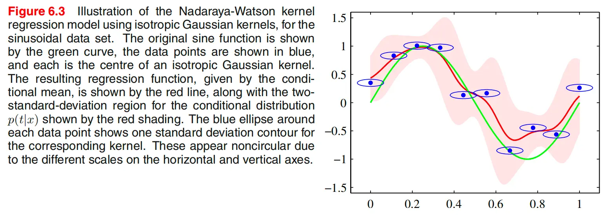

## 本节小结

`6.3` 的关键不是单纯引入一类新的基函数，而是把 RBF 的几种不同来源串了起来。它一方面可以来自插值和正则化理论，另一方面也可以来自输入带噪声时的最优函数推导；而在 `6.3.1` 中，它又通过 Parzen 联合密度估计自然导向了 Nadaraya-Watson kernel regression。于是，kernel 在这里第一次明确呈现为“局部相似性加权平均”的机制，而这恰好为下一节中 Gaussian process 的概率化视角做好了准备。

# 高斯过程

`6.4` 是本章最重要的提升之一。在 `6.1` 中，kernel 主要作为对偶表示中的内积出现；在 `6.3` 中，kernel 进一步表现为局部加权平均中的权重函数；而到了 `6.4`，kernel 的角色又发生了一次根本性升级：它成为函数值之间的协方差函数。也就是说，我们不再只是把 kernel 看作“两个输入有多像”，而是把它看作“两个输入处的函数值在先验上有多强的相关性”。到这里，本章的方法论主线也变得完整起来：同一个 kernel，先后被解释为特征内积、局部相似性和协方差结构。

## 从参数空间走向函数空间

在第 3 章的贝叶斯线性回归中，我们从参数空间出发：先给权重向量 $w$ 一个先验，再由模型
$$
y(x)=w^\top \phi(x)
$$
诱导出预测分布。Gaussian process 采取的是另一种语言：直接给函数本身一个先验分布。表面上看，这似乎意味着要处理一个定义在无穷维函数空间上的概率分布，但 Gaussian process 的关键便利在于：实际计算只需要关心函数在有限个输入点上的取值，而这些有限维随机向量是高斯分布即可。

因此，Gaussian process 的定义是：若对任意有限输入集合 $x_1,\dots,x_N$，向量
$$
\bigl(y(x_1),\dots,y(x_N)\bigr)^\top
$$
都服从联合高斯分布，则称 $y(x)$ 为一个 Gaussian process。由于高斯分布完全由均值和协方差决定，所以 Gaussian process 也完全由均值函数和协方差函数决定：
$$
m(x)=\mathbb E[y(x)],\qquad
k(x,x')=\operatorname{cov}(y(x),y(x')).
$$
在多数情形下，均值函数取为零，因此真正决定模型性质的是协方差函数，也就是 kernel。

## 有限点上的 latent vector 与 GP 超参数

无论是 GP 回归还是 GP 分类，它们在先验层面都共享同一个骨架：先在某个 latent function 上放置 Gaussian process 先验，然后再结合不同的观测模型。对回归问题，这个 latent function 通常记为 $y(x)$；对分类问题，则常记为 $a(x)$，随后再通过 sigmoid 或 probit 之类的非线性映射把它变成类别概率。

一旦只在有限多个输入点 $x_1,\dots,x_N$ 上考察这个 latent function，它就退化成一个有限维高斯随机向量：
$$
f_N=(f(x_1),\dots,f(x_N))^\top \sim \mathcal N(m_N,K_N).
$$
因此，“Gaussian process 是函数空间上的先验”并不意味着实际计算时要直接操纵无限维对象；真正进入运算的，始终是有限个输入点上的多元正态分布。

这里需要区分两类量。第一类是 latent vector $f_N$，它的维数随着样本数 $N$ 改变，是需要被积分掉或近似推断的随机变量。第二类是 GP 的超参数，例如 kernel 的幅度、长度尺度、噪声参数以及 ARD 参数，它们的维数通常固定，只依赖于输入维度 $D$ 或所选 kernel 形式，而不会随着样本数一起增长。前者不是通常意义下的“固定模型参数”，后者才是通过边缘似然去学习的真正超参数。

:::: {.callout-note title="一个常见混淆"}
GP 常被称为非参数模型，不是因为它完全没有参数，而是因为它不依赖一个固定维度的参数向量来直接表示函数本身。随着数据量增大，latent vector 的维数会增长；而 hyperparameters 的个数通常保持为常数级或 $D$ 级。
::::

## 线性回归视角下的高斯过程

### 从权重先验诱导函数先验

先回到熟悉的线性模型
$$
y(x)=w^\top \phi(x), \tag{6.49}
$$
并对参数向量放置各向同性高斯先验
$$
p(w)=\mathcal N(w\mid 0,\alpha^{-1}I). \tag{6.50}
$$
这意味着我们先验上偏好较小的权重，$\alpha$ 是精度参数。

现在考虑一组输入点 $x_1,\dots,x_N$ 上的函数值向量
$$
y=(y(x_1),\dots,y(x_N))^\top.
$$
由线性模型可得
$$
y=\Phi w, \tag{6.51}
$$
其中 $\Phi$ 是设计矩阵。因为 $w$ 是高斯随机向量，而高斯在线性变换下仍为高斯，所以 $y$ 也是高斯向量。

### 均值与协方差

由高斯分布的线性变换性质可得
$$
\mathbb E[y]=\Phi \mathbb E[w]=0, \tag{6.52}
$$
而协方差为
$$
\operatorname{cov}(y)
=\mathbb E[yy^\top]
=\Phi \mathbb E[ww^\top]\Phi^\top
=\frac{1}{\alpha}\Phi\Phi^\top. \tag{6.53}
$$
于是自然定义 Gram matrix
$$
K=\frac{1}{\alpha}\Phi\Phi^\top,
$$
其元素为
$$
K_{nm}=k(x_n,x_m)=\frac{1}{\alpha}\phi(x_n)^\top\phi(x_m). \tag{6.54}
$$
因此，在这个具体例子里，
$$
\mathbb E[y(x_n)y(x_m)]=k(x_n,x_m). \tag{6.55}
$$
这一步说明：第 3 章中的贝叶斯线性回归，本身就是 Gaussian process 的一个具体实例。也就是说，kernel 在这里不再只是特征空间内积，而是函数值之间的协方差函数。

:::: {.callout-important title="这一小节的核心结论"}
贝叶斯线性回归可以等价地从两种视角理解：一是参数空间视角，对 $w$ 放先验；二是函数空间视角，直接把 $y(x)$ 看成一个 Gaussian process。两者在有限基函数情形下给出完全一致的预测分布。
::::

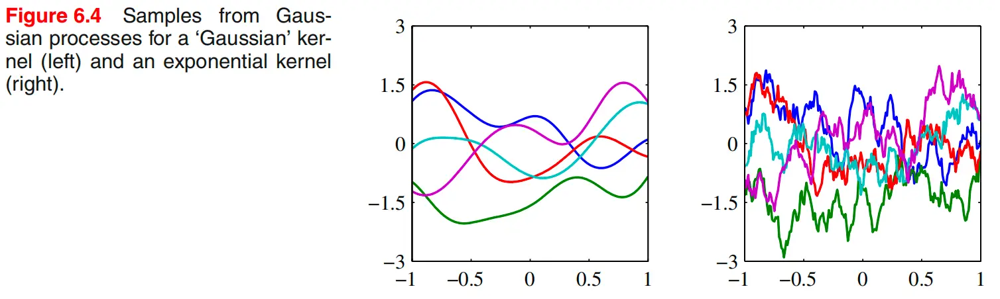

## 高斯过程回归

### 加入观测噪声

为了把 Gaussian process 用于回归，必须把观测噪声考虑进去。设
$$
t_n=y_n+\epsilon_n, \tag{6.57}
$$
其中
$$
\epsilon_n\sim \mathcal N(0,\beta^{-1}). \tag{6.58}
$$
这意味着在给定 latent function value $y_n$ 的条件下，
$$
p(t_n\mid y_n)=\mathcal N(t_n\mid y_n,\beta^{-1}).
$$
由于各个数据点的噪声相互独立，所以
$$
p(t\mid y)=\mathcal N(t\mid y,\beta^{-1}I). \tag{6.59}
$$
而由 Gaussian process 的定义，
$$
p(y)=\mathcal N(y\mid 0,K). \tag{6.60}
$$

### 训练目标的边缘分布

将 latent vector $y$ 积分掉，可以得到训练目标向量的边缘分布：
$$
p(t)=\int p(t\mid y)p(y)\,dy
=\mathcal N(t\mid 0,C). \tag{6.61}
$$
其中协方差矩阵为
$$
C=K+\beta^{-1}I, \qquad
C(x_n,x_m)=k(x_n,x_m)+\beta^{-1}\delta_{nm}. \tag{6.62}
$$
这个公式揭示了 GP regression 中总协方差的两部分来源：一部分来自 latent function 自身的协方差结构 $K$，另一部分来自独立同分布的观测噪声 $\beta^{-1}I$。因为这两个噪声源相互独立，所以协方差直接相加。

### 常见的回归 kernel

这一节给出一个常用的 kernel 族：
$$
k(x_n,x_m)=\theta_0\exp\left(-\frac{\theta_1}{2}\|x_n-x_m\|^2\right)+\theta_2+\theta_3 x_n^\top x_m. \tag{6.63}
$$
其中第一项是 Gaussian 型的平滑相关结构，$\theta_2$ 提供常数项，$\theta_3 x_n^\top x_m$ 则对应线性趋势。这个例子很有代表性，因为它说明 GP kernel 完全可以把“局部平滑成分”和“全局线性成分”组合在一起。

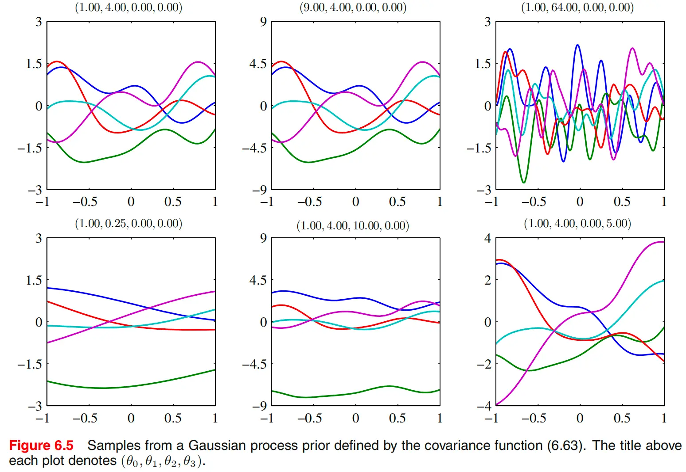

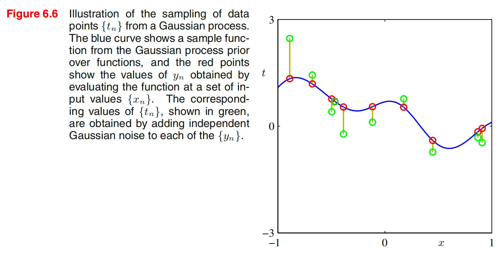

### 预测分布

设训练目标向量为
$$
t_N=(t_1,\dots,t_N)^\top,
$$
测试点对应目标为 $t_{N+1}$。我们先写出联合分布
$$
p(t_{N+1})=\mathcal N(t_{N+1}\mid 0,C_{N+1}), \tag{6.64}
$$
并将协方差矩阵分块为
$$
C_{N+1}=
\begin{pmatrix}
C_N & k\\
k^\top & c
\end{pmatrix}, \tag{6.65}
$$
其中 $k$ 是测试点与所有训练点之间的协方差向量，$c=k(x_{N+1},x_{N+1})+\beta^{-1}$。

由于联合分布是高斯分布，直接应用条件高斯公式，就得到预测分布
$$
p(t_{N+1}\mid t_N)=\mathcal N\bigl(t_{N+1}\mid m(x_{N+1}),\sigma^2(x_{N+1})\bigr),
$$
其中
$$
m(x_{N+1})=k^\top C_N^{-1}t, \tag{6.66}
$$
$$
\sigma^2(x_{N+1})=c-k^\top C_N^{-1}k. \tag{6.67}
$$
这两条式子是 Gaussian process regression 最核心的结果。预测均值依然是训练目标值的线性组合，而预测方差则量化了在给定训练数据后的剩余不确定性。

### 预测均值与 RBF expansion 的联系

进一步可以看出，预测均值可以写成
$$
m(x_{N+1})=\sum_{n=1}^N a_n k(x_n,x_{N+1}), \tag{6.68}
$$
其中 $a_n$ 是向量 $C_N^{-1}t$ 的分量。因此，如果 kernel 只依赖于距离 $\|x_n-x_m\|$，那么预测均值就是一个 RBF expansion。这说明 `6.4` 与 `6.3` 并不是断裂的：前一节的 RBF / kernel regression，在这一节中被重新解释为函数空间中的概率模型。

### 计算复杂度与有限基函数模型的比较

Gaussian process regression 的主要计算代价来自对 $N\times N$ 协方差矩阵求逆，因此标准方法的复杂度是 $O(N^3)$。相比之下，若采用有限基函数模型，只需处理 $M\times M$ 的矩阵，因此当 $M\ll N$ 时会更加高效。但 GP 的优势在于，它允许我们直接使用只能由无限维基函数表示的 kernel，因此获得更大的表示能力。这个代价 - 表达力权衡，是理解 GP 与有限参数模型差别的关键。

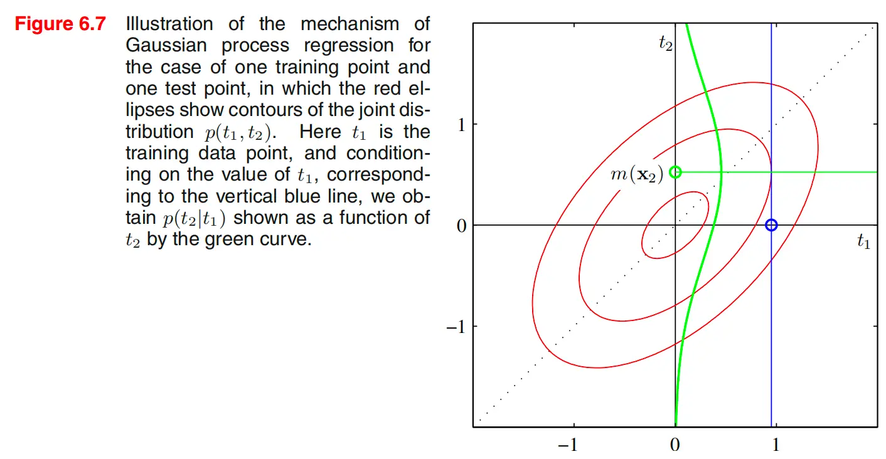

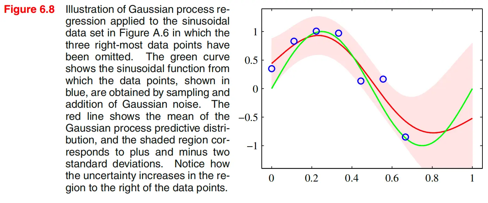

## 超参数学习

### 为什么需要学习超参数

Gaussian process 的表现高度依赖于 kernel 的超参数以及噪声参数。例如在式 `(6.63)` 中，各个参数的作用可以分开理解：

- $\theta_0$ 控制函数波动的整体尺度。
- $\theta_1$ 控制长度尺度，从而决定相关性随距离衰减的快慢。
- $\theta_2$ 对应常数偏移项。
- $\theta_3$ 对应全局线性趋势。
- $\beta$ 控制观测噪声的强弱。

若这些量固定不变，GP 只是一个先验假设；若希望模型能适应具体数据，就必须根据数据学习这些超参数。

### 边缘似然

由于训练目标向量满足
$$
t\sim \mathcal N(0,C_N),
$$
因此可以直接写出边缘似然
$$
p(t\mid \theta)=\mathcal N(t\mid 0,C_N),
$$
其中 $\theta$ 代表全部超参数。于是对数边缘似然为
$$
\ln p(t\mid \theta)
=-\frac12 \ln |C_N|
-\frac12 t^\top C_N^{-1}t
-\frac{N}{2}\ln(2\pi). \tag{6.69}
$$
这条式子的结构非常重要。第一项是复杂度惩罚，第二项是数据拟合项，第三项是常数项。因此，最大化边缘似然不是单纯追求训练误差最小，而是在“更好解释数据”和“避免函数先验过度复杂”之间进行平衡。这也是 GP 中常说的自动 Occam’s razor。

### 梯度公式

为了利用梯度法优化超参数，需要计算
$$
\frac{\partial}{\partial \theta_i}\ln p(t\mid \theta).
$$
利用矩阵求导公式
$$
\frac{\partial}{\partial \theta}\ln|C|
=\operatorname{Tr}\left(C^{-1}\frac{\partial C}{\partial \theta}\right),
$$
以及
$$
\frac{\partial C^{-1}}{\partial \theta}
=-C^{-1}\frac{\partial C}{\partial \theta}C^{-1},
$$
可以得到
$$
\frac{\partial}{\partial \theta_i}\ln p(t\mid \theta)
=-\frac12 \operatorname{Tr}\left(C_N^{-1}\frac{\partial C_N}{\partial \theta_i}\right)
+\frac12 t^\top C_N^{-1}\frac{\partial C_N}{\partial \theta_i}C_N^{-1}t. \tag{6.70}
$$
这条梯度公式的两项分别对应复杂度项和拟合项的变化方向，因此优化超参数的过程，本质上也是在这两种效应之间自动权衡。

### 为什么没有闭式解

一般来说，$\ln p(t\mid \theta)$ 不是凸函数，因此往往存在多个局部极大值。超参数通常需要用数值优化方法来估计，例如共轭梯度法或其他基于梯度的算法，而不能写出闭式解。换句话说，超参数学习并不是一个“解出公式”的问题，而是一个以边缘似然为目标函数的连续优化问题。

:::: {.callout-important title="这一小节的核心理解"}
学习超参数，等价于让数据自己去选择“什么样的函数先验最合理”。因此，最大化边缘似然并不只是调参，而是在用数据反推 GP 所偏好的函数类。
::::

## 自动相关性判定

### 基本思想

在普通 Gaussian kernel 中，所有输入维度通常共享同一个长度尺度参数，这意味着模型默认各输入维度的重要性相同。ARD 的思想是把这个统一长度尺度拆开，为每个输入维度分配一个独立参数，从而允许模型自动判断不同维度的重要性。

对于二维输入，可以写成
$$
k(x,x')=\theta_0\exp\left\{-\frac12\sum_{i=1}^2 \eta_i (x_i-x_i')^2\right\}. \tag{6.71}
$$
更一般地，对 $D$ 维输入，可以把它并入之前的回归 kernel 得到
$$
k(x_n,x_m)=\theta_0\exp\left\{-\frac12\sum_{i=1}^D \eta_i (x_{ni}-x_{mi})^2\right\}
+\theta_2+\theta_3\sum_{i=1}^D x_{ni}x_{mi}. \tag{6.72}
$$

### 为什么 $\eta_i$ 表示变量重要性

若某个 $\eta_i$ 很大，则第 $i$ 维上的微小变化都会显著影响 kernel，因此函数对该维度非常敏感；若 $\eta_i$ 很小，则即使这一维改变较多，kernel 也变化不大，说明函数对该维度不敏感。于是可以把这些参数解释为逐维相关性强弱的刻画：

- $\eta_i$ 大：第 $i$ 维重要；
- $\eta_i$ 小：第 $i$ 维不重要；
- $\eta_i\to 0$：模型几乎忽略该维度。

若使用长度尺度记号 $\ell_i$，则常有
$$
\eta_i=\frac{1}{\ell_i^2}.
$$
因此 ARD 也可以理解为：为每个输入维度学习一个独立长度尺度。

### 这些尺度参数怎么确定

ARD 中的尺度参数不是手工指定的，而是与其他超参数一样，通过最大化边缘似然自动学出来。也就是说，把
$$
\theta=(\theta_0,\eta_1,\dots,\eta_D,\beta,\dots)
$$
一起代入前面的对数边缘似然 `(6.69)`，然后通过梯度公式 `(6.70)` 做数值优化。这样，数据会自动推动重要维度对应的 $\eta_i$ 变大，而把无关维度对应的 $\eta_i$ 压小。

因此，ARD 并不是先做变量筛选再建模，而是在建模过程中把“变量相关性判断”内生到 kernel 超参数学习里。

### Figure 6.9 与 Figure 6.10 的意义

Figure 6.9 展示了在二维输入下，当两个 $\eta_i$ 取不同值时，GP prior 样本形状如何变化。若某个 $\eta_i$ 变得很小，函数在该维方向上就会变得不敏感。Figure 6.10 则通过一个三维合成数据例子说明：在边缘似然优化后，真正重要的输入维度会对应较大的 $\eta_i$，而无关维度会对应很小的 $\eta_i$。这给 ARD 提供了直观的变量选择解释。

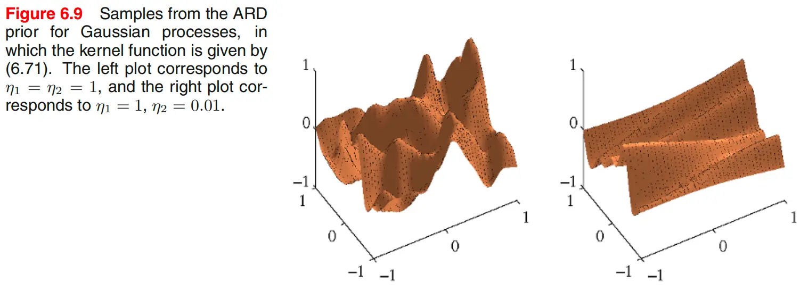

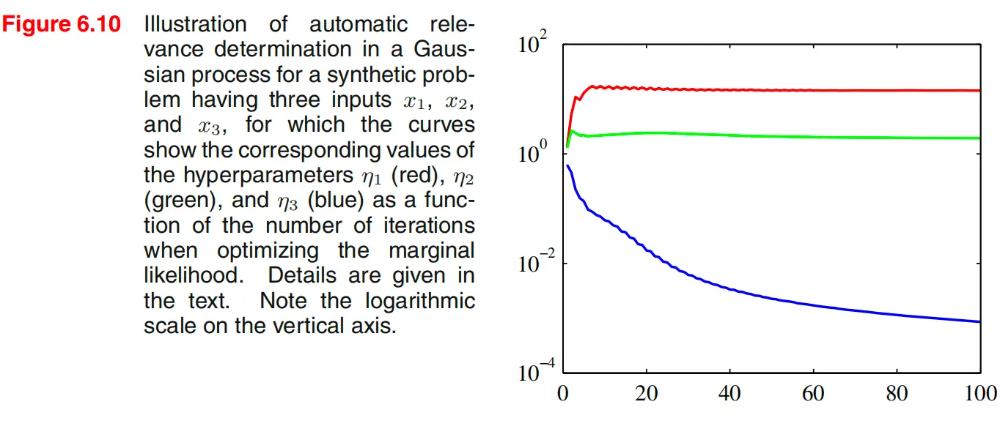

### ARD 的局限

ARD 提供的是一种模型内的“软变量选择”信号，而不是绝对的因果解释。若输入变量之间存在较强相关性，或者 kernel 形式本身选得不合适，ARD 得到的变量重要性排序可能并不稳定。因此，它更适合作为模型内部的 relevance measure，而不是唯一的变量筛选依据。

## 高斯过程分类

### 从回归到分类的关键变化

Gaussian process 回归之所以能保持解析可解，是因为先验 $p(y)$ 和似然 $p(t\mid y)$ 都是高斯分布，因此后验和预测分布仍然处在高斯族中。分类问题的困难恰恰在于这一闭包被打破了。我们希望预测的是类别概率，而概率必须落在 $(0,1)$ 中；但 Gaussian process 的输出天然定义在整个实数轴上。因此，不能直接把 GP 的输出当作分类概率，而必须先引入一个实值 latent function，再通过非线性映射把它压到概率空间中。

对于二分类问题，我们在一个实值过程 $a(x)$ 上赋予 GP 先验，再通过 logistic sigmoid
$$
y(x)=\sigma(a(x))
$$
把它转成类别为 1 的后验概率。于是条件分布写成
$$
p(t\mid a)=\sigma(a)^t(1-\sigma(a))^{1-t}. \tag{6.73}
$$
这说明 GP 分类本质上是在 latent function 上做 GP，而不是直接在概率函数上做 GP。

### 有限点上的先验分布

与回归完全一样，一旦只考虑训练输入 $x_1,\dots,x_N$ 以及测试点 $x_{N+1}$，latent values
$$
a_{N+1}=(a(x_1),\dots,a(x_N),a(x_{N+1}))^\top
$$
就服从一个多元正态先验
$$
p(a_{N+1})=\mathcal N(a_{N+1}\mid 0,C_{N+1}). \tag{6.74}
$$
这里的协方差矩阵元素为
$$
C(x_n,x_m)=k(x_n,x_m)+\nu\delta_{nm}, \tag{6.75}
$$
其中 $\nu$ 是为了数值稳定性而加入的小对角项。与回归情形不同，这里没有显式的观测噪声精度 $\beta^{-1}$，因为分类标签不是带高斯噪声的连续观测。

### 为什么预测变得不可解

我们希望计算测试点属于类别 1 的概率
$$
p(t_{N+1}=1\mid t_N)
=\int p(t_{N+1}=1\mid a_{N+1})\, p(a_{N+1}\mid t_N)\, da_{N+1}. \tag{6.76}
$$
其中
$$
p(t_{N+1}=1\mid a_{N+1})=\sigma(a_{N+1}).
$$
困难在于：虽然先验是高斯，但与 logistic likelihood 相乘后，训练 latent vector 的后验
$$
p(a_N\mid t_N)
$$
不再是高斯，因此这个积分无法像回归那样解析求解。常见的近似方法包括：

- variational inference；
- expectation propagation；
- Laplace approximation。

本节重点讨论最后一种。

:::: {.callout-important title="回归与分类的真正分叉点"}
两者在先验层面完全相同：都先在一个 latent function 上放 GP 先验，并在有限多个点上退化为多元正态。真正导致推断路线不同的，是观测模型是否为高斯。
::::

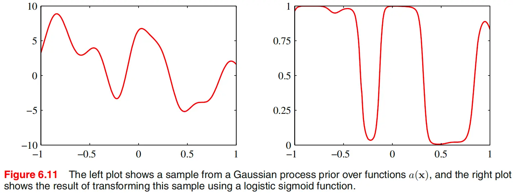

## Laplace 近似

### 近似的目标

Laplace approximation 的目标，是把非高斯后验近似成一个高斯分布。其做法是先找到后验众数，再在众数附近对对数后验做二阶 Taylor 展开。由于指数化一个二次函数就得到高斯分布，因此这给出了一个局部高斯近似。

在 GP 分类中，这一步之所以必要，是因为高斯先验与 logistic 似然不再保持高斯形式。Laplace approximation 的作用，正是“修复”这一被打破的高斯闭包。

### 对数后验

设训练点对应的 latent vector 为
$$
a_N=(a_1,\dots,a_N)^\top.
$$
其先验分布为
$$
p(a_N)=\mathcal N(a_N\mid 0,C_N),
$$
似然为
$$
p(t_N\mid a_N)
=\prod_{n=1}^N \sigma(a_n)^{t_n}(1-\sigma(a_n))^{1-t_n}. \tag{6.79}
$$
于是，对数后验（忽略常数）可写为
$$
\Psi(a_N)=\ln p(a_N)+\ln p(t_N\mid a_N). \tag{6.80}
$$
展开后得到
$$
\Psi(a_N)
=-\frac12 a_N^\top C_N^{-1}a_N+t_N^\top a_N-\sum_{n=1}^N \ln(1+e^{a_n})+\text{const}.
$$

### 梯度与 Hessian

对 $\Psi(a_N)$ 求梯度，得到
$$
\nabla \Psi(a_N)=t_N-\sigma_N-C_N^{-1}a_N, \tag{6.81}
$$
其中 $\sigma_N$ 的第 $n$ 个分量是 $\sigma(a_n)$。继续求 Hessian，可得
$$
\nabla\nabla \Psi(a_N)=-W_N-C_N^{-1}, \tag{6.82}
$$
其中 $W_N$ 是对角矩阵，对角元为
$$
\sigma(a_n)(1-\sigma(a_n)).
$$
因为 $W_N$ 与 $C_N^{-1}$ 都是正定或半正定矩阵，所以
$$
W_N+C_N^{-1}
$$
是正定的，这说明后验只有一个众数。这个性质非常重要，因为它保证 Laplace approximation 所围绕的众数是全局最优点。

### Newton-Raphson / IRLS 更新

由于方程
$$
t_N-\sigma_N-C_N^{-1}a_N=0
$$
含有 sigmoid 非线性，众数无法直接解出。这里使用 Newton-Raphson 方法迭代求解，得到更新公式
$$
a_N^{\text{new}}
=C_N(I+W_N C_N)^{-1}\{t_N-\sigma_N+W_N a_N\}. \tag{6.83}
$$
它与逻辑回归中的 IRLS 形式高度相似，只是这里额外包含了 Gaussian process 的协方差结构。迭代收敛后得到众数 $a_N^*$，并满足
$$
a_N^*=C_N(t_N-\sigma_N). \tag{6.84}
$$

### 高斯近似后验

在众数处，Hessian 给出了局部高斯近似的精度矩阵
$$
H=W_N+C_N^{-1}. \tag{6.85}
$$
因此，Laplace 近似写成
$$
q(a_N)=\mathcal N(a_N\mid a_N^*,H^{-1}). \tag{6.86}
$$
这就是 `6.4.6` 的核心结论：用众数附近的高斯分布来代替真实的非高斯后验。

### 测试点的近似预测

有了训练 latent vector 的高斯近似后验，再结合条件分布 $p(a_{N+1}\mid a_N)$，即可得到测试点 latent variable 的近似高斯后验，其均值与方差分别为
$$
\mathbb E[a_{N+1}\mid t_N]=k^\top (t_N-\sigma_N), \tag{6.87}
$$
$$
\operatorname{var}(a_{N+1}\mid t_N)=c-k^\top (W_N^{-1}+C_N)^{-1}k. \tag{6.88}
$$
再将这一近似高斯分布与 sigmoid 结合，就能进一步近似分类概率。若只关心决策边界，则往往只需要看均值项。

:::: {.callout-tip title="对这一节最简洁的理解"}
GP 分类并不是换了一个新的先验，而是在原有 GP 先验之上换了一个非高斯的分类似然；Laplace approximation 的任务，就是把这一非高斯后验重新近似回高斯。
::::

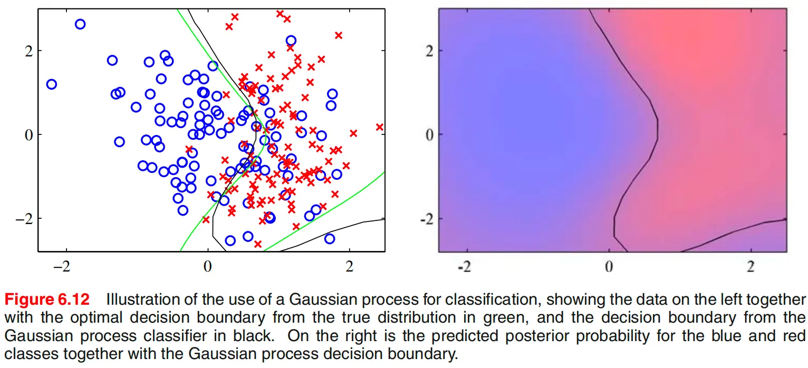

## 与神经网络的联系

`6.4.7` 的作用，是把 Gaussian process 与第 5 章的神经网络联系起来。在贝叶斯神经网络中，对参数放置先验会诱导出函数上的先验分布；而对一大类权重先验来说，当隐藏单元数 $M\to\infty$ 时，由神经网络诱导出的函数分布会趋向 Gaussian process。

这意味着，Gaussian process 可以看作某些贝叶斯神经网络在无限隐藏单元极限下的函数空间极限。它的重要意义不在于“神经网络等于 GP”，而在于说明：参数空间视角和函数空间视角之间是可以相互过渡的。神经网络通过参数先验诱导函数分布，而 Gaussian process 则是直接在函数空间中工作。

不过也要看到，这个极限不会保留神经网络的全部结构优势。尤其是多输出网络共享隐藏单元所带来的“借力”效应，在 GP 极限下会削弱甚至丢失。因此，GP 是某些神经网络的函数空间极限，但并不意味着两者在统计行为和建模能力上完全等价。

## 本节小结

`6.4` 的完整主线可以概括为：先把贝叶斯线性回归重新解释为函数空间上的 Gaussian process，再在加入观测噪声后得到 GP regression 的预测均值与预测方差公式；随后通过边缘似然学习 kernel 超参数，并进一步推广到逐维长度尺度的 ARD；接着在分类问题中，由于 logistic 似然打破了高斯闭包，只能借助 Laplace approximation 等方法做近似推断；最后又通过无限隐藏单元极限，把 Gaussian process 与贝叶斯神经网络联系起来。到这里，kernel 的角色已经彻底升级为函数先验的协方差结构，而 Gaussian process 也因此成为一种统一连接回归、分类、不确定性量化、变量相关性分析与神经网络极限的框架。

# 参考

- C. M. Bishop, *Pattern Recognition and Machine Learning*. Springer, 2006. Chapter 6.
- Mercer 定理与核函数谱展开
